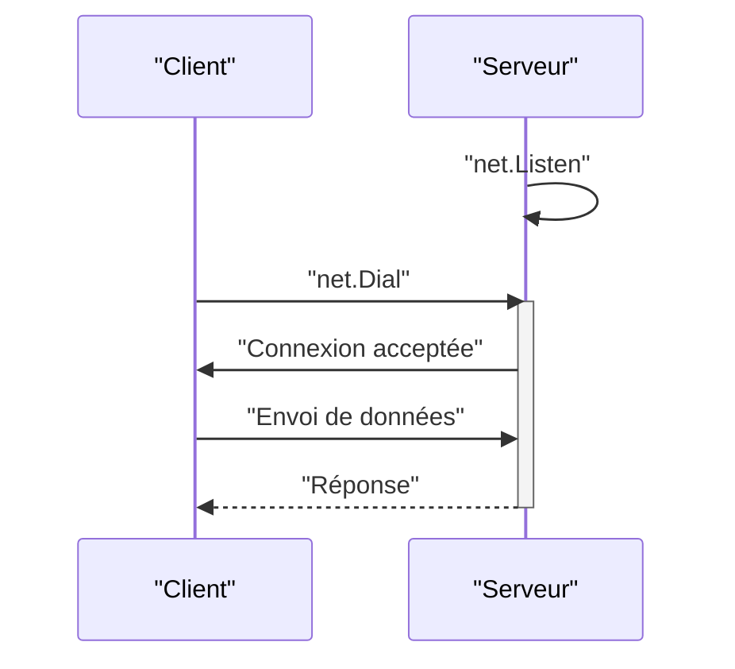

# Chapitre 39 : Réseau de base (TCP/UDP) {#chapitre-39-réseau-de-base-(tcp/udp)}

net, TCP, UDP, socket, serveur, client

## Le package net {#le-package-net}

### 1. Quoi {#quoi}
Le package **net** fournit une interface portable pour les E/S réseau, incluant les sockets TCP/IP, UDP, la résolution de noms de domaine et les sockets Unix. C'est la fondation sur laquelle reposent les protocoles de plus haut niveau comme HTTP.

### 2. Pourquoi {#pourquoi}
Comprendre le package `net` est essentiel pour construire des services réseau personnalisés, des outils de communication temps réel ou des systèmes distribués où le protocole HTTP est trop lourd ou inadapté.

### 3. Comment {#comment}

#### A. Syntaxe de base
Un serveur TCP écoute sur un port et accepte des connexions entrantes.

```go
// Serveur TCP simple
listener, _ := net.Listen("tcp", ":8080")
for {
    conn, _ := listener.Accept()
    go handleConnection(conn) // Gestion en goroutine
}
```

#### B. Cas concret : Communication TCP


```go
// Exemple de serveur TCP robuste
func handleConnection(conn net.Conn) {
	defer conn.Close()
	buf := make([]byte, 1024)
	for {
		n, err := conn.Read(buf)
		if err != nil { return } // Fin de connexion
		conn.Write(buf[:n]) // Echo simple
	}
}
```

#### C. Exemples pratiques
1. **Serveur Echo** : Un serveur qui renvoie ce qu'il reçoit (base pour le debugging).
2. **Client TCP** : Se connecter à un service distant pour envoyer des commandes.
3. **Serveur UDP** : Utiliser `net.ListenPacket` pour des communications sans connexion (plus rapide, moins fiable).

### 4. Zone de Danger {#zone-de-danger}

- ❌ **Bloquer la boucle principale** : Ne traitez jamais les données directement dans la boucle `Accept()`. Utilisez toujours une goroutine par connexion.
- ❌ **Oublier de fermer les connexions** : Chaque `Accept()` ou `Dial()` doit être suivi d'un `Close()` pour éviter les fuites de descripteurs de fichiers.
- ✅ **Bonne pratique** : Utilisez des timeouts sur vos lectures/écritures (`SetDeadline`) pour éviter qu'une connexion inactive ne bloque indéfiniment une goroutine.

### 🚨 Limitations de l'approche standard {#limitations-de-l-approche-standard}

L'utilisation directe de `net` est bas niveau et complexe à sécuriser.
*   **Problèmes** : Gestion manuelle du protocole, absence de chiffrement (TLS), difficulté à gérer la montée en charge.
*   **Solutions modernes** : Pour la plupart des applications, utilisez `net/http` ou des frameworks gRPC. Si vous avez besoin de TLS, utilisez `crypto/tls`.
*   **Pourquoi l'enseigner** : Pour comprendre comment les données circulent réellement sur le réseau et maîtriser les fondations de Go.

## Questions clés (validation des acquis du chapitre) {#questions-clés-(validation-des-acquis-du-chapitre)-39}

- **Quelle est la différence principale entre TCP et UDP ?** (Réponse : TCP est orienté connexion et fiable, UDP est sans connexion et non fiable).
- **Pourquoi utilise-t-on une goroutine par connexion dans un serveur TCP ?** (Réponse : Pour ne pas bloquer le serveur pendant qu'une connexion traite ses données).
- **Quelle méthode permet de fermer proprement une connexion ?** (Réponse : `conn.Close()`).

## Exercices : {#exercices-:-39}

### Exercice 1 - Serveur Echo TCP {#exercice-1---le-serveur-echo-tcp}
🎯 **Objectif** : Créer un serveur TCP.
💼 **Mise en situation** : Vous créez un service de diagnostic réseau.
📝 **Énoncé** : Écrivez un serveur TCP qui écoute sur le port 9000 et renvoie au client tout ce qu'il reçoit.
📺 **Résultat attendu** : Le client reçoit le même message qu'il a envoyé.

<details><summary>Voir le code complet commenté</summary>

```go
package main

import (
	"io"
	"net"
)

func main() {
	l, _ := net.Listen("tcp", ":9000")
	for {
		conn, _ := l.Accept()
		go func(c net.Conn) {
			defer c.Close()
			io.Copy(c, c) // Copie l'entrée vers la sortie (Echo)
		}(conn)
	}
}
```
</details>

### Exercice 2 - Client TCP {#exercice-2---le-client-tcp}
🎯 **Objectif** : Créer un client TCP.
💼 **Mise en situation** : Vous voulez tester votre serveur.
📝 **Énoncé** : Écrivez un client qui se connecte au port 9000, envoie "Hello" et affiche la réponse.
📺 **Résultat attendu** : Affiche "Hello" dans la console.

<details><summary>Voir le code complet commenté</summary>

```go
package main

import (
	"fmt"
	"net"
)

func main() {
	conn, _ := net.Dial("tcp", "localhost:9000")
	defer conn.Close()
	conn.Write([]byte("Hello"))
	
	buf := make([]byte, 1024)
	n, _ := conn.Read(buf)
	fmt.Println(string(buf[:n]))
}
```
</details>

### Exercice 3 - Serveur UDP {#exercice-3---le-serveur-udp}
🎯 **Objectif** : Utiliser UDP.
💼 **Mise en situation** : Vous voulez un service de log rapide.
📝 **Énoncé** : Utilisez `net.ListenPacket` pour écouter des paquets UDP sur le port 9001. Affichez le contenu reçu.
📺 **Résultat attendu** : Affiche le message reçu dans la console.

<details><summary>Voir le code complet commenté</summary>

```go
package main

import (
	"fmt"
	"net"
)

func main() {
	pc, _ := net.ListenPacket("udp", ":9001")
	defer pc.Close()
	buf := make([]byte, 1024)
	for {
		n, _, _ := pc.ReadFrom(buf)
		fmt.Printf("Reçu : %s\n", string(buf[:n]))
	}
}
```
</details>

> 📸 **CAPTURE D'ÉCRAN REQUISE**
> **Sujet** : Terminal montrant le serveur TCP en attente et le client recevant la réponse.
> **Alt Text** : Console affichant la communication entre le client et le serveur.