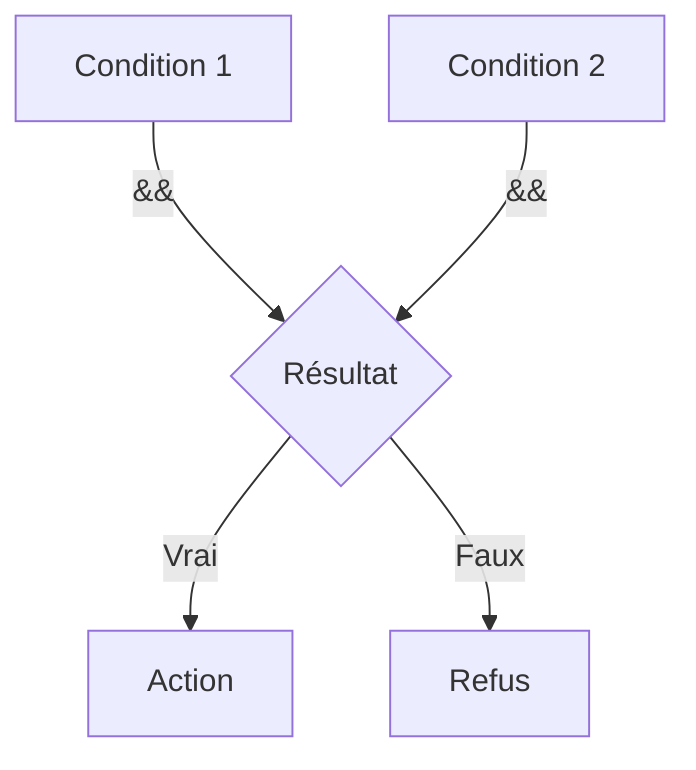

# Chapitre 4 : Opérateurs et expressions {#chapitre-4-:-opérateurs-et-expressions}

Opérateurs arithmétiques, opérateurs de comparaison, opérateurs logiques, priorité des opérateurs

## Opérateurs arithmétiques et de comparaison {#opérateurs-arithmétiques-et-de-comparaison-4}

### 1. Quoi
Les **opérateurs arithmétiques** (`+`, `-`, `*`, `/`, `%`) permettent d'effectuer des calculs mathématiques, tandis que les **opérateurs de comparaison** (`==`, `!=`, `<`, `>`, `<=`, `>=`) permettent d'évaluer des relations entre deux valeurs pour retourner un booléen.

### 2. Pourquoi
Ils sont le fondement de toute logique de traitement de données et de prise de décision dans un programme.

### 3. Comment
A. **Syntaxe de base** :
```go
somme := 10 + 5
estEgal := (10 == 5) // Retourne false
```

B. **Cas concret** :
```go
package main

import "fmt"

func main() {
    a, b := 10, 3
    
    // Arithmétique
    modulo := a % b // Reste de la division
    
    // Comparaison
    estSuperieur := a > b
    
    fmt.Printf("Modulo: %d, Supérieur: %t\n", modulo, estSuperieur)
}
```

C. **Exemples pratiques** :
- **Modulo (`%`)** : Déterminer si un nombre est pair (`n % 2 == 0`).
- **Comparaison** : Vérifier si un âge est suffisant pour accéder à une ressource.

### 4. Zone de Danger
❌ **À ne pas faire** : Comparer des types différents (ex: `int` avec `float64`) sans conversion explicite, Go ne le permet pas.
✅ **Bonne Pratique** : Utilisez des parenthèses pour clarifier la priorité des opérations, même si elle est définie par le langage.

---

## Opérateurs logiques {#opérateurs-logiques-4}

### 1. Quoi
Les **opérateurs logiques** (`&&` pour ET, `||` pour OU, `!` pour NON) permettent de combiner plusieurs expressions booléennes pour créer des conditions complexes.

### 2. Pourquoi
Ils permettent de gérer des flux de contrôle sophistiqués basés sur plusieurs critères simultanés.

### 3. Comment
A. **Syntaxe de base** :
```go
if age > 18 && estMembre {
    // Accès autorisé
}
```

B. **Flux logique** :


C. **Exemples pratiques** :
- **Authentification** : `estConnecté && aLesDroits`.
- **Validation** : `estValide || estAdmin`.

### 4. Zone de Danger
❌ **À ne pas faire** : Créer des conditions logiques trop imbriquées qui deviennent illisibles.
✅ **Bonne Pratique** : Si une condition est trop complexe, extrayez-la dans une fonction nommée (ex: `func estAutorise() bool`).

---

## Questions clés (validation des acquis du chapitre) {#questions-clés-(validation-des-acquis-du-chapitre)-4}

- **Quel opérateur permet d'obtenir le reste d'une division entière ?**
  *Réponse : L'opérateur modulo (`%`).*

- **Que retourne l'expression `!(5 > 3)` ?**
  *Réponse : `false` (car 5 > 3 est vrai, et `!` inverse le résultat).*

- **Peut-on comparer directement un `int` et un `float64` en Go ?**
  *Réponse : Non, il faut convertir explicitement l'un des deux types.*

---

## Exercices : {#exercices-:-4}

### Exercice 1 - Pair ou Impair {#exercice-1---pair-ou-impair}

🎯 **Objectif** : Utiliser l'opérateur modulo.

💼 **Mise en situation** : Vous devez classer des numéros de commande.

📝 **Énoncé** : Déclarez une variable `nombre`. Utilisez l'opérateur `%` pour vérifier si le nombre est pair ou impair et affichez le résultat.

📺 **Résultat attendu** : `Le nombre 7 est impair.`

💡 **Solution** :
<details><summary>Voir le code complet commenté</summary>

```go
package main

import "fmt"

func main() {
    nombre := 7
    // Si le reste de la division par 2 est 0, c'est pair
    if nombre % 2 == 0 {
        fmt.Printf("Le nombre %d est pair.\n", nombre)
    } else {
        fmt.Printf("Le nombre %d est impair.\n", nombre)
    }
}
```
</details>

### Exercice 2 - Accès VIP {#exercice-2---accès-vip}

🎯 **Objectif** : Utiliser les opérateurs logiques.

💼 **Mise en situation** : Un club privé n'accepte que les membres majeurs.

📝 **Énoncé** : Déclarez `age := 20` et `estMembre := true`. Vérifiez si l'utilisateur peut entrer (doit avoir >= 18 ans ET être membre).

📺 **Résultat attendu** : `Accès autorisé.`

💡 **Solution** :
<details><summary>Voir le code complet commenté</summary>

```go
package main

import "fmt"

func main() {
    age := 20
    estMembre := true

    // Utilisation de && pour vérifier deux conditions simultanées
    if age >= 18 && estMembre {
        fmt.Println("Accès autorisé.")
    } else {
        fmt.Println("Accès refusé.")
    }
}
```
</details>

### Exercice 3 - Comparaison stricte {#exercice-3---comparaison-stricte}

🎯 **Objectif** : Gérer les types dans les comparaisons.

💼 **Mise en situation** : Vous comparez des mesures provenant de deux capteurs différents.

📝 **Énoncé** : `capteurA := 10` (int) et `capteurB := 10.5` (float64). Vérifiez si `capteurA` est strictement inférieur à `capteurB`.

📺 **Résultat attendu** : `Le capteur A est inférieur au capteur B.`

💡 **Solution** :
<details><summary>Voir le code complet commenté</summary>

```go
package main

import "fmt"

func main() {
    capteurA := 10
    capteurB := 10.5

    // Conversion nécessaire car Go ne compare pas int et float64 directement
    if float64(capteurA) < capteurB {
        fmt.Println("Le capteur A est inférieur au capteur B.")
    }
}
```
</details>