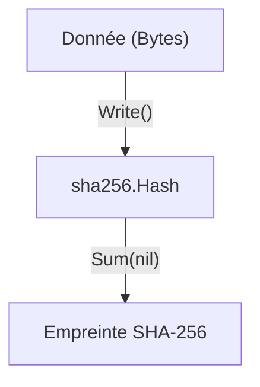

# Chapitre 40 : Hachage de données {#chapitre-40-hachage-de-données}

crypto/sha256, hash, intégrité, empreinte numérique, sécurité

## Le package crypto/sha256 {#le-package-crypto/sha256}

### 1. Quoi {#quoi}
Le **hachage** est un processus qui transforme une donnée de taille arbitraire en une chaîne de caractères de taille fixe, appelée **empreinte numérique** (ou *hash*). Le package `crypto/sha256` implémente l'algorithme SHA-256, qui est une fonction de hachage cryptographique unidirectionnelle : il est impossible de retrouver la donnée originale à partir de son hash.

### 2. Pourquoi {#pourquoi}
Le hachage est fondamental pour garantir l'**intégrité des données** (vérifier qu'un fichier n'a pas été modifié), stocker des mots de passe de manière sécurisée (avec un sel) et créer des signatures numériques.

### 3. Comment {#comment}

#### A. Syntaxe de base
On utilise l'interface `hash.Hash` fournie par le package `crypto/sha256`.

```go
import (
	"crypto/sha256"
	"fmt"
)

func main() {
	donnee := []byte("message secret")
	hash := sha256.Sum256(donnee)
	fmt.Printf("%x\n", hash) // Affichage en hexadécimal
}
```

#### B. Cas concret : Hachage de flux de données
Pour des fichiers volumineux, on utilise `sha256.New()` pour écrire les données par morceaux.



```go
func hacherFichier(r io.Reader) string {
	h := sha256.New()
	io.Copy(h, r) // Lecture par flux pour économiser la RAM
	return fmt.Sprintf("%x", h.Sum(nil))
}
```

#### C. Exemples pratiques
1. **Vérification d'intégrité** : Comparer le hash d'un fichier téléchargé avec celui fourni par l'éditeur.
2. **Stockage de mots de passe** : Hacher un mot de passe avant de le stocker en base de données.
3. **Identification d'objets** : Créer un identifiant unique basé sur le contenu d'un objet.

### 4. Zone de Danger {#zone-de-danger}

- ❌ **Hacher des mots de passe sans "sel" (salt)** : Un hash simple est vulnérable aux attaques par tables arc-en-ciel (*rainbow tables*). Utilisez toujours un sel aléatoire.
- ❌ **Utiliser SHA-256 pour le chiffrement** : Le hachage n'est pas du chiffrement. Vous ne pouvez pas "déchiffrer" un hash.
- ✅ **Bonne pratique** : Pour les mots de passe, utilisez des fonctions de hachage adaptées comme `bcrypt` ou `argon2` plutôt que SHA-256 seul.

### 🚨 Limitations de l'approche standard {#limitations-de-l-approche-standard}

SHA-256 est extrêmement rapide, ce qui est un défaut pour le stockage de mots de passe.
*   **Problèmes** : La rapidité permet aux attaquants de tester des milliards de combinaisons par seconde.
*   **Solutions modernes** : Utilisez `golang.org/x/crypto/bcrypt` pour les mots de passe, car il inclut un facteur de coût (lenteur volontaire) pour contrer les attaques par force brute.
*   **Pourquoi l'enseigner** : SHA-256 reste la référence pour l'intégrité des fichiers et les structures de données comme les blockchains.

## Questions clés (validation des acquis du chapitre) {#questions-clés-(validation-des-acquis-du-chapitre)-40}

- **Pourquoi dit-on qu'une fonction de hachage est unidirectionnelle ?** (Réponse : Parce qu'il est mathématiquement impossible de retrouver la donnée source à partir du hash).
- **Quelle est la différence entre `sha256.Sum256` et `sha256.New()` ?** (Réponse : `Sum256` est pour les petites données en une fois, `New` permet de traiter des données par flux).
- **Pourquoi ne faut-il pas utiliser SHA-256 seul pour des mots de passe ?** (Réponse : Il est trop rapide, facilitant les attaques par force brute).

## Exercices : {#exercices-:-40}

### Exercice 1 - Hash simple {#exercice-1---le-hash-simple}
🎯 **Objectif** : Générer un hash SHA-256.
💼 **Mise en situation** : Vous voulez créer une empreinte pour un message.
📝 **Énoncé** : Hachez la chaîne "GoLang" et affichez le résultat en hexadécimal.
📺 **Résultat attendu** : Une chaîne hexadécimale de 64 caractères.

<details><summary>Voir le code complet commenté</summary>

```go
package main

import (
	"crypto/sha256"
	"fmt"
)

func main() {
	h := sha256.Sum256([]byte("GoLang"))
	fmt.Printf("%x\n", h) // %x formate en hexadécimal
}
```
</details>

### Exercice 2 - Vérification d'intégrité {#exercice-2---la-vérification-d-intégrité}
🎯 **Objectif** : Comparer deux hashs.
💼 **Mise en situation** : Vous vérifiez si deux fichiers sont identiques.
📝 **Énoncé** : Écrivez une fonction qui compare deux hashs SHA-256.
📺 **Résultat attendu** : `true` si identiques, `false` sinon.

<details><summary>Voir le code complet commenté</summary>

```go
func comparerHashs(h1, h2 []byte) bool {
	// On utilise souvent subtle.ConstantTimeCompare pour éviter les attaques temporelles
	return fmt.Sprintf("%x", h1) == fmt.Sprintf("%x", h2)
}
```
</details>

### Exercice 3 - Hachage de flux {#exercice-3---le-hachage-de-flux}
🎯 **Objectif** : Utiliser `io.Copy`.
💼 **Mise en situation** : Vous hachez un gros fichier.
📝 **Énoncé** : Utilisez `sha256.New()` et `io.Copy` pour hacher une chaîne de caractères via un `strings.Reader`.
📺 **Résultat attendu** : Le hash correct du contenu.

<details><summary>Voir le code complet commenté</summary>

```go
import (
	"crypto/sha256"
	"fmt"
	"io"
	"strings"
)

func main() {
	reader := strings.NewReader("Contenu très long...")
	h := sha256.New()
	io.Copy(h, reader)
	fmt.Printf("%x\n", h.Sum(nil))
}
```
</details>

> 📸 **CAPTURE D'ÉCRAN REQUISE**
> **Sujet** : Console affichant le hash SHA-256 généré.
> **Alt Text** : Terminal montrant une chaîne hexadécimale longue et complexe.