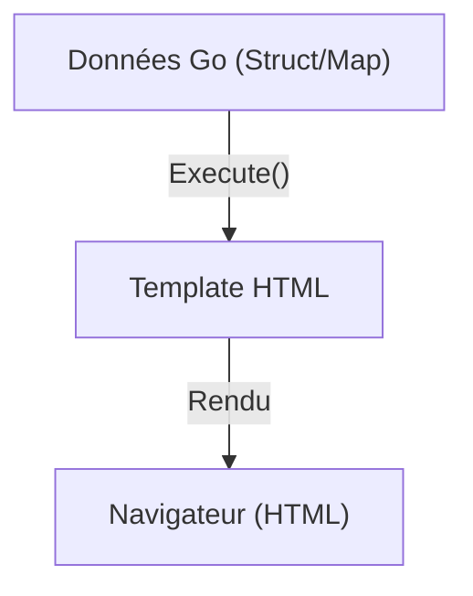

# Chapitre 41 : Modèles HTML {#chapitre-41-modèles-html}

html/template, templates, rendu, sécurité, XSS

## Le package html/template {#le-package-html/template}

### 1. Quoi {#quoi}
Le package **html/template** est la bibliothèque standard de Go pour générer des documents HTML dynamiques. Il permet d'injecter des données Go dans des fichiers HTML tout en protégeant automatiquement contre les attaques de type **XSS** (Cross-Site Scripting) en échappant les données contextuellement.

### 2. Pourquoi {#pourquoi}
Pour créer des applications web dynamiques (serveur-side rendering), il est nécessaire de séparer la logique métier (Go) de la présentation (HTML). Ce package offre une solution sécurisée et performante pour fusionner les deux.

### 3. Comment {#comment}

#### A. Syntaxe de base
Le template utilise des doubles accolades `{{ }}` pour insérer des données.

```go
// template.html
<h1>Bonjour, {{ .Nom }} !</h1>

// main.go
tmpl := template.Must(template.ParseFiles("template.html"))
data := struct{ Nom string }{Nom: "Alice"}
tmpl.Execute(w, data)
```

#### B. Cas concret : Architecture de rendu


```go
// Exemple robuste avec boucles et conditions
func handler(w http.ResponseWriter, r *http.Request) {
	items := []string{"Pomme", "Banane", "Orange"}
	tmpl := template.Must(template.New("liste").Parse(`
		<ul>
		{{ range . }}
			<li>{{ . }}</li>
		{{ else }}
			<li>Aucun élément</li>
		{{ end }}
		</ul>`))
	tmpl.Execute(w, items)
}
```

#### C. Exemples pratiques
1. **Rendu de listes** : Utiliser `{{ range }}` pour itérer sur des slices.
2. **Conditions** : Utiliser `{{ if }}` pour afficher des éléments selon le contexte.
3. **Layouts** : Utiliser des templates imbriqués pour partager des en-têtes et pieds de page.

### 4. Zone de Danger {#zone-de-danger}

- ❌ **Utiliser `text/template` pour du HTML** : `text/template` n'échappe pas les données, ce qui rend votre application vulnérable aux attaques XSS. Utilisez toujours `html/template`.
- ❌ **Injecter du HTML brut sans précaution** : Si vous devez absolument injecter du HTML brut, utilisez le type `template.HTML` (à manipuler avec une extrême prudence).
- ✅ **Bonne pratique** : Gardez vos templates dans des fichiers séparés (`.html`) plutôt que dans des chaînes de caractères dans votre code Go.

### 🚨 Limitations de l'approche standard {#limitations-de-l-approche-standard}

Le système de templates de Go est puissant mais peut être limité pour des interfaces très complexes.
*   **Problèmes** : Pas de gestion native de composants réutilisables complexes, syntaxe parfois verbeuse.
*   **Solutions modernes** : Pour des applications web modernes, beaucoup utilisent des frameworks SPA (React, Vue) avec une API Go (REST/gRPC), ou des outils comme **HTMX** pour enrichir le rendu serveur.
*   **Pourquoi l'enseigner** : C'est la base du développement web en Go et c'est suffisant pour de nombreux outils internes ou sites simples.

## Questions clés (validation des acquis du chapitre) {#questions-clés-(validation-des-acquis-du-chapitre)-41}

- **Pourquoi `html/template` est-il plus sûr que `text/template` ?** (Réponse : Il effectue un échappement contextuel des données pour prévenir les attaques XSS).
- **Quelle balise permet d'itérer sur une slice dans un template ?** (Réponse : `{{ range . }}`).
- **Comment injecter une structure Go dans un template ?** (Réponse : Via la méthode `Execute(w, data)`).

## Exercices : {#exercices-:-41}

### Exercice 1 - Bonjour dynamique {#exercice-1---le-bonjour-dynamique}
🎯 **Objectif** : Rendu simple.
💼 **Mise en situation** : Vous créez une page d'accueil personnalisée.
📝 **Énoncé** : Créez un template affichant "Bienvenue, [Nom] !" et injectez un nom depuis une variable Go.
📺 **Résultat attendu** : "Bienvenue, [Nom] !" affiché dans le navigateur.

<details><summary>Voir le code complet commenté</summary>

```go
func handler(w http.ResponseWriter, r *http.Request) {
	tmpl := template.Must(template.New("web").Parse("Bienvenue, {{ . }} !"))
	tmpl.Execute(w, "Utilisateur")
}
```
</details>

### Exercice 2 - Liste de tâches {#exercice-2---la-liste-de-tâches}
🎯 **Objectif** : Utiliser `range`.
💼 **Mise en situation** : Vous gérez une liste de tâches.
📝 **Énoncé** : Créez une slice de chaînes `[]string{"Acheter du pain", "Faire du Go"}` et affichez-les dans une liste `<ul>` HTML.
📺 **Résultat attendu** : Une liste HTML avec deux items.

<details><summary>Voir le code complet commenté</summary>

```go
func handler(w http.ResponseWriter, r *http.Request) {
	taches := []string{"Acheter du pain", "Faire du Go"}
	tmpl := template.Must(template.New("taches").Parse("<ul>{{ range . }}<li>{{ . }}</li>{{ end }}</ul>"))
	tmpl.Execute(w, taches)
}
```
</details>

### Exercice 3 - Conditionnel {#exercice-3---le-conditionnel}
🎯 **Objectif** : Utiliser `if`.
💼 **Mise en situation** : Vous affichez un message d'erreur si la liste est vide.
📝 **Énoncé** : Si la slice est vide, affichez "Aucune tâche", sinon affichez la liste.
📺 **Résultat attendu** : "Aucune tâche" si la slice est vide, sinon la liste.

<details><summary>Voir le code complet commenté</summary>

```go
func handler(w http.ResponseWriter, r *http.Request) {
	taches := []string{}
	tmpl := template.Must(template.New("taches").Parse(`
		{{ if . }}
			<ul>{{ range . }}<li>{{ . }}</li>{{ end }}</ul>
		{{ else }}
			<p>Aucune tâche</p>
		{{ end }}`))
	tmpl.Execute(w, taches)
}
```
</details>

> 📸 **CAPTURE D'ÉCRAN REQUISE**
> **Sujet** : Page web affichant la liste de tâches rendue par le serveur.
> **Alt Text** : Navigateur montrant une liste HTML générée dynamiquement par Go.