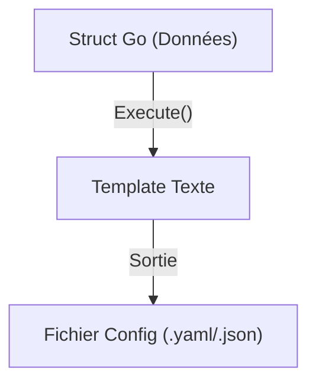

# Chapitre 42 : Modèles de texte {#chapitre-42-modèles-de-texte}

text/template, templates, génération de code, automatisation, CLI

## Le package text/template {#le-package-text/template}

### 1. Quoi {#quoi}
Le package **text/template** est la bibliothèque standard de Go permettant de générer des sorties textuelles dynamiques. Contrairement à `html/template`, il n'effectue aucun échappement de sécurité contextuel, ce qui le rend idéal pour générer du code source, des fichiers de configuration ou des e-mails en texte brut.

### 2. Pourquoi {#pourquoi}
Il est indispensable pour automatiser la création de fichiers répétitifs. Que ce soit pour générer des fichiers de configuration YAML, des classes dans un autre langage, ou des rapports textuels, `text/template` offre une syntaxe puissante pour manipuler des structures de données Go.

### 3. Comment {#comment}

#### A. Syntaxe de base
La syntaxe est identique à celle de `html/template` : `{{ .Champ }}` pour accéder aux données.

```go
// main.go
tmpl := template.Must(template.New("test").Parse("Nom : {{ .Nom }}"))
data := struct{ Nom string }{Nom: "Go"}
tmpl.Execute(os.Stdout, data)
```

#### B. Cas concret : Génération de configuration


```go
// Exemple : Génération d'un fichier de config
const configTmpl = `
serveur:
  port: {{ .Port }}
  host: {{ .Host }}
`
func genererConfig(p int, h string) {
	t := template.Must(template.New("config").Parse(configTmpl))
	data := struct{ Port int; Host string }{p, h}
	t.Execute(os.Stdout, data)
}
```

#### C. Exemples pratiques
1. **Génération de code** : Créer des fichiers `.go` automatiquement à partir d'un schéma.
2. **Configuration** : Générer des fichiers `nginx.conf` ou `docker-compose.yml` dynamiques.
3. **E-mails** : Préparer le corps de messages textuels personnalisés.

### 4. Zone de Danger {#zone-de-danger}

- ❌ **Utiliser `text/template` pour du HTML** : C'est une faille de sécurité majeure (XSS). Utilisez toujours `html/template` pour le web.
- ❌ **Ignorer les erreurs de parsing** : `template.Parse` peut échouer si la syntaxe est invalide. Utilisez `template.Must` pour paniquer immédiatement en cas d'erreur de développement.
- ✅ **Bonne pratique** : Utilisez des fonctions personnalisées (`FuncMap`) pour formater vos données (ex: mettre en majuscules, formater des dates) directement dans le template.

### 🚨 Limitations de l'approche standard {#limitations-de-l-approche-standard}

Bien que robuste, `text/template` peut devenir complexe pour des besoins très avancés.
*   **Problèmes** : La logique dans les templates peut devenir illisible si elle est trop complexe.
*   **Solutions modernes** : Pour des besoins de génération de code très complexes, envisagez des outils dédiés comme `cue` ou des générateurs de code typés.
*   **Pourquoi l'enseigner** : C'est un outil natif, sans dépendance, extrêmement rapide et suffisant pour 90% des besoins d'automatisation.

## Questions clés (validation des acquis du chapitre) {#questions-clés-(validation-des-acquis-du-chapitre)-42}

- **Quelle est la différence majeure entre `text/template` et `html/template` ?** (Réponse : `html/template` échappe les données pour prévenir les attaques XSS, `text/template` ne le fait pas).
- **Quelle fonction permet de s'assurer qu'un template est correctement parsé ?** (Réponse : `template.Must`).
- **Peut-on utiliser des fonctions personnalisées dans un template ?** (Réponse : Oui, via `FuncMap`).

## Exercices : {#exercices-:-42}

### Exercice 1 - Générateur de salutation {#exercice-1---le-générateur-de-salutation}
🎯 **Objectif** : Utiliser `text/template`.
💼 **Mise en situation** : Vous créez un outil CLI qui génère un message de bienvenue.
📝 **Énoncé** : Créez un template qui affiche "Bonjour [Nom], bienvenue sur [Projet] !" et exécutez-le avec une structure Go.
📺 **Résultat attendu** : "Bonjour Gopher, bienvenue sur Go-Formation !"

<details><summary>Voir le code complet commenté</summary>

```go
func main() {
	t := template.Must(template.New("msg").Parse("Bonjour {{ .Nom }}, bienvenue sur {{ .Projet }} !"))
	data := struct{ Nom, Projet string }{"Gopher", "Go-Formation"}
	t.Execute(os.Stdout, data)
}
```
</details>

### Exercice 2 - Générateur de fichier config {#exercice-2---le-générateur-de-fichier-config}
🎯 **Objectif** : Générer une configuration.
💼 **Mise en situation** : Vous automatisez la création d'un fichier `.env`.
📝 **Énoncé** : Créez un template pour un fichier `.env` contenant `DB_USER` et `DB_PASS`.
📺 **Résultat attendu** : Affichage du contenu du fichier `.env` formaté.

<details><summary>Voir le code complet commenté</summary>

```go
func main() {
	t := template.Must(template.New("env").Parse("DB_USER={{ .User }}\nDB_PASS={{ .Pass }}"))
	data := map[string]string{"User": "admin", "Pass": "secret"}
	t.Execute(os.Stdout, data)
}
```
</details>

### Exercice 3 - Utilisation de FuncMap {#exercice-3---l-utilisation-de-funcmap}
🎯 **Objectif** : Formater les données.
💼 **Mise en situation** : Vous voulez mettre le nom en majuscules.
📝 **Énoncé** : Créez une `FuncMap` avec une fonction `upper` et utilisez-la dans votre template pour afficher le nom en majuscules.
📺 **Résultat attendu** : "NOM : GOPHER".

<details><summary>Voir le code complet commenté</summary>

```go
import ("strings"; "text/template"; "os")

func main() {
	funcMap := template.FuncMap{"upper": strings.ToUpper}
	t := template.Must(template.New("test").Funcs(funcMap).Parse("NOM : {{ . | upper }}"))
	t.Execute(os.Stdout, "gopher")
}
```
</details>

> 📸 **CAPTURE D'ÉCRAN REQUISE**
> **Sujet** : Terminal affichant le résultat de la génération de texte.
> **Alt Text** : Console montrant le texte généré dynamiquement par le template.