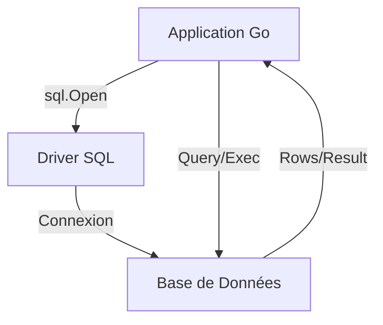

# Chapitre 43 : Accès aux bases de données {#chapitre-43-accès-aux-bases-de-données}

database/sql, SQL, drivers, connexion, requêtes, transactions

## Le package database/sql {#le-package-database/sql}

### 1. Quoi {#quoi}
Le package **database/sql** fournit une interface générique pour interagir avec des bases de données SQL. Il ne contient pas l'implémentation spécifique pour chaque moteur (PostgreSQL, MySQL, SQLite), mais définit les méthodes standards que les **drivers** doivent implémenter.

### 2. Pourquoi {#pourquoi}
La majorité des applications professionnelles nécessitent une persistance des données. `database/sql` permet d'écrire du code qui peut, avec un minimum de modifications, basculer d'un moteur de base de données à un autre, tout en offrant une gestion robuste des connexions (pool de connexions).

### 3. Comment {#comment}

#### A. Syntaxe de base
Pour utiliser `database/sql`, vous devez importer le package et un driver spécifique (généralement avec un import anonyme `_`).

```go
import (
    "database/sql"
    _ "github.com/lib/pq" // Driver PostgreSQL
)

db, _ := sql.Open("postgres", "connexion_string")
defer db.Close()
```

#### B. Cas concret : Flux d'exécution


```go
// Exemple robuste : Requête avec paramètre
func getUtilisateur(db *sql.DB, id int) (string, error) {
    var nom string
    // Utilisation de $1 ou ? pour éviter les injections SQL
    err := db.QueryRow("SELECT nom FROM utilisateurs WHERE id = $1", id).Scan(&nom)
    return nom, err
}
```

#### C. Exemples pratiques
1. **Requêtes de lecture** : Utiliser `Query` pour récupérer plusieurs lignes.
2. **Requêtes d'écriture** : Utiliser `Exec` pour `INSERT`, `UPDATE` ou `DELETE`.
3. **Transactions** : Utiliser `db.Begin()` pour garantir l'atomicité de plusieurs opérations.

### 4. Zone de Danger {#zone-de-danger}

- ❌ **Concaténation de chaînes dans les requêtes** : Ne jamais construire de requêtes SQL avec `fmt.Sprintf`. Cela expose votre application aux **injections SQL**. Utilisez toujours les paramètres préparés (`$1`, `?`).
- ❌ **Oublier de fermer les `rows`** : Si vous utilisez `Query`, vous devez impérativement faire `defer rows.Close()` pour libérer la connexion au pool.
- ✅ **Bonne pratique** : Configurez votre pool de connexions avec `db.SetMaxOpenConns` et `db.SetMaxIdleConns` pour optimiser les performances en production.

### 🚨 Limitations de l'approche standard {#limitations-de-l-approche-standard}

`database/sql` est une interface de bas niveau.
*   **Problèmes** : Beaucoup de code répétitif (*boilerplate*) pour mapper les colonnes SQL vers des structs Go.
*   **Solutions modernes** : Utilisez des bibliothèques de mapping comme **sqlx** (pour simplifier le scan) ou des ORM comme **GORM** ou **Ent** si votre modèle de données est très complexe.
*   **Pourquoi l'enseigner** : Comprendre `database/sql` est crucial pour maîtriser les performances et le fonctionnement réel de la persistance en Go, indépendamment de l'outil de haut niveau choisi.

## Questions clés (validation des acquis du chapitre) {#questions-clés-(validation-des-acquis-du-chapitre)-43}

- **Pourquoi faut-il importer un driver avec `_` ?** (Réponse : Pour enregistrer le driver auprès du package `database/sql` sans utiliser ses fonctions directement).
- **Comment prévenir les injections SQL ?** (Réponse : En utilisant des requêtes paramétrées avec des placeholders comme `$1` ou `?`).
- **Quelle méthode utiliser pour une requête qui ne retourne qu'une seule ligne ?** (Réponse : `QueryRow`).

## Exercices : {#exercices-:-43}

### Exercice 1 - Connexion simple {#exercice-1---la-connexion-simple}
🎯 **Objectif** : Ouvrir une connexion.
💼 **Mise en situation** : Vous initialisez votre application.
📝 **Énoncé** : Écrivez une fonction qui ouvre une connexion à une base SQLite (utilisez `github.com/mattn/go-sqlite3`).
📺 **Résultat attendu** : Une instance `*sql.DB` valide.

<details><summary>Voir le code complet commenté</summary>

```go
import (
    "database/sql"
    _ "github.com/mattn/go-sqlite3"
)

func initDB() (*sql.DB, error) {
    // SQLite en fichier local
    return sql.Open("sqlite3", "./test.db")
}
```
</details>

### Exercice 2 - Lecture sécurisée {#exercice-2---la-lecture-sécurisée}
🎯 **Objectif** : Exécuter une requête paramétrée.
💼 **Mise en situation** : Vous récupérez un produit par son ID.
📝 **Énoncé** : Écrivez une fonction `GetProduit(db, id)` qui retourne le nom du produit.
📺 **Résultat attendu** : Le nom du produit ou une erreur.

<details><summary>Voir le code complet commenté</summary>

```go
func GetProduit(db *sql.DB, id int) (string, error) {
    var nom string
    // On utilise ? pour SQLite, $1 pour Postgres
    err := db.QueryRow("SELECT nom FROM produits WHERE id = ?", id).Scan(&nom)
    return nom, err
}
```
</details>

### Exercice 3 - Transaction {#exercice-3---la-transaction}
🎯 **Objectif** : Utiliser une transaction.
💼 **Mise en situation** : Vous transférez de l'argent entre deux comptes.
📝 **Énoncé** : Écrivez une fonction qui utilise `db.Begin()` pour mettre à jour deux soldes de manière atomique.
📺 **Résultat attendu** : Les deux soldes sont mis à jour ou aucun.

<details><summary>Voir le code complet commenté</summary>

```go
func Transfert(db *sql.DB, from, to int, montant float64) error {
    tx, _ := db.Begin()
    defer tx.Rollback() // Annule si on ne commit pas

    _, err := tx.Exec("UPDATE comptes SET solde = solde - ? WHERE id = ?", montant, from)
    if err != nil { return err }

    _, err = tx.Exec("UPDATE comptes SET solde = solde + ? WHERE id = ?", montant, to)
    if err != nil { return err }

    return tx.Commit() // Valide les changements
}
```
</details>

> 📸 **CAPTURE D'ÉCRAN REQUISE**
> **Sujet** : Terminal montrant une exécution réussie d'une requête SQL via Go.
> **Alt Text** : Console affichant les résultats d'une requête SELECT.