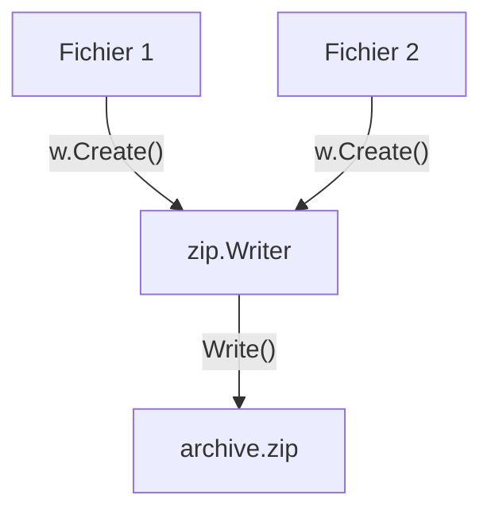

# Chapitre 44 : Compression ZIP {#chapitre-44-compression-zip}

archive/zip, compression, archivage, fichiers, io

## Le package archive/zip {#le-package-archive/zip}

### 1. Quoi {#quoi}
Le package **archive/zip** fournit des outils pour lire et écrire des fichiers au format ZIP. C'est un format d'archivage et de compression de données très répandu, permettant de regrouper plusieurs fichiers et répertoires dans un seul fichier compressé.

### 2. Pourquoi {#pourquoi}
La compression est essentielle pour réduire l'espace de stockage des données et accélérer les transferts réseau. Le package `archive/zip` permet d'automatiser la création de sauvegardes, l'envoi de lots de fichiers ou la distribution logicielle.

### 3. Comment {#comment}

#### A. Syntaxe de base
Pour créer un ZIP, on utilise un `zip.Writer` qui écrit dans un fichier ou un buffer.

```go
// Création d'un fichier ZIP
f, _ := os.Create("archive.zip")
defer f.Close()
w := zip.NewWriter(f)
defer w.Close()

// Ajout d'un fichier dans le ZIP
f1, _ := w.Create("test.txt")
f1.Write([]byte("Contenu du fichier"))
```

#### B. Cas concret : Flux d'archivage


```go
// Exemple robuste : Ajout d'un fichier existant dans un ZIP
func ajouterFichier(w *zip.Writer, cheminFichier string) {
    f, _ := os.Open(cheminFichier)
    defer f.Close()
    
    // Création de l'entrée dans le ZIP
    zf, _ := w.Create(cheminFichier)
    io.Copy(zf, f) // Copie le contenu du fichier source vers le ZIP
}
```

#### C. Exemples pratiques
1. **Sauvegarde automatique** : Archiver les logs de l'application chaque jour.
2. **Export de données** : Permettre aux utilisateurs de télécharger plusieurs documents en une seule archive.
3. **Déploiement** : Créer des packages de distribution pour des outils CLI.

### 4. Zone de Danger {#zone-de-danger}

- ❌ **Oublier de fermer le `zip.Writer`** : Le fichier ZIP ne sera pas finalisé correctement si vous n'appelez pas `w.Close()`.
- ❌ **Chemins de fichiers non sécurisés** : Lors de la lecture d'un ZIP, vérifiez toujours que les chemins des fichiers extraits ne sortent pas du répertoire cible (attaque *Zip Slip*).
- ✅ **Bonne pratique** : Utilisez `io.Copy` pour transférer les données entre les fichiers et le ZIP, c'est beaucoup plus efficace en mémoire que de charger tout le contenu dans une variable.

### 🚨 Limitations de l'approche standard {#limitations-de-l-approche-standard}

Le package `archive/zip` est simple mais bas niveau.
*   **Problèmes** : Gestion manuelle des permissions de fichiers et des métadonnées complexes.
*   **Solutions modernes** : Pour des besoins de sauvegarde complexes (avec gestion des permissions Unix, compression avancée), utilisez des outils comme `tar` ou des bibliothèques tierces si vous avez besoin de formats plus performants comme `zstd`.
*   **Pourquoi l'enseigner** : Le format ZIP est universel. Savoir le manipuler nativement en Go est une compétence indispensable pour tout développeur système.

## Questions clés (validation des acquis du chapitre) {#questions-clés-(validation-des-acquis-du-chapitre)-44}

- **Pourquoi doit-on fermer le `zip.Writer` ?** (Réponse : Pour écrire les métadonnées finales et fermer proprement l'archive).
- **Quelle fonction permet de copier efficacement le contenu d'un fichier dans le ZIP ?** (Réponse : `io.Copy`).
- **Quel est le risque principal lors de l'extraction d'un ZIP ?** (Réponse : L'attaque *Zip Slip* où des fichiers malveillants tentent d'écrire hors du répertoire cible).

## Exercices : {#exercices-:-44}

### Exercice 1 - Créer un ZIP {#exercice-1---créer-un-zip}
🎯 **Objectif** : Créer une archive.
💼 **Mise en situation** : Vous créez un outil de sauvegarde.
📝 **Énoncé** : Créez un fichier `backup.zip` et ajoutez-y un fichier nommé `log.txt` contenant "Hello World".
📺 **Résultat attendu** : Un fichier `backup.zip` créé sur le disque.

<details><summary>Voir le code complet commenté</summary>

```go
func main() {
	f, _ := os.Create("backup.zip")
	defer f.Close()
	w := zip.NewWriter(f)
	defer w.Close()

	zf, _ := w.Create("log.txt")
	zf.Write([]byte("Hello World"))
}
```
</details>

### Exercice 2 - Ajouter un fichier existant {#exercice-2---ajouter-un-fichier-existant}
🎯 **Objectif** : Archiver un fichier réel.
💼 **Mise en situation** : Vous archivez un fichier de configuration.
📝 **Énoncé** : Ouvrez un fichier `config.yaml` existant et ajoutez-le dans `archive.zip`.
📺 **Résultat attendu** : `archive.zip` contient `config.yaml`.

<details><summary>Voir le code complet commenté</summary>

```go
func main() {
	f, _ := os.Create("archive.zip")
	defer f.Close()
	w := zip.NewWriter(f)
	defer w.Close()

	src, _ := os.Open("config.yaml")
	defer src.Close()

	zf, _ := w.Create("config.yaml")
	io.Copy(zf, src) // Copie efficace
}
```
</details>

### Exercice 3 - Lecture d'un ZIP {#exercice-3---lecture-d-un-zip}
🎯 **Objectif** : Lire une archive.
💼 **Mise en situation** : Vous extrayez des données.
📝 **Énoncé** : Ouvrez `archive.zip` et listez les noms des fichiers qu'il contient.
📺 **Résultat attendu** : Affichage des noms des fichiers dans la console.

<details><summary>Voir le code complet commenté</summary>

```go
func main() {
	r, _ := zip.OpenReader("archive.zip")
	defer r.Close()
	for _, f := range r.File {
		fmt.Println("Fichier trouvé :", f.Name)
	}
}
```
</details>

> 📸 **CAPTURE D'ÉCRAN REQUISE**
> **Sujet** : Terminal montrant la liste des fichiers extraits d'une archive.
> **Alt Text** : Console affichant les noms des fichiers trouvés dans le ZIP.