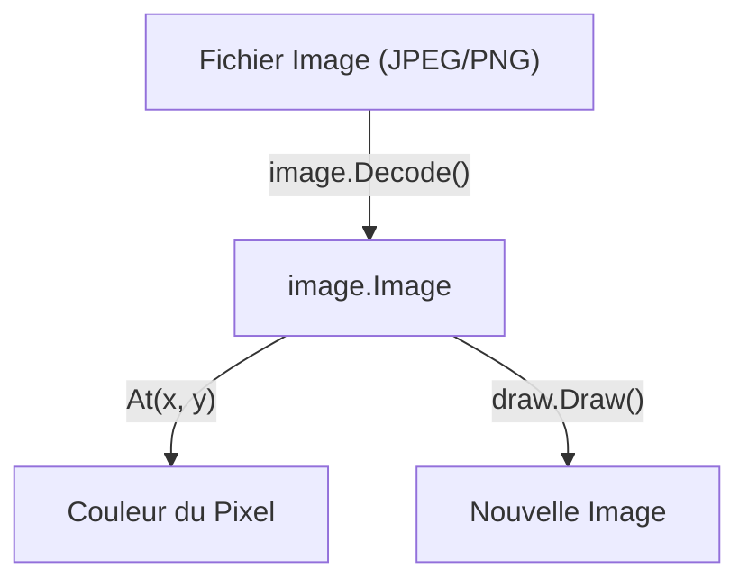

# Chapitre 45 : Traitement d'images de base {#chapitre-45-traitement-d-images-de-base}

image, image/draw, image/jpeg, image/png, pixels, traitement

## Le package image {#le-package-image}

### 1. Quoi {#quoi}
Le package **image** est la bibliothèque standard de Go pour représenter et manipuler des images numériques. Il définit des interfaces pour les couleurs (`color.Color`) et les images (`image.Image`), permettant de lire, créer et transformer des données de pixels.

### 2. Pourquoi {#pourquoi}
Le traitement d'images est crucial pour de nombreuses applications : redimensionnement automatique de photos d'utilisateurs, génération de graphiques, traitement de documents scannés ou encore création de filtres visuels. Go offre une approche performante et typée pour ces tâches.

### 3. Comment {#comment}

#### A. Syntaxe de base
Pour manipuler des images, on décode d'abord un fichier, puis on accède aux pixels via la méthode `At(x, y)`.

```go
import (
    "image"
    _ "image/jpeg" // Enregistre le décodeur JPEG
    "os"
)

file, _ := os.Open("photo.jpg")
img, _, _ := image.Decode(file)
couleur := img.At(10, 10) // Récupère la couleur du pixel en (10, 10)
```

#### B. Cas concret : Flux de traitement


```go
// Exemple robuste : Création d'une image vide et dessin
func creerImage() {
    rect := image.Rect(0, 0, 100, 100)
    img := image.NewRGBA(rect)
    // On peut maintenant manipuler les pixels de img
}
```

#### C. Exemples pratiques
1. **Redimensionnement** : Créer des miniatures (thumbnails) pour une galerie web.
2. **Filtrage** : Convertir une image en niveaux de gris en modifiant chaque pixel.
3. **Watermarking** : Superposer un logo sur une image existante avec `image/draw`.

### 4. Zone de Danger {#zone-de-danger}

- ❌ **Oublier d'importer les décodeurs** : Si vous oubliez `_ "image/png"`, `image.Decode` retournera une erreur "unknown format".
- ❌ **Manipulation directe sur des images non modifiables** : `image.Image` est une interface en lecture seule. Pour modifier une image, vous devez créer une nouvelle image (ex: `image.NewRGBA`) et y copier les données.
- ✅ **Bonne pratique** : Pour des opérations complexes (redimensionnement haute qualité, filtres avancés), utilisez des bibliothèques tierces comme `github.com/disintegration/imaging`, car la bibliothèque standard est volontairement minimaliste.

### 🚨 Limitations de l'approche standard {#limitations-de-l-approche-standard}

La bibliothèque standard est très bas niveau.
*   **Problèmes** : Pas d'algorithmes de redimensionnement avancés (ex: Lanczos), gestion limitée des métadonnées EXIF.
*   **Solutions modernes** : Utilisez `github.com/disintegration/imaging` pour le redimensionnement ou `github.com/chai2010/webp` pour le support du format WebP.
*   **Pourquoi l'enseigner** : Elle permet de comprendre la structure d'une image (grille de pixels) sans dépendances externes, ce qui est fondamental pour tout développeur système.

## Questions clés (validation des acquis du chapitre) {#questions-clés-(validation-des-acquis-du-chapitre)-45}

- **Pourquoi doit-on importer `_ "image/jpeg"` ?** (Réponse : Pour enregistrer le décodeur JPEG dans le package `image` via un effet de bord).
- **Quelle est la différence entre `image.Image` et `image.RGBA` ?** (Réponse : `image.Image` est une interface en lecture seule, `image.RGBA` est une implémentation modifiable).
- **Comment accéder à la couleur d'un pixel spécifique ?** (Réponse : Via la méthode `At(x, y)`).

## Exercices : {#exercices-:-45}

### Exercice 1 - Lire les dimensions {#exercice-1---lire-les-dimensions}
🎯 **Objectif** : Décoder une image.
💼 **Mise en situation** : Vous vérifiez la taille d'une image uploadée.
📝 **Énoncé** : Ouvrez une image et affichez ses dimensions (largeur et hauteur).
📺 **Résultat attendu** : "Dimensions : 800x600".

<details><summary>Voir le code complet commenté</summary>

```go
func main() {
	f, _ := os.Open("test.jpg")
	defer f.Close()
	img, _, _ := image.Decode(f)
	bounds := img.Bounds()
	fmt.Printf("Dimensions : %dx%d\n", bounds.Dx(), bounds.Dy())
}
```
</details>

### Exercice 2 - Créer une image unie {#exercice-2---créer-une-image-unie}
🎯 **Objectif** : Créer une image.
💼 **Mise en situation** : Vous générez un avatar par défaut.
📝 **Énoncé** : Créez une image `image.NewRGBA` de 100x100 pixels et remplissez-la de bleu.
📺 **Résultat attendu** : Un fichier image bleu généré.

<details><summary>Voir le code complet commenté</summary>

```go
func main() {
	img := image.NewRGBA(image.Rect(0, 0, 100, 100))
	blue := color.RGBA{0, 0, 255, 255}
	for y := 0; y < 100; y++ {
		for x := 0; x < 100; x++ {
			img.Set(x, y, blue) // On définit la couleur de chaque pixel
		}
	}
}
```
</details>

### Exercice 3 - Détection de couleur {#exercice-3---la-détection-de-couleur}
🎯 **Objectif** : Analyser des pixels.
💼 **Mise en situation** : Vous vérifiez si une image est principalement sombre.
📝 **Énoncé** : Parcourez les pixels d'une image et comptez combien sont "noirs" (R,G,B < 50).
📺 **Résultat attendu** : Nombre de pixels sombres affiché.

<details><summary>Voir le code complet commenté</summary>

```go
func main() {
	img, _, _ := image.Decode(os.Stdin)
	count := 0
	bounds := img.Bounds()
	for y := bounds.Min.Y; y < bounds.Max.Y; y++ {
		for x := bounds.Min.X; x < bounds.Max.X; x++ {
			r, g, b, _ := img.At(x, y).RGBA()
			if r < 50 && g < 50 && b < 50 { // Comparaison simplifiée
				count++
			}
		}
	}
	fmt.Println("Pixels sombres :", count)
}
```
</details>

> 📸 **CAPTURE D'ÉCRAN REQUISE**
> **Sujet** : Terminal affichant les dimensions de l'image analysée.
> **Alt Text** : Console montrant la largeur et la hauteur de l'image traitée.