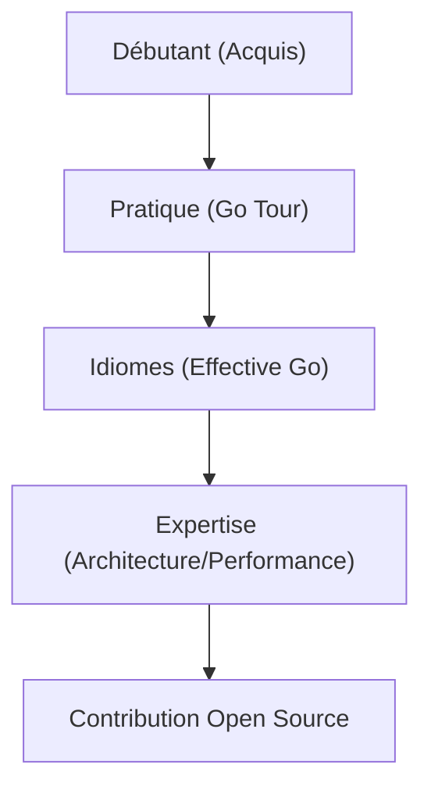

# Chapitre 46 : Aller plus loin {#chapitre-46-aller-plus-loin}

ressources, bonnes pratiques, projet final, écosystème, communauté

## Avant-propos {#avant-propos}

Félicitations ! Vous avez parcouru les fondamentaux de Go, de la syntaxe de base aux manipulations avancées de fichiers et de données. Ce chapitre marque la fin de votre parcours "Junior" et ouvre la porte vers la maîtrise du langage.

**Objectifs pédagogiques :**
- Consolider vos acquis.
- Identifier les ressources pour progresser vers un niveau intermédiaire/avancé.
- Comprendre les bonnes pratiques de production.
- Lancer votre projet final récapitulatif.

## Ressources pour progresser {#ressources-pour-progresser}

La communauté Go est l'une des plus accueillantes et des mieux documentées. Voici les piliers pour continuer votre apprentissage :

- **[Go Tour](https://tour.golang.org/)** : L'incontournable pour pratiquer la syntaxe interactivement.
- **[Effective Go](https://go.dev/doc/effective_go)** : Le guide officiel pour écrire du code "idiomatique" (le fameux *Go way*).
- **[Go Blog](https://go.dev/blog/)** : Des articles techniques de haute qualité sur les évolutions du langage.
- **[Go by Example](https://gobyexample.com/)** : Des exemples courts et concrets pour chaque concept.

## Bonnes pratiques de production {#bonnes-pratiques-de-production}

Passer du script au service de production demande de la rigueur :

1. **Gestion des erreurs** : Ne jamais ignorer une erreur (`if err != nil`).
2. **Tests unitaires** : Le package `testing` est intégré nativement. Écrivez des tests pour chaque logique métier.
3. **Concurrence** : Utilisez les Goroutines et les Channels avec parcimonie. Préférez la communication au partage de mémoire.
4. **Observabilité** : Intégrez des logs structurés et des métriques (Prometheus) dès le début.
5. **Dépendances** : Utilisez les `go modules` (`go.mod`) pour gérer vos versions de bibliothèques.

## Projet final : Le "Gopher-Hub" {#projet-final-:-le-gopher-hub}

Pour valider vos acquis, réalisez une application CLI de gestion de fichiers personnels.

**Cahier des charges :**
1. **Interface** : Une application en ligne de commande (utilisez `flag` pour les arguments).
2. **Fonctionnalités** :
   - Lister les fichiers d'un répertoire.
   - Créer une archive ZIP de ces fichiers (utilisez `archive/zip`).
   - Générer un rapport textuel des fichiers archivés (utilisez `text/template`).
   - Sauvegarder les métadonnées de l'archive dans une base SQLite (utilisez `database/sql`).
3. **Qualité** :
   - Code organisé en plusieurs packages.
   - Gestion stricte des erreurs.
   - Tests unitaires pour la logique de compression.

> 📸 **CAPTURE D'ÉCRAN REQUISE**
> **Sujet** : Terminal affichant l'exécution du projet final "Gopher-Hub" avec un rapport généré.
> **Alt Text** : Console montrant le succès de l'archivage et de la génération du rapport.

En terminant ce projet, vous aurez touché à l'essentiel de ce qu'un développeur Go utilise quotidiennement. Continuez à explorer, à lire le code source de la bibliothèque standard et surtout, **codez chaque jour**. Bonne route dans l'écosystème Go !