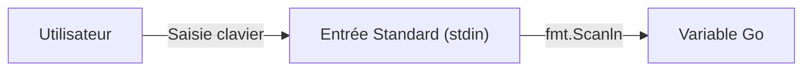

# Chapitre 5 : Entrées et sorties avec fmt {#chapitre-5-:-entrées-et-sorties-avec-fmt}

Package fmt, affichage formaté, lecture utilisateur, gestion des erreurs d'entrée

## Affichage formaté avec fmt {#affichage-formaté-avec-fmt-5}

### 1. Quoi
Le package **fmt** (format) est la bibliothèque standard de Go pour formater du texte. Il permet d'afficher des données sur la sortie standard (`stdout`) ou de lire des données depuis l'entrée standard (`stdin`).

### 2. Pourquoi
Il est indispensable pour déboguer, interagir avec l'utilisateur via la console et générer des rapports textuels structurés.

### 3. Comment
A. **Syntaxe de base** :
```go
fmt.Println("Hello") // Affiche avec un saut de ligne
fmt.Printf("Nom: %s, Age: %d\n", "Alice", 30) // Affiche formaté
```

B. **Cas concret** :
```go
package main

import "fmt"

func main() {
    produit := "Ordinateur"
    prix := 999.99
    
    // %s pour string, %.2f pour float avec 2 décimales
    fmt.Printf("Produit: %s | Prix: %.2f€\n", produit, prix)
}
```

C. **Exemples pratiques** :
- `fmt.Println` : Pour des messages simples.
- `fmt.Printf` : Pour des logs ou des affichages complexes.
- `fmt.Sprintf` : Pour créer une chaîne formatée sans l'afficher immédiatement.

### 4. Zone de Danger
❌ **À ne pas faire** : Utiliser des verbes de formatage incorrects (ex: `%d` pour une chaîne), ce qui provoquera une erreur à l'exécution.
✅ **Bonne Pratique** : Utilisez `%v` (valeur par défaut) si vous ne connaissez pas le type exact ou pour un débogage rapide.

---

## Lecture des entrées utilisateur {#lecture-des-entrées-utilisateur-5}

### 1. Quoi
La lecture d'entrées permet de capturer des données saisies par l'utilisateur dans le terminal via des fonctions comme `fmt.Scan` ou `fmt.Scanln`.

### 2. Pourquoi
Cela permet de créer des programmes interactifs, des outils en ligne de commande (CLI) ou de configurer dynamiquement une application au démarrage.

### 3. Comment
A. **Syntaxe de base** :
```go
var nom string
fmt.Scanln(&nom) // Capture la saisie dans la variable nom
```

B. **Flux de données** :


C. **Exemples pratiques** :
```go
package main

import "fmt"

func main() {
    var age int
    fmt.Print("Entrez votre âge: ")
    
    // On passe l'adresse de la variable (&) pour que Scan puisse la modifier
    _, err := fmt.Scanln(&age)
    if err != nil {
        fmt.Println("Erreur de saisie")
        return
    }
    fmt.Printf("Vous avez %d ans.\n", age)
}
```

### 4. Zone de Danger
❌ **À ne pas faire** : Oublier de passer l'adresse de la variable (`&`) à `fmt.Scan`.
✅ **Bonne Pratique** : Toujours vérifier l'erreur retournée par les fonctions de lecture pour gérer les saisies invalides.

### 🚨 Limitations de fmt.Scan
- **Problèmes** : `fmt.Scan` s'arrête aux espaces. Si l'utilisateur saisit "Jean Dupont", seule "Jean" sera capturée.
- **Solution moderne** : Pour des saisies complexes (lignes entières), utilisez `bufio.NewScanner(os.Stdin)`.
- **Pourquoi l'enseigner** : `fmt` est suffisant pour des outils simples et permet de comprendre les bases de l'interaction console.

---

## Questions clés (validation des acquis du chapitre) {#questions-clés-(validation-des-acquis-du-chapitre)-5}

- **Quelle est la différence entre `Println` et `Printf` ?**
  *Réponse : `Println` affiche simplement avec un saut de ligne, tandis que `Printf` permet d'insérer des variables dans une chaîne formatée.*

- **Pourquoi faut-il utiliser `&` devant une variable dans `fmt.Scanln` ?**
  *Réponse : Pour passer l'adresse mémoire de la variable afin que la fonction puisse modifier directement sa valeur.*

- **Comment limiter un nombre flottant à deux décimales dans `Printf` ?**
  *Réponse : En utilisant le verbe `%.2f`.*

---

## Exercices : {#exercices-:-5}

### Exercice 1 - Salutations personnalisées {#exercice-1---salutations-personnalisées}

🎯 **Objectif** : Utiliser `fmt.Scanln`.

💼 **Mise en situation** : Vous créez un assistant de bienvenue.

📝 **Énoncé** : Demandez à l'utilisateur son prénom, puis affichez "Bonjour [prénom] !".

📺 **Résultat attendu** : `Entrez votre prénom: Alice` -> `Bonjour Alice !`

💡 **Solution** :
<details><summary>Voir le code complet commenté</summary>

```go
package main

import "fmt"

func main() {
    var prenom string
    fmt.Print("Entrez votre prénom: ")
    // Capture la saisie utilisateur
    fmt.Scanln(&prenom)
    fmt.Printf("Bonjour %s !\n", prenom)
}
```
</details>

### Exercice 2 - Calculatrice de TVA {#exercice-2---calculatrice-de-tva}

🎯 **Objectif** : Formater des nombres.

💼 **Mise en situation** : Vous calculez le prix TTC d'un article.

📝 **Énoncé** : Demandez un prix HT (float64). Calculez le prix TTC (HT * 1.20). Affichez le résultat avec 2 décimales.

📺 **Résultat attendu** : `Prix TTC: 119.99€`

💡 **Solution** :
<details><summary>Voir le code complet commenté</summary>

```go
package main

import "fmt"

func main() {
    var prixHT float64
    fmt.Print("Entrez le prix HT: ")
    fmt.Scanln(&prixHT)
    
    prixTTC := prixHT * 1.20
    // %.2f assure l'affichage de deux chiffres après la virgule
    fmt.Printf("Prix TTC: %.2f€\n", prixTTC)
}
```
</details>

### Exercice 3 - Gestion des erreurs de saisie {#exercice-3---gestion-des-erreurs-de-saisie}

🎯 **Objectif** : Gérer les erreurs de lecture.

💼 **Mise en situation** : Vous sécurisez la saisie d'un code secret numérique.

📝 **Énoncé** : Demandez un code (int). Si l'utilisateur saisit autre chose qu'un nombre, affichez une erreur.

📺 **Résultat attendu** : `Entrez le code: abc` -> `Erreur: saisie invalide.`

💡 **Solution** :
<details><summary>Voir le code complet commenté</summary>

```go
package main

import "fmt"

func main() {
    var code int
    fmt.Print("Entrez le code: ")
    
    // Scanln retourne le nombre d'éléments lus et une erreur
    _, err := fmt.Scanln(&code)
    
    if err != nil {
        fmt.Println("Erreur: saisie invalide.")
    } else {
        fmt.Printf("Code reçu: %d\n", code)
    }
}
```
</details>