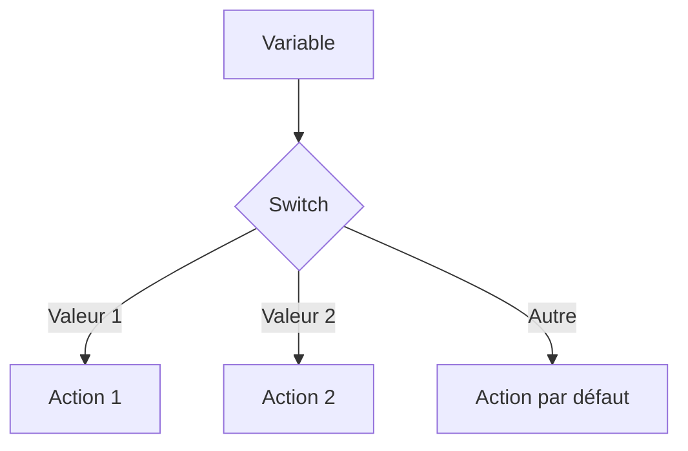

# Chapitre 6 : Structures conditionnelles {#chapitre-6-:-structures-conditionnelles}

Instructions if, else, else if, switch, déclaration courte dans les conditions.

## Instructions if, else et else if {#instructions-if-else-et-else-if-6}

### 1. Quoi
Les structures conditionnelles permettent d'exécuter des blocs de code différents selon qu'une condition booléenne est vraie ou fausse.

### 2. Pourquoi
Elles sont essentielles pour gérer la logique métier, valider des entrées utilisateur ou diriger le flux d'exécution en fonction de l'état du programme.

### 3. Comment
A. **Syntaxe de base** :
```go
if condition {
    // Exécuté si vrai
} else if autreCondition {
    // Exécuté si la première est fausse et celle-ci est vraie
} else {
    // Exécuté sinon
}
```

B. **Cas concret avec déclaration courte** :
Go permet de déclarer une variable directement dans l'instruction `if`, ce qui limite sa portée au bloc conditionnel.
```go
package main

import "fmt"

func main() {
    // 'valeur' n'est accessible que dans le bloc if/else
    if valeur := 10; valeur > 5 {
        fmt.Println("La valeur est supérieure à 5")
    } else {
        fmt.Println("La valeur est inférieure ou égale à 5")
    }
}
```

C. **Exemples pratiques** :
- **Validation** : Vérifier si un mot de passe a la longueur requise.
- **Gestion d'erreurs** : `if err != nil { ... }` (pattern omniprésent en Go).
- **État** : Vérifier si un utilisateur est connecté avant d'afficher une page.

### 4. Zone de Danger
❌ **À ne pas faire** : Utiliser des parenthèses inutiles autour de la condition (ex: `if (x > 0) { ... }` est déconseillé en Go).
✅ **Bonne Pratique** : Utilisez la déclaration courte `if x := calcul(); x > 0` pour garder le code propre et limiter la portée des variables temporaires.

---

## Instruction switch {#instruction-switch-6}

### 1. Quoi
L'instruction `switch` est une alternative plus lisible aux chaînes de `if-else if` lorsque vous comparez une variable à plusieurs valeurs possibles.

### 2. Pourquoi
Elle simplifie la lecture du code et réduit la complexité cyclomatique lors de tests sur une seule variable.

### 3. Comment
A. **Syntaxe de base** :
```go
switch variable {
case valeur1:
    // Code
case valeur2:
    // Code
default:
    // Code par défaut
}
```

B. **Flux logique** :


C. **Exemples pratiques** :
- **Menu CLI** : Gérer les choix d'un utilisateur (1, 2, 3, quitter).
- **Status HTTP** : Gérer les différents codes de retour (200, 404, 500).

### 4. Zone de Danger
❌ **À ne pas faire** : Oublier le cas `default` si vous devez gérer des entrées inattendues.
✅ **Bonne Pratique** : En Go, il n'y a pas besoin de `break` à la fin de chaque `case` (le comportement par défaut est de sortir du switch). Si vous voulez passer au cas suivant, utilisez `fallthrough`.

---

## Questions clés (validation des acquis du chapitre) {#questions-clés-(validation-des-acquis-du-chapitre)-6}

- **Comment limiter la portée d'une variable à un bloc `if` ?**
  *Réponse : En utilisant la syntaxe de déclaration courte : `if x := calcul(); x > 0 { ... }`.*

- **Est-il nécessaire d'ajouter `break` à la fin d'un `case` dans un `switch` Go ?**
  *Réponse : Non, Go sort automatiquement du `switch` après l'exécution d'un `case`.*

- **Quelle instruction permet de forcer l'exécution du `case` suivant dans un `switch` ?**
  *Réponse : L'instruction `fallthrough`.*

---

## Exercices : {#exercices-:-6}

### Exercice 1 - Le videur de boîte de nuit {#exercice-1---le-videur-de-boîte-de-nuit}

🎯 **Objectif** : Utiliser `if/else`.

💼 **Mise en situation** : Vous gérez l'entrée d'un club.

📝 **Énoncé** : Déclarez une variable `age`. Si l'âge est >= 18, affichez "Entrée autorisée". Sinon, affichez "Entrée refusée".

📺 **Résultat attendu** : `Entrée autorisée` (pour age=20).

💡 **Solution** :
<details><summary>Voir le code complet commenté</summary>

```go
package main

import "fmt"

func main() {
    age := 20
    
    if age >= 18 {
        fmt.Println("Entrée autorisée")
    } else {
        fmt.Println("Entrée refusée")
    }
}
```
</details>

### Exercice 2 - Traducteur de notes {#exercice-2---traducteur-de-notes}

🎯 **Objectif** : Utiliser `switch`.

💼 **Mise en situation** : Vous convertissez des notes numériques en lettres.

📝 **Énoncé** : Pour une note de 1 à 5, affichez une appréciation (1: Très mauvais, 2: Insuffisant, 3: Moyen, 4: Bien, 5: Excellent). Gérez le cas par défaut.

📺 **Résultat attendu** : `Note 4 : Bien`.

💡 **Solution** :
<details><summary>Voir le code complet commenté</summary>

```go
package main

import "fmt"

func main() {
    note := 4
    
    switch note {
    case 1:
        fmt.Println("Note 1 : Très mauvais")
    case 2:
        fmt.Println("Note 2 : Insuffisant")
    case 3:
        fmt.Println("Note 3 : Moyen")
    case 4:
        fmt.Println("Note 4 : Bien")
    case 5:
        fmt.Println("Note 5 : Excellent")
    default:
        fmt.Println("Note invalide")
    }
}
```
</details>

### Exercice 3 - Validation de saisie {#exercice-3---validation-de-saisie}

🎯 **Objectif** : Utiliser la déclaration courte dans `if`.

💼 **Mise en situation** : Vous validez un code secret.

📝 **Énoncé** : Simulez une saisie utilisateur avec une variable `saisie := 1234`. Dans un `if`, déclarez une variable `codeCorrect := 1234` et vérifiez si la saisie est correcte.

📺 **Résultat attendu** : `Code correct !`

💡 **Solution** :
<details><summary>Voir le code complet commenté</summary>

```go
package main

import "fmt"

func main() {
    saisie := 1234
    
    // Déclaration courte : codeCorrect n'existe qu'à l'intérieur du if/else
    if codeCorrect := 1234; saisie == codeCorrect {
        fmt.Println("Code correct !")
    } else {
        fmt.Println("Code incorrect.")
    }
}
```
</details>