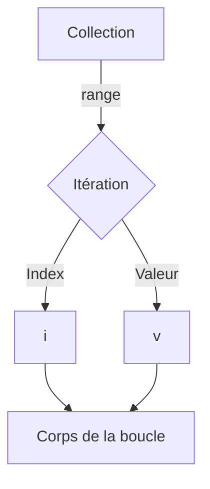

# Chapitre 7 : Boucles et itérations {#chapitre-7-:-boucles-et-itérations}

Boucle for, itération sur les collections, range, contrôle de boucle

## La boucle for {#la-boucle-for-7}

### 1. Quoi
En Go, il n'existe qu'une seule instruction de boucle : le **`for`**. Il est extrêmement polyvalent et peut remplacer les boucles `while` ou `do-while` présentes dans d'autres langages.

### 2. Pourquoi
La simplicité du langage Go repose sur la réduction du nombre de mots-clés. Le `for` couvre tous les scénarios d'itération, ce qui rend le code plus prévisible et facile à maintenir.

### 3. Comment
A. **Syntaxe de base** :
```go
// Boucle classique (initialisation; condition; post-itération)
for i := 0; i < 5; i++ {
    fmt.Println(i)
}

// Boucle "while" (condition seule)
for condition {
    // ...
}

// Boucle infinie
for {
    // ...
}
```

B. **Cas concret** :
```go
package main

import "fmt"

func main() {
    // On itère 3 fois pour traiter des requêtes
    for tentative := 1; tentative <= 3; tentative++ {
        fmt.Printf("Tentative numéro %d\n", tentative)
    }
}
```

C. **Exemples pratiques** :
- **Compteur** : Répéter une action un nombre défini de fois.
- **Attente** : Boucle infinie avec `break` pour attendre un signal externe.

### 4. Zone de Danger
❌ **À ne pas faire** : Créer une boucle infinie sans condition de sortie (`break`), ce qui bloquera votre programme.
✅ **Bonne Pratique** : Utilisez toujours une condition de sortie claire ou un `break` explicite dans les boucles infinies.

---

## Itération sur les collections avec range {#itération-sur-les-collections-avec-range-7}

### 1. Quoi
Le mot-clé **`range`** est utilisé avec `for` pour itérer sur les éléments d'une collection (tableaux, slices, maps, chaînes de caractères).

### 2. Pourquoi
Il simplifie l'accès aux index et aux valeurs des éléments, évitant les erreurs de dépassement d'index (out-of-bounds).

### 3. Comment
A. **Syntaxe de base** :
```go
// 'i' est l'index, 'v' est la valeur
for i, v := range collection {
    fmt.Println(i, v)
}
```

B. **Flux logique** :


C. **Exemples pratiques** :
```go
package main

import "fmt"

func main() {
    noms := []string{"Alice", "Bob", "Charlie"}
    
    // On ignore l'index avec '_' si on n'en a pas besoin
    for _, nom := range noms {
        fmt.Printf("Bonjour %s\n", nom)
    }
}
```

### 4. Zone de Danger
❌ **À ne pas faire** : Ignorer les erreurs potentielles lors de l'itération sur des structures complexes.
✅ **Bonne Pratique** : Utilisez l'identifiant vide `_` pour ignorer les valeurs inutilisées (index ou valeur), car Go interdit les variables déclarées mais non utilisées.

---

## Questions clés (validation des acquis du chapitre) {#questions-clés-(validation-des-acquis-du-chapitre)-7}

- **Combien de types de boucles existe-t-il en Go ?**
  *Réponse : Un seul, le `for`.*

- **À quoi sert le mot-clé `range` ?**
  *Réponse : À itérer facilement sur les éléments d'une collection (slices, maps, etc.).*

- **Comment ignorer l'index lors d'une boucle `range` ?**
  *Réponse : En utilisant l'identifiant vide `_` à la place de la variable d'index.*

---

## Exercices : {#exercices-:-7}

### Exercice 1 - Le compte à rebours {#exercice-1---le-compte-à-rebours}

🎯 **Objectif** : Utiliser la boucle `for` classique.

💼 **Mise en situation** : Vous lancez une fusée.

📝 **Énoncé** : Faites un compte à rebours de 5 à 1, puis affichez "Décollage !".

📺 **Résultat attendu** : `5, 4, 3, 2, 1, Décollage !`

💡 **Solution** :
<details><summary>Voir le code complet commenté</summary>

```go
package main

import "fmt"

func main() {
    // On décrémente i à chaque tour
    for i := 5; i > 0; i-- {
        fmt.Printf("%d, ", i)
    }
    fmt.Println("Décollage !")
}
```
</details>

### Exercice 2 - Liste de courses {#exercice-2---liste-de-courses}

🎯 **Objectif** : Utiliser `range` sur une slice.

💼 **Mise en situation** : Vous affichez votre liste de courses.

📝 **Énoncé** : Déclarez une slice `courses := []string{"Pommes", "Lait", "Pain"}`. Parcourez-la avec `range` et affichez chaque élément.

📺 **Résultat attendu** : `Article 1 : Pommes`, etc.

💡 **Solution** :
<details><summary>Voir le code complet commenté</summary>

```go
package main

import "fmt"

func main() {
    courses := []string{"Pommes", "Lait", "Pain"}
    
    // i+1 pour avoir une numérotation humaine commençant à 1
    for i, article := range courses {
        fmt.Printf("Article %d : %s\n", i+1, article)
    }
}
```
</details>

### Exercice 3 - Somme des éléments {#exercice-3---somme-des-éléments}

🎯 **Objectif** : Manipuler des données dans une boucle.

💼 **Mise en situation** : Vous calculez le total d'un panier.

📝 **Énoncé** : Déclarez une slice `prix := []int{10, 20, 30}`. Calculez la somme totale en parcourant la slice avec `range`.

📺 **Résultat attendu** : `Total : 60`.

💡 **Solution** :
<details><summary>Voir le code complet commenté</summary>

```go
package main

import "fmt"

func main() {
    prix := []int{10, 20, 30}
    total := 0
    
    // On ignore l'index avec '_'
    for _, p := range prix {
        total += p // Accumulation du total
    }
    
    fmt.Printf("Total : %d\n", total)
}
```
</details>