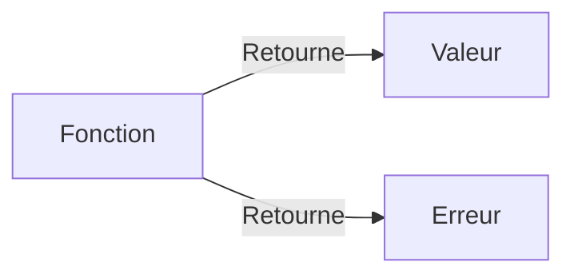

# Chapitre 8 : Fonctions de base {#chapitre-8-:-fonctions-de-base}

Déclaration de fonctions, paramètres, valeurs de retour, fonctions à retours multiples.

## Déclaration et appel de fonctions {#déclaration-et-appel-de-fonctions-8}

### 1. Quoi
Une **fonction** est un bloc de code nommé qui effectue une tâche spécifique. En Go, les fonctions sont des citoyens de première classe : elles peuvent être définies, assignées à des variables et passées en arguments.

### 2. Pourquoi
Les fonctions permettent de **modulariser** le code, de le rendre réutilisable, plus lisible et plus facile à tester en isolant les responsabilités.

### 3. Comment
A. **Syntaxe de base** :
```go
func nomDeLaFonction(paramètre type) typeDeRetour {
    // Corps de la fonction
    return résultat
}
```

B. **Cas concret** :
```go
package main

import "fmt"

// Fonction simple avec un paramètre et un retour
func saluer(nom string) string {
    return "Bonjour " + nom
}

func main() {
    message := saluer("Gopher")
    fmt.Println(message)
}
```

C. **Exemples pratiques** :
- **Calcul** : Une fonction `calculerTVA(prix float64) float64`.
- **Validation** : Une fonction `estValide(email string) bool`.
- **Formatage** : Une fonction `formaterNom(prenom, nom string) string`.

### 4. Zone de Danger
❌ **À ne pas faire** : Créer des fonctions "fourre-tout" qui font trop de choses différentes (violation du principe de responsabilité unique).
✅ **Bonne Pratique** : Une fonction doit avoir un nom verbeux décrivant son action et ne faire qu'une seule chose bien.

---

## Retours multiples {#retours-multiples-8}

### 1. Quoi
Go permet à une fonction de retourner **plusieurs valeurs** simultanément.

### 2. Pourquoi
C'est une fonctionnalité puissante pour retourner à la fois un résultat et une erreur (le pattern `(valeur, error)` est la norme en Go).

### 3. Comment
A. **Syntaxe de base** :
```go
func diviser(a, b float64) (float64, error) {
    if b == 0 {
        return 0, fmt.Errorf("division par zéro")
    }
    return a / b, nil
}
```

B. **Flux logique** :


C. **Exemples pratiques** :
- **Gestion d'erreurs** : Retourner le résultat d'une opération et une erreur si elle échoue.
- **Recherche** : Retourner l'index d'un élément et un booléen indiquant s'il a été trouvé.

### 4. Zone de Danger
❌ **À ne pas faire** : Ignorer systématiquement les erreurs retournées par les fonctions.
✅ **Bonne Pratique** : Toujours vérifier si l'erreur retournée est `nil` avant d'utiliser le résultat principal.

---

## Questions clés (validation des acquis du chapitre) {#questions-clés-(validation-des-acquis-du-chapitre)-8}

- **Quel mot-clé est utilisé pour définir une fonction en Go ?**
  *Réponse : Le mot-clé `func`.*

- **Comment retourner plusieurs valeurs depuis une fonction ?**
  *Réponse : En spécifiant plusieurs types de retour entre parenthèses dans la signature : `func f() (int, string) { ... }`.*

- **Pourquoi est-il recommandé de retourner une `error` en plus du résultat ?**
  *Réponse : Pour permettre à l'appelant de gérer proprement les cas d'échec de la fonction.*

---

## Exercices : {#exercices-:-8}

### Exercice 1 - La calculatrice simple {#exercice-1---la-calculatrice-simple}

🎯 **Objectif** : Créer une fonction basique.

💼 **Mise en situation** : Vous construisez une bibliothèque mathématique.

📝 **Énoncé** : Créez une fonction `additionner(a, b int) int` qui retourne la somme de deux entiers. Appelez-la dans `main` et affichez le résultat.

📺 **Résultat attendu** : `Somme : 15`.

💡 **Solution** :
<details><summary>Voir le code complet commenté</summary>

```go
package main

import "fmt"

// Additionne deux entiers
func additionner(a, b int) int {
    return a + b
}

func main() {
    resultat := additionner(5, 10)
    fmt.Printf("Somme : %d\n", resultat)
}
```
</details>

### Exercice 2 - Vérificateur de majorité {#exercice-2---vérificateur-de-majorité}

🎯 **Objectif** : Utiliser des retours booléens.

💼 **Mise en situation** : Vous automatisez le contrôle d'accès.

📝 **Énoncé** : Créez une fonction `estMajeur(age int) bool`. Elle retourne `true` si l'âge est >= 18, sinon `false`.

📺 **Résultat attendu** : `Majeur : true`.

💡 **Solution** :
<details><summary>Voir le code complet commenté</summary>

```go
package main

import "fmt"

func estMajeur(age int) bool {
    return age >= 18
}

func main() {
    fmt.Printf("Majeur : %t\n", estMajeur(20))
}
```
</details>

### Exercice 3 - Division sécurisée {#exercice-3---division-sécurisée}

🎯 **Objectif** : Utiliser les retours multiples.

💼 **Mise en situation** : Vous évitez les plantages lors de divisions.

📝 **Énoncé** : Créez une fonction `diviser(a, b float64) (float64, error)`. Si `b` est 0, retournez une erreur. Sinon, retournez le résultat et `nil`.

📺 **Résultat attendu** : `Résultat : 5.0` ou `Erreur : division par zéro`.

💡 **Solution** :
<details><summary>Voir le code complet commenté</summary>

```go
package main

import (
    "errors"
    "fmt"
)

func diviser(a, b float64) (float64, error) {
    if b == 0 {
        return 0, errors.New("division par zéro")
    }
    return a / b, nil
}

func main() {
    res, err := diviser(10, 2)
    if err != nil {
        fmt.Println("Erreur :", err)
    } else {
        fmt.Printf("Résultat : %.1f\n", res)
    }
}
```
</details>