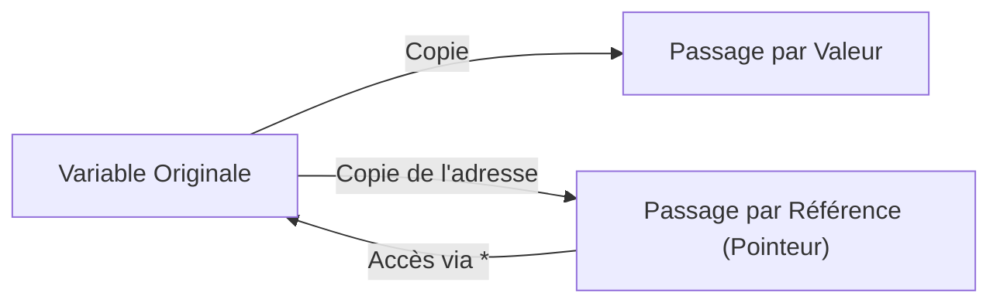

# Chapitre 9 : Pointeurs et références {#chapitre-9-:-pointeurs-et-références}

Adresses mémoire, opérateurs & et *, passage par valeur vs passage par référence.

## Comprendre les pointeurs {#comprendre-les-pointeurs-9}

### 1. Quoi
Un **pointeur** est une variable qui stocke l'adresse mémoire d'une autre variable, au lieu de stocker sa valeur directement.

### 2. Pourquoi
Les pointeurs permettent de modifier la valeur d'une variable à l'intérieur d'une fonction sans avoir à la retourner, et d'optimiser les performances en évitant de copier des structures de données volumineuses.

### 3. Comment
A. **Syntaxe de base** :
- `&` : Opérateur d'adresse (obtient l'adresse d'une variable).
- `*` : Opérateur de déréférencement (accède à la valeur pointée).

```go
x := 10
p := &x    // p est un pointeur vers x
fmt.Println(*p) // Affiche 10
```

B. **Cas concret** :
```go
package main

import "fmt"

// La fonction reçoit l'adresse de la variable
func incrementer(n *int) {
    *n++ // On modifie la valeur à l'adresse n
}

func main() {
    valeur := 5
    incrementer(&valeur)
    fmt.Println(valeur) // Affiche 6
}
```

C. **Exemples pratiques** :
- **Modification in-place** : Mettre à jour un état global ou une structure complexe.
- **Optimisation** : Passer un pointeur vers une grosse `struct` pour éviter une copie coûteuse.

### 4. Zone de Danger
❌ **À ne pas faire** : Déréférencer un pointeur `nil` (cela provoque un crash immédiat du programme).
✅ **Bonne Pratique** : Vérifiez toujours si un pointeur est `nil` avant de l'utiliser.

---

## Passage par valeur vs par référence {#passage-par-valeur-vs-par-référence-9}

### 1. Quoi
En Go, tout est **passage par valeur**. Lorsque vous passez une variable à une fonction, Go en crée une copie. Passer un pointeur revient à passer une copie de l'adresse mémoire, ce qui permet d'agir sur l'original.

### 2. Pourquoi
Comprendre cette distinction est crucial pour maîtriser la gestion de la mémoire et éviter des bugs de logique où les modifications ne sont pas répercutées.

### 3. Comment
A. **Visualisation** :


B. **Tableau comparatif** :

| Caractéristique | Passage par valeur | Passage par référence (pointeur) |
|-----------------|--------------------|----------------------------------|
| **Donnée** | Copie de la valeur | Copie de l'adresse |
| **Performance** | Coûteux pour les grosses structures | Très rapide |
| **Effet de bord** | Aucun sur l'original | Modifie l'original |

### 4. Zone de Danger
❌ **À ne pas faire** : Utiliser des pointeurs partout par "habitude".
✅ **Bonne Pratique** : Utilisez le passage par valeur par défaut. N'utilisez les pointeurs que si vous devez modifier la valeur originale ou si la structure est très lourde.

### 🚨 Limitations des pointeurs
- **Problèmes** : Ils complexifient le code et rendent le suivi du cycle de vie des données plus difficile (fuites mémoire potentielles si mal géré, bien que Go possède un Garbage Collector).
- **Solutions modernes** : Utilisez des types immuables ou des structures de données fonctionnelles si possible.
- **Pourquoi l'enseigner** : Indispensable pour comprendre le fonctionnement interne de Go et utiliser les bibliothèques standards qui manipulent des pointeurs.

---

## Questions clés (validation des acquis du chapitre) {#questions-clés-(validation-des-acquis-du-chapitre)-9}

- **Quel opérateur permet d'obtenir l'adresse mémoire d'une variable ?**
  *Réponse : L'opérateur `&`.*

- **Que se passe-t-il si on déréférence un pointeur `nil` ?**
  *Réponse : Le programme panique (crash).*

- **Est-ce que Go supporte le passage par référence réel comme le C++ ?**
  *Réponse : Non, Go utilise toujours le passage par valeur, mais on peut passer la valeur d'une adresse mémoire (pointeur).*

---

## Exercices : {#exercices-:-9}

### Exercice 1 - L'échangeur de valeurs {#exercice-1---l'échangeur-de-valeurs}

🎯 **Objectif** : Modifier des variables via des pointeurs.

💼 **Mise en situation** : Vous créez une fonction utilitaire pour échanger deux nombres.

📝 **Énoncé** : Créez une fonction `echanger(a, b *int)` qui inverse les valeurs des deux entiers passés en paramètres.

📺 **Résultat attendu** : `Avant : 1, 2 | Après : 2, 1`.

💡 **Solution** :
<details><summary>Voir le code complet commenté</summary>

```go
package main

import "fmt"

func echanger(a, b *int) {
    // On utilise une variable temporaire pour l'échange
    temp := *a
    *a = *b
    *b = temp
}

func main() {
    x, y := 1, 2
    fmt.Printf("Avant : %d, %d\n", x, y)
    echanger(&x, &y)
    fmt.Printf("Après : %d, %d\n", x, y)
}
```
</details>

### Exercice 2 - Mise à jour de profil {#exercice-2---mise-à-jour-de-profil}

🎯 **Objectif** : Utiliser des pointeurs avec des structs.

💼 **Mise en situation** : Vous mettez à jour l'âge d'un utilisateur.

📝 **Énoncé** : Déclarez une `struct Utilisateur { age int }`. Créez une fonction `vieillir(u *Utilisateur)` qui incrémente l'âge de 1.

📺 **Résultat attendu** : `Âge après : 26`.

💡 **Solution** :
<details><summary>Voir le code complet commenté</summary>

```go
package main

import "fmt"

type Utilisateur struct {
    age int
}

func vieillir(u *Utilisateur) {
    // Go déréférence automatiquement le pointeur pour accéder au champ
    u.age++
}

func main() {
    user := Utilisateur{age: 25}
    vieillir(&user)
    fmt.Printf("Âge après : %d\n", user.age)
}
```
</details>

### Exercice 3 - Le piège du nil {#exercice-3---le-piège-du-nil}

🎯 **Objectif** : Sécuriser l'usage des pointeurs.

💼 **Mise en situation** : Vous traitez des données optionnelles.

📝 **Énoncé** : Créez une fonction `afficherValeur(p *int)`. Si le pointeur est `nil`, affichez "Aucune valeur". Sinon, affichez la valeur.

📺 **Résultat attendu** : `Aucune valeur` (si nil) ou `Valeur : 10`.

💡 **Solution** :
<details><summary>Voir le code complet commenté</summary>

```go
package main

import "fmt"

func afficherValeur(p *int) {
    if p == nil {
        fmt.Println("Aucune valeur")
        return
    }
    fmt.Printf("Valeur : %d\n", *p)
}

func main() {
    var p *int
    afficherValeur(p) // Test avec nil
    
    val := 10
    afficherValeur(&val) // Test avec valeur
}
```
</details>