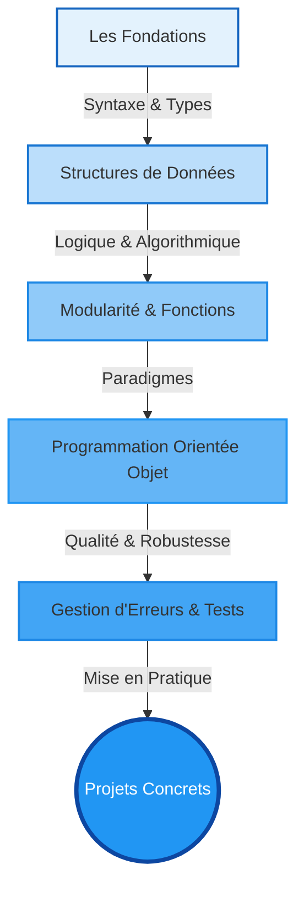

# Bienvenue dans l'univers Python {#bienvenue-0}

Vous vous apprêtez à entamer un voyage d'apprentissage complet au cœur de Python, le langage qui a révolutionné le développement logiciel moderne. Que votre ambition soit d'automatiser des tâches, d'analyser des données massives, de construire des applications web scalables ou de plonger dans l'intelligence artificielle, Python est la compétence fondamentale qui ouvre toutes ces portes.

Ce cours a été conçu avec une philosophie claire : vous enseigner non seulement la syntaxe, mais surtout l'art d'écrire du code **"Pythonique"**. L'objectif n'est pas simplement que votre code fonctionne, mais qu'il soit élégant, efficace et maintenable, respectant les standards de l'industrie.

> 📸 **CAPTURE D'ÉCRAN REQUISE**
> **Sujet** : Un visuel attrayant montrant le logo Python au centre, connecté par des lignes à des icônes représentant ses domaines d'application : web (Django), data (Pandas), IA (TensorFlow), scripting.
> **Alt Text** : Écosystème Python illustrant sa polyvalence.

## La Structure de Votre Apprentissage {#structure-apprentissage-0}

Nous croyons en une progression logique et structurée. Chaque nouveau concept s'appuiera sur des fondations solides que nous construirons ensemble. Ce n'est pas une simple collection de tutoriels, mais un parcours cohérent qui vous fera monter en compétence de manière tangible.

Voici une carte de votre progression tout au long de cette formation :

## Objectifs de la Formation {#objectifs-formation-0}

À l'issue de ce parcours, vous ne serez pas un simple "codeur", mais un développeur Python compétent, capable de :

1.  **Concevoir et développer** des applications complexes en respectant les meilleures pratiques.
2.  **Maîtriser l'écosystème moderne** de Python (environnements virtuels, `pip`, bibliothèques majeures).
3.  **Architecturer du code modulaire** et réutilisable grâce à la Programmation Orientée Objet (POO).
4.  **Écrire du code propre (Clean Code)**, lisible et conforme à la norme PEP 8, facilitant la collaboration.
5.  **Déboguer et tester** vos programmes pour garantir leur fiabilité en production.

## Prérequis Techniques et Matériels {#pre-requis-0}

Pour suivre cette formation dans des conditions optimales, voici ce dont vous aurez besoin.

### Matériel et Logiciels
*   Un ordinateur (Windows, macOS ou Linux) avec des droits d'administrateur pour installer des logiciels.
*   Une connexion internet stable pour le téléchargement des outils et bibliothèques.
*   Un éditeur de code. Nous recommandons fortement **Visual Studio Code (VS Code)**, que nous utiliserons tout au long du cours.

### Connaissances
*   **Aucune expérience en programmation n'est requise.** Ce cours part des bases absolues.
*   Une familiarité avec l'utilisation générale d'un ordinateur (créer des dossiers, naviguer dans les fichiers) est attendue.
*   La compétence la plus importante est la **curiosité** et la **volonté de résoudre des problèmes**.

## Comment Profiter au Mieux de ce Cours {#comment-profiter-0}

Chaque chapitre technique est structuré pour maximiser votre apprentissage :
*   **Théorie ciblée** : Nous expliquons le "Pourquoi" avant de plonger dans le "Comment".
*   **Exemples concrets** : Des cas d'usage réels pour illustrer chaque concept.
*   **Zones de Danger** : Des avertissements sur les pièges courants pour vous faire gagner du temps.
*   **Validation des acquis** : Des questions et exercices pour ancrer durablement vos nouvelles compétences.

Vous êtes prêt ? Alors commençons par la première étape cruciale : l'installation et la configuration de votre environnement de développement.