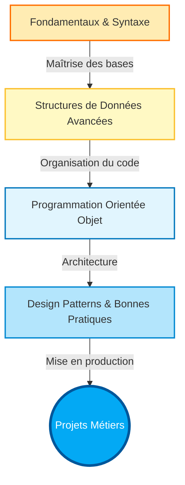

# Bienvenue dans la formation Python {#bienvenue-0}

Le langage Python s'est imposé comme une référence incontournable dans le paysage technologique moderne. De l'automatisation de tâches simples à l'intelligence artificielle, en passant par le développement web backend et l'analyse de données, sa syntaxe claire et sa puissance en font un outil privilégié tant par les startups que par les géants de la Tech.

Ce cursus a été conçu pour transformer votre approche du développement. Nous ne nous contenterons pas d'apprendre à "écrire du Python", nous apprendrons à **penser en Python** (le fameux *Pythonic way*).

> 📸 **CAPTURE D'ÉCRAN REQUISE**
> **Sujet** : Illustration stylisée du logo Python entouré de ses domaines d'application (Web, Data, Scripting, IA).
> **Alt Text** : Écosystème Python montrant la polyvalence du langage.

## Philosophie du Cursus {#philosophie-0}

Cette formation dépasse la simple documentation technique. Elle est structurée pour vous guider progressivement des fondamentaux vers une architecture logicielle robuste. L'objectif est de vous rendre autonome sur des projets complexes, en insistant sur la lisibilité du code, la performance et la maintenabilité.

Voici la trajectoire d'apprentissage que nous allons suivre :

## Objectifs Pédagogiques {#objectifs-pedagogiques-0}

À la fin de ce parcours, vous disposerez des compétences nécessaires pour :

1.  **Maîtriser la syntaxe Python** et ses idiomes spécifiques (List Comprehensions, Decorators, Generators).
2.  **Concevoir des architectures orientées objet** solides et évolutives.
3.  **Manipuler les données** efficacement avec les bibliothèques standards et tierces.
4.  **Déboguer et optimiser** vos scripts pour garantir performance et fiabilité.
5.  **Respecter les standards PEP 8** pour produire un code professionnel et collaboratif.

## Prérequis Techniques {#pre-requis-0}

Bien que Python soit réputé pour son accessibilité, ce cours "Special" vise une maîtrise approfondie. Assurez-vous de disposer de l'environnement suivant :

### Matériel et Logiciel
*   **Système d'exploitation** : Windows 10/11, macOS ou une distribution Linux récente.
*   **Droits d'administration** : Nécessaires pour installer l'interpréteur Python et les paquets via `pip`.
*   **IDE (Environnement de Développement)** : Nous recommandons **VS Code** (avec l'extension Python) ou **PyCharm** (Community ou Pro).
*   **Terminal** : Une familiarité de base avec l'invite de commande (PowerShell, Bash ou Zsh) est recommandée.

### État d'esprit
Aucune connaissance préalable d'un autre langage de programmation n'est strictement requise, mais une compréhension de la **logique algorithmique de base** (variables, boucles, conditions) facilitera votre progression. Si vous venez d'un langage typé statiquement (comme Java ou C++), préparez-vous à embrasser la flexibilité du typage dynamique de Python.

## Structure des Chapitres {#structure-chapitres-0}

Pour garantir une assimilation efficace, chaque module technique (type "Standard") respectera une structure identique :

*   **Quoi & Pourquoi** : Comprendre l'intérêt du concept avant de l'utiliser.
*   **Comment** : Syntaxe pure et exemples d'application concrets.
*   **Zone de Danger** : Les pièges courants et les erreurs de performance à éviter.
*   **Validation** : Des questions de contrôle et des exercices progressifs basés sur des scénarios réels.

Préparez votre environnement, ouvrez votre terminal, et commençons notre exploration de Python.