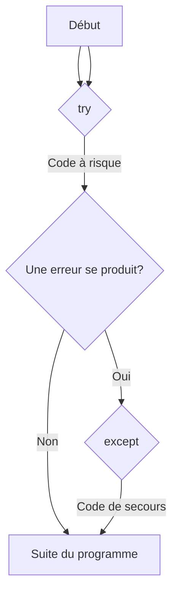

# Gestion des Erreurs: Blocs Try, Except {#gestion-erreurs-try-except-16}

Un programme parfait n'existe pas. Tôt ou tard, une situation inattendue se produira : un utilisateur entre du texte au lieu d'un nombre, le fichier que vous voulez lire n'existe pas, la connexion internet est coupée... Quand Python rencontre une telle situation, il lève une **exception** (une erreur) et, par défaut, arrête brutalement le programme en affichant un message d'erreur.

Pour créer des applications robustes et conviviales, nous devons apprendre à "attraper" ces exceptions et à les gérer proprement. C'est le rôle des blocs `try...except`.

## 1. Le Bloc `try...except` de Base {#try-except-base-16}

### Quoi
Le bloc `try...except` est une structure qui vous permet d'exécuter un bloc de code "à risque" et de définir un plan B au cas où une erreur surviendrait.
-   Le code dans le bloc `try` est exécuté.
-   Si une erreur se produit, Python saute immédiatement au bloc `except` correspondant et exécute son code.
-   Si aucune erreur ne se produit, le bloc `except` est ignoré.



### Pourquoi
C'est le filet de sécurité de votre programme. Au lieu de planter, votre application peut afficher un message d'erreur clair à l'utilisateur, essayer une autre approche, ou simplement ignorer l'opération qui a échoué et continuer à fonctionner.

### Comment
Le cas le plus classique est la conversion d'une entrée utilisateur en nombre.

```python
# Cas d'usage : Demander l'âge de l'utilisateur de manière sécurisée
try:
    age_str = input("Quel est votre âge ? ")
    age_int = int(age_str) # Ligne risquée : peut lever une ValueError
    print(f"Vous aurez {age_int + 1} ans l'année prochaine.")
except:
    print("Erreur : Veuillez entrer un nombre valide.")

print("La suite du programme continue...")
```
Si vous entrez "trente" au lieu de "30", le programme n'arrêtera pas. Il affichera le message d'erreur et continuera son exécution.

> 📸 **CAPTURE D'ÉCRAN REQUISE**
> **Sujet** : Le script ci-dessus en cours d'exécution dans un terminal. L'utilisateur a tapé "trente", et le programme affiche "Erreur : Veuillez entrer un nombre valide." sans crasher.
> **Alt Text** : Exemple de gestion d'erreur avec try-except en Python pour une entrée utilisateur invalide.

### Zone de Danger
*   **Le `except` fourre-tout** : Utiliser `except:` sans spécifier le type d'erreur est une mauvaise pratique. Cela attrape **toutes** les erreurs possibles, y compris celles que vous n'aviez pas prévues (comme une faute de frappe dans un nom de variable) ou même l'interruption du programme avec Ctrl+C. Vous risquez de masquer des bugs réels. Il est toujours préférable d'être spécifique.

---

## 2. Attraper des Exceptions Spécifiques {#exceptions-specifiques-16}

### Quoi
Pour éviter le piège du `except` fourre-tout, on peut spécifier le type d'exception que l'on s'attend à attraper. Les plus courantes sont :
-   `ValueError`: Une opération reçoit un argument de bon type mais de valeur inappropriée (ex: `int("abc")`).
-   `TypeError`: Une opération est appliquée à un objet de type inapproprié (ex: `"5" + 2`).
-   `ZeroDivisionError`: Division par zéro.
-   `KeyError`: Clé de dictionnaire non trouvée.
-   `FileNotFoundError`: Fichier non trouvé.

### Pourquoi
Cela rend votre code plus précis et plus sûr. Vous pouvez avoir différents blocs `except` pour gérer différemment chaque type d'erreur. Si une erreur inattendue se produit, elle ne sera pas attrapée et arrêtera le programme, ce qui est souvent préférable car cela signale un vrai bug à corriger.

### Comment
```python
# Cas d'usage : Une petite calculatrice de division
try:
    dividende_str = input("Entrez le nombre à diviser : ")
    diviseur_str = input("Entrez le diviseur : ")

    dividende = int(dividende_str)
    diviseur = int(diviseur_str)

    resultat = dividende / diviseur
    print(f"Le résultat est : {resultat}")

except ValueError:
    print("Erreur : Les deux entrées doivent être des nombres entiers.")
except ZeroDivisionError:
    print("Erreur : Il est impossible de diviser par zéro.")
```
Ce code gère maintenant deux cas d'erreur distincts avec des messages personnalisés.

### Zone de Danger
*   **Ne pas connaître les erreurs possibles** : Parfois, on ne sait pas quelle exception un morceau de code peut lever. Dans ce cas, on peut temporairement utiliser `except Exception as e:`, qui attrape la plupart des erreurs standards et les stocke dans la variable `e`. Cela vous permet d'afficher l'erreur réelle pour mieux comprendre ce qui se passe.

```python
try:
    # ... code complexe ...
except Exception as e:
    print(f"Une erreur inattendue est survenue : {e}")
```

---

## 3. Les Blocs `else` et `finally` {#else-finally-16}

### Quoi
La structure `try...except` peut être complétée par deux blocs optionnels :
-   `else`: Le code dans ce bloc est exécuté **uniquement si aucune exception n'a été levée** dans le bloc `try`.
-   `finally`: Le code dans ce bloc est exécuté **dans tous les cas**, qu'une exception ait eu lieu ou non, et même si on utilise `return` dans le `try`.

### Pourquoi
-   `else` améliore la lisibilité. Il permet de séparer le code qui peut échouer (`try`) du code qui ne doit s'exécuter qu'en cas de succès (`else`).
-   `finally` est crucial pour les actions de "nettoyage" qui doivent absolument être effectuées, comme fermer un fichier ou une connexion réseau, pour éviter de laisser des ressources ouvertes.

### Comment
```python
# Cas d'usage : Lecture d'un fichier
fichier = None # On déclare la variable avant pour qu'elle soit accessible dans le finally
try:
    nom_fichier = "mon_fichier.txt"
    fichier = open(nom_fichier, 'r')
    contenu = fichier.read()
except FileNotFoundError:
    print(f"Erreur : Le fichier '{nom_fichier}' est introuvable.")
else:
    # Ce bloc s'exécute seulement si le 'open' a réussi
    print("Contenu du fichier lu avec succès :")
    print(contenu)
finally:
    # Ce bloc s'exécute toujours pour garantir la fermeture du fichier
    if fichier:
        fichier.close()
    print("--- Fin de la tentative de lecture. ---")
```

---

## Validation des Acquis {#validation-16}

### 3 Questions Clés

1.  Quel est l'objectif principal d'un bloc `try...except` ?
2.  Pourquoi est-il généralement déconseillé d'utiliser un `except:` vide (sans spécifier le type d'erreur) ?
3.  Quelle est la différence de comportement entre un bloc `else` et un bloc `finally` ?

### 3 Exercices Progressifs

#### Exercice 1 : Calculateur d'Indice de Masse Corporelle (IMC)
Créez un script qui demande à l'utilisateur son poids (en kg) et sa taille (en mètres).
1.  Utilisez `try...except` pour vous assurer que les entrées sont bien des nombres (`float`). Si ce n'est pas le cas, affichez un message d'erreur clair.
2.  Gérez aussi le cas où la taille serait de `0` pour éviter une `ZeroDivisionError`.
3.  Si tout est correct, calculez et affichez l'IMC (`poids / taille**2`).

<details>
<summary>Découvrir la solution commentée</summary>

```python
try:
    poids_str = input("Entrez votre poids en kg : ")
    taille_str = input("Entrez votre taille en mètres (ex: 1.75) : ")

    poids = float(poids_str)
    taille = float(taille_str)

    if taille == 0:
        print("Erreur : La taille ne peut pas être égale à zéro.")
    else:
        imc = poids / (taille ** 2)
        print(f"Votre Indice de Masse Corporelle (IMC) est de : {imc:.2f}")

except ValueError:
    print("Erreur : Veuillez entrer des valeurs numériques pour le poids et la taille.")
```
</details>

#### Exercice 2 : Accès Sécurisé à un Dictionnaire
Créez une fonction `chercher_capitale(pays)` qui prend un nom de pays en paramètre.
1.  Dans la fonction, définissez un dictionnaire de quelques capitales (`{"France": "Paris", "Allemagne": "Berlin", ...}`).
2.  La fonction doit utiliser un bloc `try...except KeyError` pour chercher la capitale.
3.  Si le pays est trouvé, elle retourne la capitale.
4.  Si le pays n'est pas dans le dictionnaire, elle doit retourner la chaîne `"Capitale non trouvée"`.

<details>
<summary>Découvrir la solution commentée</summary>

```python
def chercher_capitale(pays):
    """
    Recherche la capitale d'un pays dans un dictionnaire de manière sécurisée.
    Retourne la capitale ou un message d'erreur.
    """
    capitales = {
        "France": "Paris",
        "Allemagne": "Berlin",
        "Italie": "Rome",
        "Espagne": "Madrid"
    }
    
    try:
        # On essaie d'accéder à la clé
        capitale = capitales[pays]
        return capitale
    except KeyError:
        # Si la clé n'existe pas, on retourne le message d'erreur
        return "Capitale non trouvée"

# Tests de la fonction
print(f"Capitale de la France : {chercher_capitale('France')}")
print(f"Capitale du Japon : {chercher_capitale('Japon')}")
```
</details>

#### Exercice 3 : Écriture dans un Fichier
Écrivez un script qui demande à l'utilisateur une ligne de texte et l'ajoute à la fin d'un fichier `journal.log`.
1.  Le script doit ouvrir le fichier `journal.log` en mode "ajout" (`'a'`).
2.  Utilisez `try...except` pour gérer une éventuelle `IOError` si le fichier ne peut pas être écrit (par exemple, à cause de permissions).
3.  Utilisez un bloc `else` pour afficher un message de succès "Ligne ajoutée au journal." si l'écriture réussit.
4.  Utilisez un bloc `finally` pour vous assurer que le fichier est bien fermé, quoi qu'il arrive.

<details>
<summary>Découvrir la solution commentée</summary>

```python
# On demande le texte à l'utilisateur
texte_a_ajouter = input("Entrez une ligne à ajouter au journal : ")

fichier_log = None # On déclare la variable à l'extérieur du try

try:
    # On ouvre le fichier en mode 'append' (ajout).
    # 'a' crée le fichier s'il n'existe pas, donc pas de FileNotFoundError ici.
    fichier_log = open('journal.log', 'a')
    
    # On écrit la ligne suivie d'un retour à la ligne
    fichier_log.write(texte_a_ajouter + '\n')

except IOError as e:
    # IOError est plus générale pour les erreurs d'entrée/sortie
    print(f"Erreur d'écriture dans le fichier : {e}")
else:
    # Succès de l'opération d'écriture
    print("Ligne ajoutée au journal avec succès.")
finally:
    # On s'assure que le fichier est fermé s'il a bien été ouvert
    if fichier_log:
        fichier_log.close()
    print("Opération terminée.")
```
</details>