# Introduction à Python et son Écosystème {#introduction-ecosysteme-1}

Avant de plonger dans l'écriture de votre premier script, il est fondamental de comprendre ce qu'est réellement Python. Bien plus qu'un simple langage, c'est un écosystème complet, avec sa propre philosophie, ses outils et son architecture. Ce chapitre pose les bases théoriques indispensables pour comprendre comment votre code prend vie.

## Qu'est-ce que Python ? {#quest-ce-que-python-1}

Python est un langage de programmation **interprété**, **de haut niveau** et **multi-paradigme**. Décortiquons ces termes :

*   **Interprété** : Contrairement à un langage compilé (comme C++), le code Python est lu et exécuté ligne par ligne par un programme appelé "interpréteur". Cela facilite le débogage et le développement rapide.
*   **Haut niveau** : Il vous abstrait de la complexité de la machine. Vous n'avez pas à gérer manuellement la mémoire ou les registres du processeur, ce qui vous permet de vous concentrer sur la logique de votre application.
*   **Multi-paradigme** : Il ne vous enferme pas dans un seul style de programmation. Vous pouvez écrire du code simple et direct (procédural), l'organiser en objets (POO), ou même adopter une approche fonctionnelle.

La philosophie de Python est souvent résumée par son adage : **"Batteries Included"** (Piles incluses). Il est livré avec une vaste bibliothèque standard qui vous permet de tout faire, de la création d'un serveur web à la lecture de vos emails, sans installer de paquets externes.

> 📸 **CAPTURE D'ÉCRAN REQUISE**
> **Sujet** : Un terminal affichant le "Zen de Python" (résultat de la commande `python -c "import this"`).
> **Alt Text** : Le Zen de Python, les 19 aphorismes qui guident la conception du langage.

## Comment fonctionne Python ? {#comment-fonctionne-python-1}

Dire que Python est "interprété" est une simplification. En réalité, une étape de compilation intermédiaire a lieu. Voici le cycle de vie de votre code, de sa création à son exécution par le processeur.

```mermaid
graph TD
    A[Votre code : script.py] -->|1. Compilation| B{Bytecode : script.pyc}
    B -->|2. Exécution| C[PVM (Python Virtual Machine)]
    C -->|3. Traduction en temps réel| D[Instructions Machine]
    D --> E[Processeur (CPU)]

    subgraph "Étape Humaine"
        A
    end
    subgraph "Étape Interne de Python"
        B
        C
    end
    subgraph "Étape Matérielle"
        D
        E
    end
    
    style A fill:#e3f2fd,stroke:#1565c0,stroke-width:2px
    style B fill:#fff9c4,stroke:#fbc02d,stroke-width:2px
    style C fill:#dcedc8,stroke:#33691e,stroke-width:2px
```

1.  **Compilation en Bytecode** : Lorsque vous lancez un script, Python le compile d'abord en un langage intermédiaire appelé "bytecode". Ce code est optimisé pour être exécuté par la PVM. Vous pouvez voir ces fichiers avec l'extension `.pyc` dans les dossiers `__pycache__`.
2.  **La PVM (Python Virtual Machine)** : C'est le cœur de Python. C'est un programme qui prend le bytecode en entrée et le traduit en instructions que votre machine peut comprendre. C'est cette PVM qui rend Python portable sur différents systèmes d'exploitation (Windows, macOS, Linux).

## L'Écosystème : PyPI et les Environnements Virtuels {#ecosysteme-outils-1}

La véritable puissance de Python réside dans sa communauté et les outils qu'elle a créés.

### PyPI et pip
*   **PyPI (Python Package Index)** : C'est l'entrepôt officiel de logiciels tiers pour Python. Imaginez-le comme l'App Store ou le Google Play Store pour les développeurs Python. Il contient des centaines de milliers de bibliothèques (appelées "packages") qui étendent les capacités de Python.
*   **pip** : C'est le gestionnaire de paquets que vous utilisez en ligne de commande pour installer, mettre à jour et supprimer des bibliothèques depuis PyPI.

```mermaid
sequenceDiagram
    participant Dev as Développeur
    participant Terminal
    participant PyPI as Dépôt PyPI (Cloud)
    participant Projet as Dossier du Projet
    
    Dev->>Terminal: pip install requests
    Terminal->>PyPI: Recherche 'requests'
    PyPI-->>Terminal: Trouvé ! Envoi du paquet
    Terminal->>Projet: Installe la bibliothèque
    Terminal-->>Dev: Installation réussie !
```



### Les Environnements Virtuels (`venv`)
Une règle d'or : **isolez toujours les dépendances de vos projets**.

Imaginez que vous travaillez sur deux projets :
*   Projet A a besoin de la bibliothèque `Django v2.0`.
*   Projet B, plus récent, a besoin de `Django v4.0`.

Si vous installez `Django` globalement sur votre machine, vous ne pouvez avoir qu'une seule version, ce qui cassera l'un des deux projets. La solution est d'utiliser un **environnement virtuel**. C'est un dossier qui contient une copie isolée de l'interpréteur Python et de ses propres bibliothèques, spécifique à un projet.

## Validation de Votre Environnement {#validation-environnement-1}

Avant de passer à la pratique, vérifions que votre installation est correcte. Ouvrez votre terminal (ou invite de commandes) et tapez les commandes suivantes.

1.  **Vérifier la version de Python** :
    ```bash
    python --version
    # ou sur macOS/Linux, parfois :
    python3 --version
    ```
    *Attendu : `Python 3.x.x` (une version 3.8 ou supérieure est recommandée).*

2.  **Vérifier la version de pip** :
    ```bash
    pip --version
    # ou :
    pip3 --version
    ```
    *Attendu : `pip x.x.x from ...` (le chemin doit correspondre à votre installation de Python).*

3.  **Lancer la console interactive (REPL)** :
    Tapez `python` (ou `python3`) et appuyez sur Entrée.
    ```python
    >>> print("Mon environnement Python est fonctionnel !")
    Mon environnement Python est fonctionnel !
    >>> exit()
    ```
    Si vous voyez ce message, vous êtes prêt pour la suite 