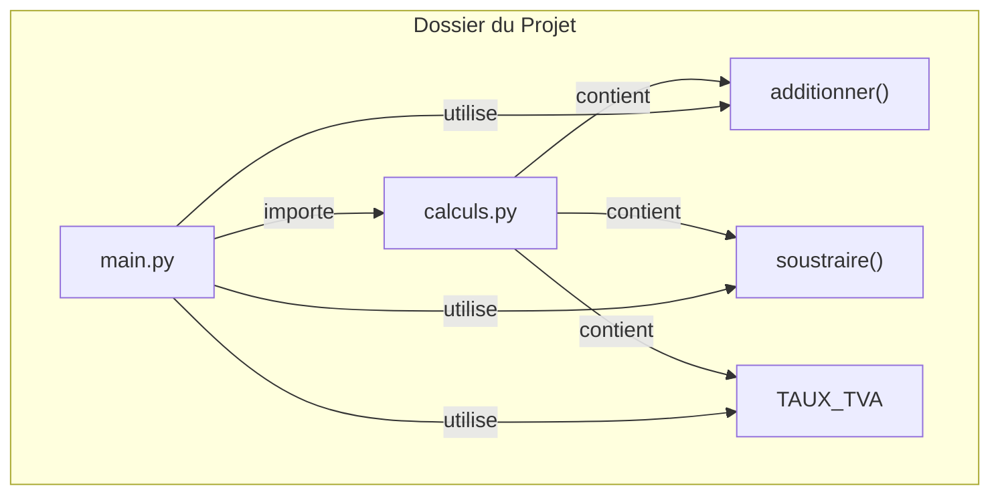

# Modules et Packages: Organisation du Code {#modules-packages-organisation-17}

À mesure que vos projets grandissent, placer tout votre code dans un seul fichier devient rapidement ingérable. Le code devient difficile à lire, à maintenir et à réutiliser. Python résout ce problème avec un système d'organisation puissant basé sur les **modules** et les **packages**.

## 1. Les Modules : Diviser pour Mieux Régner {#modules-diviser-17}

### Quoi
Un **module** est tout simplement un fichier Python (`.py`). Il peut contenir des définitions de fonctions, de classes et de variables que vous pouvez ensuite réutiliser dans d'autres fichiers.

### Pourquoi
L'idée est de regrouper le code par fonctionnalité. Un fichier pour les calculs mathématiques, un autre pour la gestion des utilisateurs, etc. Cela rend le code :
*   **Organisé** : Chaque fichier a une responsabilité claire.
*   **Réutilisable** : Une fonction définie dans un module peut être utilisée dans des dizaines d'autres fichiers sans être recopiée.
*   **Propre** : Cela évite les conflits de noms entre différentes parties de votre projet.

### Comment
Imaginez que nous avons deux fichiers dans le même dossier :

**`calculs.py`**
```python
# Ce fichier est notre module de calculs.

TAUX_TVA = 0.20 # Une variable

def additionner(a, b):
    """Retourne la somme de a et b."""
    return a + b

def soustraire(a, b):
    """Retourne la différence de a et b."""
    return a - b
```

**`main.py`** (notre script principal)
```python
# On importe le module 'calculs'. Python sait le trouver car il est dans le même dossier.
import calculs

# Pour utiliser une fonction du module, on la préfixe par le nom du module.
somme = calculs.additionner(10, 5)
difference = calculs.soustraire(10, 5)

print(f"La somme est : {somme}")
print(f"La différence est : {difference}")

# On peut aussi accéder aux variables du module
prix_ht = 100
prix_ttc = prix_ht * (1 + calculs.TAUX_TVA)
print(f"Le prix TTC est : {prix_ttc}")
```



### Zone de Danger
*   **Conflits de noms avec la bibliothèque standard** : Ne nommez **jamais** vos fichiers comme des modules Python existants. Si vous créez un fichier `math.py` ou `random.py` dans votre projet, Python tentera de l'importer à la place du module intégré, ce qui causera des erreurs très difficiles à diagnostiquer.

---

## 2. Syntaxes d'Importation : `from` et `as` {#importation-from-as-17}

### Quoi
Il existe plusieurs façons d'importer du code, chacune avec ses avantages.
-   `from ... import ...` : Pour importer une fonction ou une variable spécifique d'un module.
-   `... as ...` : Pour donner un alias (un surnom) à un module ou une fonction importée.

### Pourquoi
-   `from` permet d'alléger le code en évitant de répéter le nom du module partout.
-   `as` est utile pour abréger des noms de modules longs (`import pandas as pd`) ou pour éviter des conflits de noms si deux modules ont des fonctions avec le même nom.

### Comment
**`main.py` (version améliorée)**
```python
# Importation spécifique de la fonction 'additionner'
from calculs import additionner

# Importation du module entier avec un alias plus court
import calculs as calc

# On peut appeler 'additionner' directement
somme = additionner(10, 5) 
print(f"La somme est : {somme}")

# On utilise l'alias 'calc' pour appeler 'soustraire'
difference = calc.soustraire(10, 5)
print(f"La différence est : {difference}")
```

### Zone de Danger
*   **L'importation "joker" (`*`)** : La syntaxe `from calculs import *` importe tout ce qui se trouve dans `calculs.py` dans l'espace de noms actuel. C'est une **très mauvaise pratique**. Vous ne savez pas exactement quels noms sont importés, ce qui peut écraser des variables existantes et rendre le code très difficile à lire (d'où vient cette fonction ?). **Évitez-la.**

---

## 3. Les Packages : Organiser les Modules {#packages-organisation-17}

### Quoi
Lorsque votre application devient encore plus grande, vous pouvez avoir des dizaines de modules. Un **package** est simplement un dossier qui contient d'autres modules (et potentiellement d'autres sous-dossiers/packages). Pour que Python reconnaisse un dossier comme un package, il doit contenir un fichier spécial nommé `__init__.py` (il peut être vide).

### Pourquoi
Les packages permettent une organisation hiérarchique de votre code, tout comme les dossiers organisent les fichiers sur votre ordinateur. Cela rend les grands projets compréhensibles et maintenables.

### Comment
Voici une structure de projet typique pour une petite application de e-commerce :

> 📸 **CAPTURE D'ÉCRAN REQUISE**
> **Sujet** : L'arborescence de fichiers suivante dans un explorateur de fichiers (type VS Code).
> **Alt Text** : Structure de fichiers d'un package Python avec un dossier principal et des sous-modules.

```
mon_projet/
├── main.py
└── ecommerce/
    ├── __init__.py      # Fait de 'ecommerce' un package
    ├── paiements.py     # Module pour gérer les paiements
    └── produits.py      # Module pour gérer les produits
```

**`ecommerce/produits.py`**
```python
def trouver_produit(id_produit):
    print(f"Recherche du produit {id_produit}...")
    return {"nom": "Livre Python", "prix": 25}
```

**`main.py`**
```python
# Pour importer un module d'un package, on utilise la notation "pointée"
from ecommerce import produits

# On appelle la fonction
produit_trouve = produits.trouver_produit(123)
print(f"Produit trouvé : {produit_trouve}")
```

---

## Validation des Acquis {#validation-17}

### 3 Questions Clés

1.  Quelle est la définition la plus simple d'un module en Python ?
2.  Pourquoi l'instruction `from mon_module import *` est-elle considérée comme une mauvaise pratique ?
3.  Quel est le rôle du fichier `__init__.py` dans un dossier ?

### 3 Exercices Progressifs

#### Exercice 1 : Mon Premier Module
1.  Créez un fichier `utilitaires.py`.
2.  Dans ce fichier, créez une fonction `est_majeur(age)` qui retourne `True` si l'âge est supérieur ou égal à 18, et `False` sinon.
3.  Créez un fichier `app.py` dans le même dossier.
4.  Dans `app.py`, importez votre module `utilitaires` et utilisez la fonction `est_majeur` pour vérifier deux âges différents (par exemple, 15 et 20) et afficher les résultats.

<details>
<summary>Découvrir la solution commentée</summary>

**`utilitaires.py`**
```python
def est_majeur(age):
    """Vérifie si un âge correspond à la majorité (18 ans ou plus)."""
    return age >= 18
```

**`app.py`**
```python
# On importe le module que nous venons de créer
import utilitaires

age1 = 15
age2 = 20

# On utilise la fonction en préfixant avec le nom du module
print(f"Une personne de {age1} ans est-elle majeure ? {utilitaires.est_majeur(age1)}")
print(f"Une personne de {age2} ans est-elle majeure ? {utilitaires.est_majeur(age2)}")
```
</details>

#### Exercice 2 : Utiliser la Bibliothèque Standard
Python est livré avec une vaste "bibliothèque standard" pleine de modules utiles. Le module `random` est parfait pour tout ce qui est aléatoire.
1.  Créez un script qui simule un lancer de dé à 6 faces.
2.  Importez uniquement la fonction `randint` du module `random` (`randint(a, b)` renvoie un entier aléatoire entre `a` et `b` inclus).
3.  Appelez la fonction pour obtenir un nombre entre 1 et 6 et affichez le résultat.

<details>
<summary>Découvrir la solution commentée</summary>

```python
# On importe seulement la fonction dont on a besoin depuis le module 'random'
from random import randint

print("Lancement du dé...")

# On appelle directement randint pour générer un nombre entre 1 et 6
resultat_de = randint(1, 6)

print(f"Le résultat est : {resultat_de}")
```
</details>

#### Exercice 3 : Créer un Mini-Package
Organisez le code de l'exercice 1 dans un package.
1.  Créez une structure de dossiers :
    ```
    mon_app/
    ├── main.py
    └── helpers/
        ├── __init__.py
        └── validation.py
    ```
2.  Déplacez la fonction `est_majeur` dans le fichier `validation.py`.
3.  Dans `main.py`, modifiez l'import pour qu'il fonctionne avec cette nouvelle structure de package et appelez la fonction comme avant.

<details>
<summary>Découvrir la solution commentée</summary>

**Structure des fichiers :**
- `mon_app/main.py`
- `mon_app/helpers/__init__.py` (fichier vide)
- `mon_app/helpers/validation.py`

**`helpers/validation.py`**
```python
def est_majeur(age):
    """Vérifie si un âge correspond à la majorité (18 ans ou plus)."""
    return age >= 18
```

**`main.py`**
```python
# On importe le module 'validation' depuis le package 'helpers'
from helpers import validation

age1 = 15
age2 = 20

# L'appel de la fonction reste similaire, mais avec le nouveau chemin
print(f"Une personne de {age1} ans est-elle majeure ? {validation.est_majeur(age1)}")
print(f"Une personne de {age2} ans est-elle majeure ? {validation.est_majeur(age2)}")
```
</details>