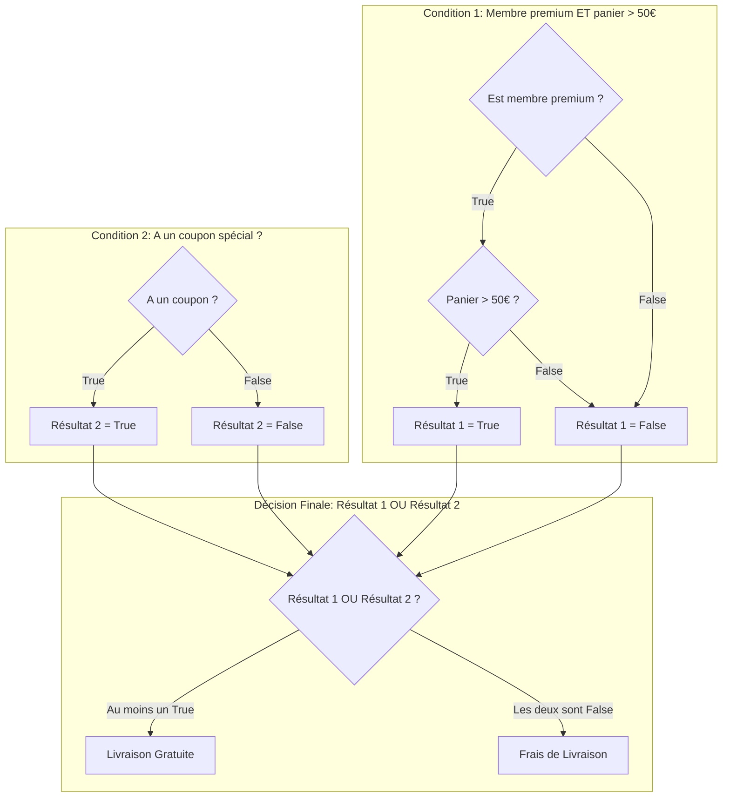

# Opérateurs Arithmétiques, de Comparaison et Logiques {#operateurs-basiques-4}

Si les variables sont les noms de notre histoire, les opérateurs en sont les verbes. Ils nous permettent d'agir sur nos données : les additionner, les comparer, les combiner. Maîtriser les opérateurs est une étape fondamentale pour donner vie à la logique de vos programmes.

Ce chapitre décompose les trois familles d'opérateurs que vous utiliserez constamment.

## 1. Opérateurs Arithmétiques {#operateurs-arithmetiques-4}

### Quoi
Ce sont les opérateurs mathématiques de base. Ils prennent deux valeurs numériques et renvoient un nouveau nombre.

| Opérateur | Nom                 | Exemple     | Résultat |
| :-------- | :------------------ | :---------- | :------- |
| `+`       | Addition            | `5 + 3`     | `8`      |
| `-`       | Soustraction        | `5 - 3`     | `2`      |
| `*`       | Multiplication      | `5 * 3`     | `15`     |
| `/`       | Division (flottante)| `5 / 2`     | `2.5`    |
| `//`      | Division (entière)  | `5 // 2`    | `2`      |
| `%`       | Modulo (reste)      | `5 % 2`     | `1`      |
| `**`      | Exponentiation      | `5 ** 2`    | `25`     |

### Pourquoi
Ils sont le fondement de tout calcul, qu'il s'agisse de calculer le montant total d'un panier d'achat, de déterminer des positions dans un jeu ou de traiter des données scientifiques.

### Comment
Leur utilisation est intuitive et suit l'ordre de priorité des opérations mathématiques (PEMDAS/BODMAS : Parenthèses, Exposants, Multiplication/Division, Addition/Soustraction).

```python
# Cas d'usage : Gérer l'inventaire d'un produit
stock_initial = 100
articles_vendus = 27
articles_retournes = 3

stock_actuel = stock_initial - articles_vendus + articles_retournes
print(f"Stock actuel : {stock_actuel}") # Affiche 76

# Cas d'usage : Répartir des items
nombre_eleves = 25
taille_groupe = 4

nombre_groupes_complets = nombre_eleves // taille_groupe
eleves_sans_groupe = nombre_eleves % taille_groupe

print(f"Il y aura {nombre_groupes_complets} groupes complets.") # Affiche 6
print(f"Il restera {eleves_sans_groupe} élève(s) non assigné(s).") # Affiche 1
```

### Zone de Danger
*   **Division par zéro** : Tenter de diviser un nombre par `0` (avec `/` ou `//`) provoquera une erreur `ZeroDivisionError` et arrêtera votre programme. Il faut toujours prévoir ce cas.
*   **Priorité des opérations** : `2 + 3 * 4` vaut `14`, pas `20`. En cas de doute, utilisez des parenthèses pour clarifier l'ordre : `(2 + 3) * 4`.

---

## 2. Opérateurs de Comparaison {#operateurs-comparaison-4}

### Quoi
Ils comparent deux valeurs et renvoient toujours un résultat booléen : `True` ou `False`.

| Opérateur | Signification              | Exemple      | Résultat |
| :-------- | :------------------------- | :----------- | :------- |
| `==`      | Égal à                     | `5 == 5`     | `True`   |
| `!=`      | Différent de               | `5 != 3`     | `True`   |
| `>`       | Strictement supérieur à    | `5 > 3`      | `True`   |
| `<`       | Strictement inférieur à    | `5 < 3`      | `False`  |
| `>=`      | Supérieur ou égal à        | `5 >= 5`     | `True`   |
| `<=`      | Inférieur ou égal à        | `5 <= 3`     | `False`  |

### Pourquoi
Ils sont la base de la prise de décision. C'est grâce à eux que l'on peut écrire des instructions conditionnelles comme "SI l'utilisateur a plus de 18 ans, ALORS afficher le contenu".

### Comment
On les utilise le plus souvent dans des structures de contrôle que nous verrons au prochain chapitre.

```python
# Cas d'usage : Vérifier l'accès à une fonctionnalité
age_utilisateur = 21
age_requis = 18

acces_autorise = (age_utilisateur >= age_requis)
print(f"Accès autorisé : {acces_autorise}") # Affiche True

# Cas d'usage : Valider un mot de passe (simplifié)
mot_de_passe_saisi = "Python123"
mot_de_passe_correct = "python123"

identifiants_valides = (mot_de_passe_saisi == mot_de_passe_correct)
print(f"Identifiants valides : {identifiants_valides}") # Affiche False (à cause de la casse)
```

### Zone de Danger
L'erreur la plus classique des débutants est de confondre `=` et `==`.
*   `=` est l'**opérateur d'assignation** : il met une valeur dans une variable (`age = 18`).
*   `==` est l'**opérateur de comparaison** : il vérifie si deux valeurs sont égales (`age == 18`).

Utiliser `=` au lieu de `==` dans une condition lèvera une `SyntaxError`.

> 📸 **CAPTURE D'ÉCRAN REQUISE**
> **Sujet** : Fenêtre VS Code montrant un `if age = 18:` avec une erreur de syntaxe soulignée en rouge.
> **Alt Text** : Erreur de syntaxe en Python due à l'utilisation de l'opérateur d'assignation (=) au lieu de l'opérateur de comparaison (==).

---

## 3. Opérateurs Logiques {#operateurs-logiques-4}

### Quoi
Ils permettent de combiner plusieurs expressions booléennes pour créer des conditions complexes. Il en existe trois : `and`, `or`, `not`.

| Opérateur | Résultat                                                      |
| :-------- | :------------------------------------------------------------ |
| `and`     | `True` si **les deux** expressions sont `True`.               |
| `or`      | `True` si **au moins une** des deux expressions est `True`.   |
| `not`     | **Inverse** l'expression ( `not True` devient `False`).       |

### Pourquoi
Ils permettent de modéliser des règles métier du monde réel. "Le client bénéficie de la livraison gratuite SI son panier dépasse 50€ **ET** qu'il est membre premium, **OU** s'il possède un coupon spécial."

### Comment



```python
# Traduction en code du diagramme
est_membre_premium = True
panier = 65.0
a_un_coupon = False

condition1 = est_membre_premium and (panier > 50) # True and True -> True
condition2 = a_un_coupon # False

livraison_gratuite = condition1 or condition2 # True or False -> True
print(f"Livraison gratuite : {livraison_gratuite}") # Affiche True

# Utilisation de 'not'
is_banned = False
can_login = not is_banned # not False -> True
print(f"Peut se connecter : {can_login}") # Affiche True
```

### Zone de Danger
*   **Évaluation paresseuse (short-circuiting)** : Python est efficace. Dans une chaîne de `and`, il s'arrête dès qu'il trouve un `False`. Dans une chaîne de `or`, il s'arrête dès qu'il trouve un `True`. Cela peut être déroutant si vous comptez sur l'exécution d'une fonction dans la deuxième partie de la condition.
*   **Priorité** : `not` est évalué en premier, puis `and`, puis `or`. En cas de doute, là encore, les parenthèses sont vos meilleures amies : `(a and b) or c`.

---

## Validation des Acquis {#validation-4}

### 3 Questions Clés

1.  Quelles sont les trois valeurs distinctes produites par `10 / 3`, `10 // 3` et `10 % 3` ? Expliquez chaque résultat.
2.  Expliquez la différence fondamentale entre `ma_variable = "test"` et `ma_variable == "test"`. Dans quel contexte utiliseriez-vous chacun ?
3.  Évaluez l'expression booléenne suivante sans l'exécuter, en détaillant les étapes : `not (10 < 5) and (3 >= 3)`.

### 3 Exercices Progressifs

#### Exercice 1 : Calculateur de Surface et Périmètre
Créez un script qui demande à l'utilisateur la longueur et la largeur d'un rectangle. Le programme doit ensuite calculer et afficher :
1.  La surface du rectangle (`longueur * largeur`).
2.  Le périmètre du rectangle (`2 * (longueur + largeur)`).

<details>
<summary>Découvrir la solution commentée</summary>

```python
# 1. Demander les dimensions à l'utilisateur
longueur_str = input("Entrez la longueur du rectangle : ")
largeur_str = input("Entrez la largeur du rectangle : ")

# 2. Convertir les entrées en nombres (float pour plus de flexibilité)
longueur = float(longueur_str)
largeur = float(largeur_str)

# 3. Effectuer les calculs arithmétiques
surface = longueur * largeur
perimetre = 2 * (longueur + largeur)

# 4. Afficher les résultats de manière claire
print(f"Pour un rectangle de {longueur} sur {largeur}:")
print(f"- La surface est de {surface}")
print(f"- Le périmètre est de {perimetre}")
```
</details>

#### Exercice 2 : Vérificateur de Seuil d'Alerte
Vous gérez un stock. Écrivez un programme qui :
1.  Définit trois variables : `stock_actuel` (int), `seuil_alerte` (int), et `nouvelle_commande_passee` (bool).
2.  Crée une variable `doit_reapprovisionner`.
3.  Cette variable doit être `True` si le stock actuel est inférieur ou égal au seuil d'alerte **ET** qu'aucune nouvelle commande n'a déjà été passée. Sinon, elle doit être `False`.
4.  Affichez le résultat. Testez avec différentes valeurs pour vos variables.

<details>
<summary>Découvrir la solution commentée</summary>

```python
# 1. Simulation des données de stock
stock_actuel = 12
seuil_alerte = 15
nouvelle_commande_passee = False

print(f"État: Stock={stock_actuel}, Seuil={seuil_alerte}, Commande passée={nouvelle_commande_passee}")

# 2. Logique de décision
# La condition est vraie si les deux sous-conditions sont vraies
en_dessous_du_seuil = (stock_actuel <= seuil_alerte)
aucune_commande_en_cours = not nouvelle_commande_passee # ou (nouvelle_commande_passee == False)

doit_reapprovisionner = en_dessous_du_seuil and aucune_commande_en_cours

# 3. Affichage de la décision
print(f"Action requise (réapprovisionnement) : {doit_reapprovisionner}") # Devrait afficher True

# --- Test avec un autre scénario ---
stock_actuel = 8
nouvelle_commande_passee = True
print(f"\nÉtat: Stock={stock_actuel}, Seuil={seuil_alerte}, Commande passée={nouvelle_commande_passee}")
doit_reapprovisionner = (stock_actuel <= seuil_alerte) and not nouvelle_commande_passee
print(f"Action requise (réapprovisionnement) : {doit_reapprovisionner}") # Devrait afficher False
```
</details>

#### Exercice 3 : Accès à un Parc d'Attractions
Développez un script qui détermine si un groupe peut accéder à une attraction.
1.  Créez les variables : `taille_min_requise_cm` (int), `age_min_requis` (int), `taille_visiteur_cm` (int), `age_visiteur` (int), `a_un_accompagnateur` (bool).
2.  La règle d'accès est la suivante : le visiteur doit respecter la taille minimale **ET** l'âge minimum.
3.  **Exception** : si le visiteur n'a pas l'âge requis mais a la taille requise, il peut quand même entrer s'il a un accompagnateur.
4.  Créez une variable `acces_accorde` qui contient le résultat booléen.
5.  Affichez le résultat.

<details>
<summary>Découvrir la solution commentée</summary>

```python
# 1. Définition des règles et des données du visiteur
taille_min_requise_cm = 120
age_min_requis = 8

taille_visiteur_cm = 130
age_visiteur = 7
a_un_accompagnateur = True

print(f"Visiteur: {age_visiteur} ans, {taille_visiteur_cm} cm, Accompagnateur: {a_un_accompagnateur}")

# 2. Décomposition de la logique en conditions booléennes
a_la_taille_requise = (taille_visiteur_cm >= taille_min_requise_cm)
a_lage_requis = (age_visiteur >= age_min_requis)

# 3. Application des règles avec les opérateurs logiques
# Règle principale : il faut l'âge ET la taille
condition_standard = a_la_taille_requise and a_lage_requis

# Règle d'exception : il faut la taille ET un accompagnateur (même si l'âge n'est pas bon)
condition_exception = a_la_taille_requise and a_un_accompagnateur

# Le visiteur a accès si la condition standard OU la condition d'exception est remplie
acces_accorde = condition_standard or condition_exception

# 4. Affichage du résultat final
print(f"Accès à l'attraction accordé : {acces_accorde}") # Devrait afficher True
```
</details>