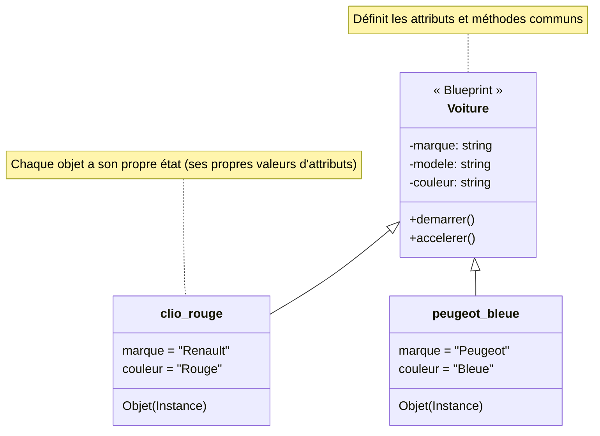

# Programmation Orientée Objet: Classes et Objets {#poo-classes-objets-23}

Jusqu'à présent, vous avez principalement utilisé la programmation procédurale : vous écrivez des séquences d'instructions et des fonctions qui manipulent des données. La Programmation Orientée Objet (POO) est un paradigme différent, extrêmement puissant pour organiser des projets complexes.

L'idée centrale de la POO est de regrouper les données (appelées **attributs**) et les fonctions qui opèrent sur ces données (appelées **méthodes**) au sein d'une même entité logique : un **objet**.

## 1. Classes et Objets : Le Plan et la Maison {#classes-objets-23}

### Quoi
-   Une **Classe** est un **plan de construction** (un *blueprint*). Elle définit la structure et le comportement que tous les objets d'un certain type auront. Par exemple, la classe `Voiture` décrirait qu'une voiture a une couleur, une marque, et qu'elle peut démarrer ou accélérer.
-   Un **Objet** (ou **instance**) est une **construction réelle** basée sur ce plan. C'est une entité concrète que vous pouvez manipuler. Par exemple, `ma_clio_rouge` et `votre_peugeot_bleue` sont deux objets différents (deux instances) de la classe `Voiture`.



### Pourquoi
La POO permet de :
-   **Encapsuler** : Regrouper la logique et les données au même endroit, ce qui rend le code plus facile à gérer.
-   **Réutiliser** : Une classe peut être utilisée pour créer autant d'objets que nécessaire.
-   **Maintenir** : Modifier le comportement d'un type d'objet se fait à un seul endroit (dans sa classe).

### Comment
La syntaxe pour déclarer une classe est simple, en utilisant le mot-clé `class`. Par convention, les noms de classes utilisent le `CamelCase`.

```python
# Définition de la classe (le plan)
class Voiture:
    pass # 'pass' signifie que la classe est vide pour l'instant

# Création de deux objets (instances) à partir de la classe
ma_voiture = Voiture()
votre_voiture = Voiture()

print(type(ma_voiture))
print(ma_voiture)
print(votre_voiture) # Ce sont bien deux objets distincts en mémoire
```

---

## 2. Le Constructeur `__init__` et le Paramètre `self` {#constructeur-init-self-23}

### Quoi
Pour qu'une classe soit utile, il faut pouvoir initialiser les attributs de ses objets lors de leur création. C'est le rôle de la méthode spéciale `__init__`.
-   `__init__` : C'est le **constructeur**. Cette méthode est appelée automatiquement par Python au moment où vous créez un nouvel objet (`Voiture()`).
-   `self` : C'est le premier paramètre de **toutes** les méthodes d'instance (y compris `__init__`). Il représente **l'instance elle-même**. C'est grâce à `self` que l'on peut accéder aux attributs et méthodes de l'objet sur lequel on travaille.

### Pourquoi
Le constructeur garantit que chaque objet sera créé dans un état initial valide, avec tous les attributs nécessaires définis. `self` est le mécanisme qui permet à un objet de manipuler ses propres données.

### Comment
**Cas Réel : Créons une classe `Voiture` fonctionnelle.**

```python
class Voiture:
    # Le constructeur __init__
    def __init__(self, marque, modele, couleur):
        print(f"Création d'une nouvelle voiture : {marque} {modele}")
        # On assigne les paramètres aux attributs de l'instance (self)
        self.marque = marque
        self.modele = modele
        self.couleur = couleur
        self.vitesse = 0 # On peut aussi initialiser un attribut avec une valeur par défaut

# Instanciation : Python appelle __init__ en arrière-plan
# Voiture("Renault", "Clio", "Rouge") devient __init__(<nouvel_objet>, "Renault", "Clio", "Rouge")
ma_renault = Voiture("Renault", "Clio", "Rouge")
ma_peugeot = Voiture("Peugeot", "208", "Bleue")

# Accès aux attributs de chaque objet
print(f"Ma première voiture est une {ma_renault.marque} de couleur {ma_renault.couleur}.")
print(f"Ma seconde voiture est une {ma_peugeot.marque} de couleur {ma_peugeot.couleur}.")
```

### Zone de Danger
*   **Oublier `self`** : Oublier `self` comme premier paramètre d'une méthode est l'erreur la plus courante en POO débutant. Python lèvera une `TypeError` vous indiquant qu'un argument est manquant.

    ```python
    class MaClasse:
        def ma_methode(): # ❌ Erreur ! Manque 'self'
            print("Hello")
    ```

---

## 3. Méthodes d'Instance {#methodes-instance-23}

### Quoi
Les méthodes sont des fonctions définies à l'intérieur d'une classe. Elles définissent le comportement des objets, c'est-à-dire les actions qu'ils peuvent effectuer.

### Pourquoi
Les méthodes permettent de manipuler l'état interne de l'objet (ses attributs) de manière contrôlée. Par exemple, au lieu de modifier directement `voiture.vitesse = 10`, on utilisera une méthode `voiture.accelerer(10)` qui pourra contenir de la logique supplémentaire (vérifier si le moteur est démarré, etc.).

### Comment
**Cas Réel : Ajoutons des comportements à notre `Voiture`.**

```python
class Voiture:
    def __init__(self, marque, modele):
        self.marque = marque
        self.modele = modele
        self.est_demarree = False
        self.vitesse = 0

    # Méthode pour démarrer la voiture
    def demarrer(self):
        if self.est_demarree:
            print(f"La {self.marque} {self.modele} est déjà démarrée.")
        else:
            print(f"Démarrage de la {self.marque} {self.modele}. Vroum !")
            self.est_demarree = True

    # Méthode pour accélérer
    def accelerer(self, acceleration):
        if not self.est_demarree:
            print("Impossible d'accélérer, le moteur est éteint.")
        else:
            self.vitesse += acceleration
            print(f"La voiture accélère. Vitesse actuelle : {self.vitesse} km/h.")

# Création d'un objet
ma_super_voiture = Voiture("Ferrari", "SF90")

# Appel des méthodes sur l'objet
ma_super_voiture.accelerer(50) # Le moteur est éteint
ma_super_voiture.demarrer()
ma_super_voiture.demarrer() # Déjà démarrée
ma_super_voiture.accelerer(50)
ma_super_voiture.accelerer(30)
```

---

## Validation des Acquis {#validation-23}

### 3 Questions Clés
1.  Quelle est la différence fondamentale entre une classe et un objet ?
2.  Quel est le rôle exact de la méthode `__init__` ? Quand est-elle appelée ?
3.  À quoi sert le paramètre `self` dans une méthode d'instance ?

### 3 Exercices Progressifs

#### Exercice 1 : Modéliser un Cercle
Créez une classe `Cercle` qui est initialisée avec un `rayon`.
-   Elle doit avoir un attribut `rayon`.
-   Elle doit avoir une méthode `calculer_aire()` qui retourne l'aire du cercle (π * rayon²).
-   Elle doit avoir une méthode `calculer_circonference()` qui retourne sa circonférence (2 * π * rayon).
*Indice : vous pouvez utiliser `math.pi` en important le module `math`.*

<details>
<summary>Découvrir la solution commentée</summary>

```python
import math

class Cercle:
    def __init__(self, rayon):
        # Le constructeur initialise l'attribut 'rayon'
        self.rayon = rayon

    def calculer_aire(self):
        """Calcule et retourne l'aire du cercle."""
        # On accède à l'attribut de l'instance via self.rayon
        return math.pi * (self.rayon ** 2)

    def calculer_circonference(self):
        """Calcule et retourne la circonférence du cercle."""
        return 2 * math.pi * self.rayon

# Test
c1 = Cercle(10)
print(f"Cercle de rayon {c1.rayon}")
print(f"Aire : {c1.calculer_aire():.2f}")
print(f"Circonférence : {c1.calculer_circonference():.2f}")
```
</details>

#### Exercice 2 : Gérer un Compte en Banque
Créez une classe `CompteBancaire`.
-   Le constructeur doit prendre un `titulaire` (string) et un `solde_initial` (float).
-   La classe doit avoir une méthode `crediter(montant)` qui ajoute un montant au solde.
-   Elle doit avoir une méthode `debiter(montant)` qui retire un montant du solde, mais seulement si le solde est suffisant. Si les fonds sont insuffisants, elle doit afficher un message d'erreur et ne rien faire.
-   Elle doit avoir une méthode `afficher_solde()` qui affiche le nom du titulaire et le solde actuel.

<details>
<summary>Découvrir la solution commentée</summary>

```python
class CompteBancaire:
    def __init__(self, titulaire, solde_initial):
        self.titulaire = titulaire
        self.solde = solde_initial

    def crediter(self, montant):
        """Ajoute un montant au solde."""
        if montant > 0:
            self.solde += montant
            print(f"{montant}€ crédités. Nouveau solde : {self.solde}€.")
        else:
            print("Le montant à créditer doit être positif.")

    def debiter(self, montant):
        """Retire un montant du solde si les fonds sont suffisants."""
        if montant <= 0:
            print("Le montant à débiter doit être positif.")
            return

        if self.solde >= montant:
            self.solde -= montant
            print(f"{montant}€ débités. Nouveau solde : {self.solde}€.")
        else:
            print(f"Opération refusée. Solde insuffisant ({self.solde}€).")

    def afficher_solde(self):
        """Affiche les informations du compte."""
        print(f"Compte de {self.titulaire} - Solde : {self.solde}€")

# Test
compte_alice = CompteBancaire("Alice", 1000)
compte_alice.afficher_solde()
compte_alice.crediter(200)
compte_alice.debiter(50)
compte_alice.debiter(1500) # Doit échouer
compte_alice.afficher_solde()
```
</details>

#### Exercice 3 : Catalogue de Produits
Créez une classe `Produit`.
-   Le constructeur prend un `nom`, un `prix_ht` (hors taxes) et un `taux_tva` (ex: 0.20 pour 20%).
-   Créez une méthode `calculer_prix_ttc()` qui calcule et retourne le prix toutes taxes comprises.
-   Créez une méthode `afficher_infos()` qui affiche le nom, le prix HT, le taux de TVA et le prix TTC du produit de manière formatée.

<details>
<summary>Découvrir la solution commentée</summary>

```python
class Produit:
    def __init__(self, nom, prix_ht, taux_tva):
        self.nom = nom
        self.prix_ht = prix_ht
        self.taux_tva = taux_tva

    def calculer_prix_ttc(self):
        """Calcule le prix TTC à partir du prix HT et de la TVA."""
        return self.prix_ht * (1 + self.taux_tva)

    def afficher_infos(self):
        """Affiche un résumé formaté des informations du produit."""
        prix_ttc = self.calculer_prix_ttc()
        
        print("--- Fiche Produit ---")
        print(f"Nom      : {self.nom}")
        print(f"Prix HT  : {self.prix_ht:.2f}€")
        print(f"TVA      : {self.taux_tva * 100}%")
        print(f"Prix TTC : {prix_ttc:.2f}€")
        print("-----------------------")

# Test
laptop = Produit("Ordinateur Portable", 1200, 0.20)
souris = Produit("Souris sans fil", 25, 0.20)

laptop.afficher_infos()
souris.afficher_infos()
```
</details>