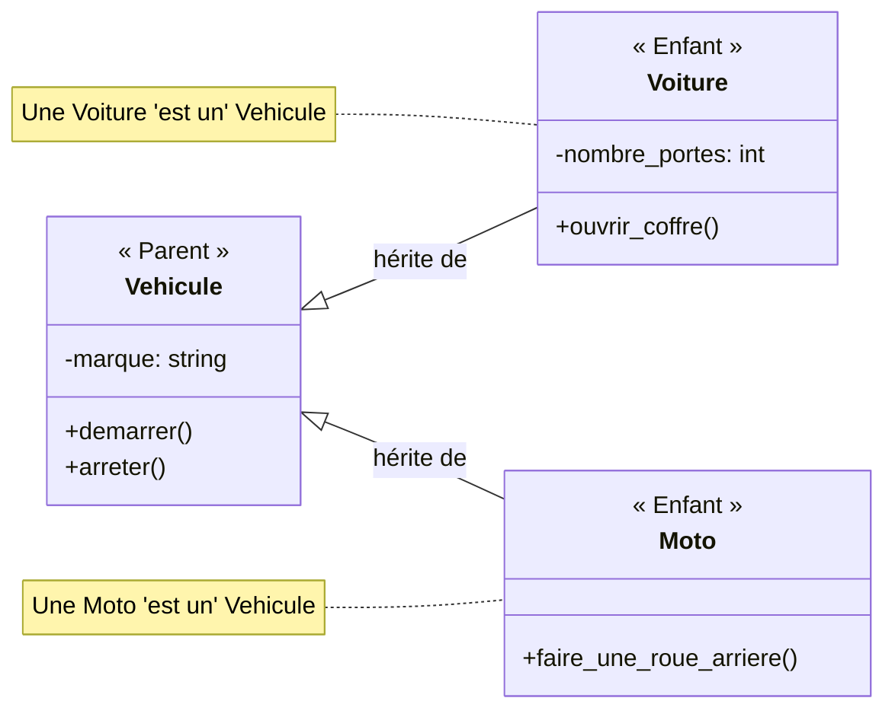

# POO: Héritage et Surcharge de Méthodes {#poo-heritage-surcharge-24}

La Programmation Orientée Objet tire sa puissance de trois piliers principaux : l'encapsulation, l'héritage et le polymorphisme. Après avoir vu comment encapsuler des données et des comportements dans des objets, nous allons maintenant explorer l'**héritage**, un mécanisme qui permet de créer de nouvelles classes en se basant sur des classes existantes.

L'héritage est le fondement de la réutilisation de code en POO. Il permet de définir une hiérarchie de classes qui partagent des caractéristiques communes tout en ayant des comportements spécifiques.

## 1. L'Héritage : Créer des Spécialisations {#heritage-specialisations-24}

### Quoi
L'héritage est une relation "est un(e)" entre deux classes. Une nouvelle classe, appelée **classe enfant** (ou *subclass*), peut **hériter** des attributs et des méthodes d'une classe existante, appelée **classe parente** (ou *superclass*).

La classe enfant obtient ainsi tout le comportement de la classe parente et peut y ajouter ses propres attributs et méthodes, ou modifier ceux qui existent déjà.



### Pourquoi
-   **Ne Pas Répéter (DRY - Don't Repeat Yourself)** : Le code commun est écrit une seule fois dans la classe parente. Toutes les classes enfants en bénéficient sans avoir à le réécrire.
-   **Organisation Logique** : L'héritage permet de structurer le code en fonction des relations logiques du monde réel, ce qui le rend plus facile à comprendre et à maintenir.
-   **Extensibilité** : On peut facilement créer de nouvelles classes spécialisées sans modifier le code existant qui a déjà été testé et validé.

### Comment
La syntaxe pour l'héritage est simple : on indique la classe parente entre parenthèses lors de la définition de la classe enfant.

**Cas Réel : Créons une hiérarchie de `Vehicule`.**
```python
# Classe Parente
class Vehicule:
    def __init__(self, marque):
        self.marque = marque

    def demarrer(self):
        print(f"Le véhicule de marque {self.marque} démarre.")

# Classe Enfant
class Voiture(Vehicule): # Voiture hérite de Vehicule
    def ouvrir_coffre(self):
        print("Le coffre de la voiture s'ouvre.")

# Utilisation
mon_vehicule = Vehicule("Générique")
ma_voiture = Voiture("Renault")

mon_vehicule.demarrer()

# ma_voiture a accès à ses propres méthodes...
ma_voiture.ouvrir_coffre()
# ... et aux méthodes héritées de Vehicule !
ma_voiture.demarrer() 
# L'attribut 'marque' est aussi hérité et initialisé
print(f"La marque de ma voiture est {ma_voiture.marque}.")
```

---

## 2. Surcharge de Méthodes et `super()` {#surcharge-methodes-super-24}

### Quoi
-   La **Surcharge de Méthodes** (Method Overriding) est le processus par lequel une classe enfant fournit une implémentation spécifique d'une méthode qui est déjà définie dans sa classe parente.
-   La fonction `super()` est un outil essentiel qui permet, depuis une classe enfant, d'appeler la méthode correspondante de la classe parente.

### Pourquoi
La surcharge permet de **spécialiser le comportement**. Un oiseau et un avion peuvent tous deux `se_deplacer()`, mais ils ne le font pas de la même manière. La surcharge permet de refléter ces différences.
`super()` est utilisé pour **étendre le comportement** du parent, au lieu de le remplacer complètement. On exécute d'abord la logique du parent, puis on ajoute la logique spécifique de l'enfant.

### Comment
**Cas 1 : Remplacer complètement une méthode.**
```python
class Animal:
    def crier(self):
        print("Cri générique d'animal")

class Chien(Animal):
    # On surcharge la méthode crier
    def crier(self):
        print("Woof ! Woof !")

rex = Chien()
rex.crier() # Affiche "Woof ! Woof !", pas le cri générique.
```

**Cas 2 : Étendre le constructeur `__init__` (cas le plus courant).**
Une classe enfant a souvent besoin de plus d'attributs que sa parente. On surcharge `__init__` pour initialiser ces nouveaux attributs, et on utilise `super().__init__()` pour laisser le parent initialiser les siens.

```python
class Salarie:
    def __init__(self, nom, matricule):
        self.nom = nom
        self.matricule = matricule
        print(f"Initialisation du Salarié {self.nom} (Mat: {self.matricule})")

class Manager(Salarie):
    def __init__(self, nom, matricule, equipe):
        # Étape 1: Appeler le constructeur du parent pour initialiser nom et matricule
        super().__init__(nom, matricule)
        
        # Étape 2: Initialiser les attributs spécifiques au Manager
        self.equipe = equipe
        print(f"Le Manager {self.nom} dirige une équipe de {len(self.equipe)} personnes.")

# Création d'une instance
chef_projet = Manager("Alice", "M123", ["Bob", "Charlie"])
```

### Zone de Danger
*   **Oublier `super().__init__()`** : Si vous surchargez `__init__` dans une classe enfant mais que vous oubliez d'appeler `super().__init__()`, les attributs de la classe parente ne seront jamais initialisés. Votre objet sera dans un état invalide, ce qui conduira à des `AttributeError` plus tard.
*   **Signature de méthode** : Quand vous surchargez une méthode, assurez-vous de respecter la signature (noms et nombre de paramètres) attendue par le reste du code qui pourrait l'utiliser. Modifier la signature peut casser le polymorphisme.

---

## Validation des Acquis {#validation-24}

### 3 Questions Clés
1.  Que signifie la relation "est un(e)" dans le contexte de l'héritage ? Donnez un exemple.
2.  À quoi sert `super()` et dans quel scénario est-il indispensable de l'utiliser ?
3.  Quelle est la différence entre *remplacer* complètement une méthode parente et l'*étendre* ?

### 3 Exercices Progressifs

#### Exercice 1 : Employés et Développeurs
1.  Créez une classe `Employe` avec un constructeur qui prend un `nom` et un `salaire_annuel`.
2.  Créez une classe `Developpeur` qui hérite de `Employe`.
3.  Le constructeur de `Developpeur` doit prendre un `nom`, un `salaire_annuel` et une liste de `langages` de programmation. Il doit correctement initialiser tous les attributs.

<details>
<summary>Découvrir la solution commentée</summary>

```python
class Employe:
    def __init__(self, nom, salaire_annuel):
        self.nom = nom
        self.salaire_annuel = salaire_annuel

class Developpeur(Employe):
    def __init__(self, nom, salaire_annuel, langages):
        # On utilise super() pour que la classe Employe gère le nom et le salaire
        super().__init__(nom, salaire_annuel)
        
        # On gère l'attribut spécifique à Developpeur
        self.langages = langages

# Test
dev1 = Developpeur("Bob", 60000, ["Python", "JavaScript"])

print(f"Nom : {dev1.nom}") # Attribut hérité
print(f"Salaire : {dev1.salaire_annuel}€") # Attribut hérité
print(f"Langages : {dev1.langages}") # Attribut propre
```
</details>

#### Exercice 2 : Affichage Spécialisé
Reprenez les classes de l'exercice 1.
1.  Ajoutez une méthode `afficher_details()` à la classe `Employe` qui affiche une chaîne comme `"Nom: [nom], Salaire: [salaire]€"`.
2.  Surchargez la méthode `afficher_details()` dans la classe `Developpeur` pour qu'elle affiche aussi la liste des langages.
3.  Utilisez `super()` pour ne pas avoir à réécrire le formatage du nom et du salaire.

<details>
<summary>Découvrir la solution commentée</summary>

```python
class Employe:
    def __init__(self, nom, salaire_annuel):
        self.nom = nom
        self.salaire_annuel = salaire_annuel

    def afficher_details(self):
        print(f"Nom: {self.nom}, Salaire: {self.salaire_annuel}€")

class Developpeur(Employe):
    def __init__(self, nom, salaire_annuel, langages):
        super().__init__(nom, salaire_annuel)
        self.langages = langages

    def afficher_details(self):
        # On appelle d'abord la méthode du parent pour afficher les infos communes
        super().afficher_details()
        
        # On ajoute ensuite l'affichage spécifique au développeur
        print(f"  Langages maîtrisés: {', '.join(self.langages)}")

# Test
employe_generique = Employe("Alice", 50000)
dev_specialise = Developpeur("Bob", 65000, ["Python", "SQL", "Docker"])

print("--- Détails de l'employé ---")
employe_generique.afficher_details()

print("\n--- Détails du développeur ---")
dev_specialise.afficher_details()
```
</details>

#### Exercice 3 : Hiérarchie de Figures Géométriques
L'objectif est de créer un système où il est impossible d'instancier une figure géométrique de base, mais où chaque figure concrète doit implémenter un calcul d'aire.
1.  Créez une classe parente `Figure`.
2.  Son constructeur ne fait rien (`pass`).
3.  Sa méthode `calculer_aire()` doit lever une exception `NotImplementedError` avec le message `"Cette méthode doit être surchargée par les classes enfants."`. C'est une façon de créer une "classe abstraite" simple.
4.  Créez deux classes enfants, `Rectangle` (avec `longueur` et `largeur`) et `Triangle` (avec `base` et `hauteur`), qui héritent de `Figure`.
5.  Implémentez leur constructeur et surchargez la méthode `calculer_aire()` pour qu'elle retourne le bon calcul.

<details>
<summary>Découvrir la solution commentée</summary>

```python
class Figure:
    def __init__(self):
        pass # Pas d'attributs communs à initialiser ici

    def calculer_aire(self):
        """
        Méthode de base qui doit être implémentée par toute sous-classe.
        """
        raise NotImplementedError("Cette méthode doit être surchargée par les classes enfants.")

class Rectangle(Figure):
    def __init__(self, longueur, largeur):
        super().__init__() # Bonne pratique même s'il ne fait rien
        self.longueur = longueur
        self.largeur = largeur

    def calculer_aire(self):
        """Surcharge pour le calcul de l'aire d'un rectangle."""
        return self.longueur * self.largeur

class Triangle(Figure):
    def __init__(self, base, hauteur):
        super().__init__()
        self.base = base
        self.hauteur = hauteur
    
    def calculer_aire(self):
        """Surcharge pour le calcul de l'aire d'un triangle."""
        return 0.5 * self.base * self.hauteur

# Test
mon_rectangle = Rectangle(10, 5)
mon_triangle = Triangle(10, 5)

print(f"Aire du rectangle : {mon_rectangle.calculer_aire()}")
print(f"Aire du triangle : {mon_triangle.calculer_aire()}")

# Essayer d'utiliser la méthode de la classe de base lèvera une erreur, comme attendu
try:
    figure_generique = Figure()
    figure_generique.calculer_aire()
except NotImplementedError as e:
    print(f"\nErreur attrapée avec succès : {e}")
```
</details>