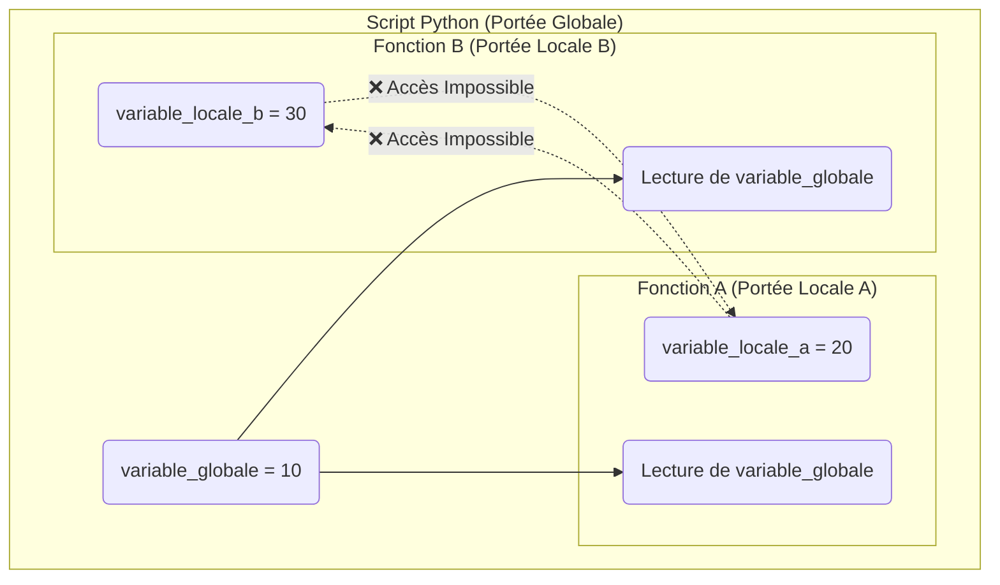

# Portée des Variables: Locale et Globale {#portee-variables-15}

Imaginez une ville où chaque maison a sa propre boîte aux lettres (`portée locale`) et il y a une grande place du village avec un panneau d'affichage public (`portée globale`). La **portée** (ou *scope* en anglais) d'une variable définit "où" cette variable est visible et accessible dans votre code.

Comprendre la portée est essentiel pour éviter des bugs déroutants où une variable ne semble pas avoir la bonne valeur ou n'existe tout simplement pas là où vous vous attendez à la trouver.



## 1. Portée Locale {#portee-locale-15}

### Quoi
Une variable créée à l'intérieur d'une fonction est dite **locale** à cette fonction. Elle naît lorsque la fonction est appelée et est détruite lorsque la fonction a terminé son exécution. Elle est complètement invisible et inaccessible depuis l'extérieur de la fonction.

### Pourquoi
C'est un principe de sécurité et de clarté. Chaque fonction devient une boîte noire indépendante. Vous pouvez utiliser des noms de variables communs comme `i`, `resultat` ou `temp` dans différentes fonctions sans qu'elles n'interfèrent les unes avec les autres. Cela empêche les "effets de bord" où une fonction modifierait accidentellement une variable utilisée ailleurs.

### Comment
```python
def calculer_prix_ttc():
    # prix_ht est locale à cette fonction
    prix_ht = 100
    tva = prix_ht * 0.2
    print(f"À l'intérieur de la fonction, le prix HT est : {prix_ht}")

calculer_prix_ttc()

# Essayer d'accéder à prix_ht depuis l'extérieur provoquera une erreur
print(prix_ht) # ❌ NameError: name 'prix_ht' is not defined
```

### Zone de Danger
*   **`NameError`** : L'erreur la plus directe liée à la portée locale. Elle survient lorsque vous essayez d'utiliser une variable en dehors de la fonction où elle a été définie. Python vous dira simplement qu'il ne connaît pas ce nom.

> 📸 **CAPTURE D'ÉCRAN REQUISE**
> **Sujet** : Le code ci-dessus exécuté, montrant la sortie de la fonction puis l'erreur `NameError: name 'prix_ht' is not defined`.
> **Alt Text** : Exemple d'une erreur NameError en Python due à la portée locale d'une variable.

---

## 2. Portée Globale {#portee-globale-15}

### Quoi
Une variable définie au niveau principal de votre script (en dehors de toute fonction) est **globale**. Sa portée s'étend à tout le fichier. Elle peut être **lue** depuis n'importe quelle fonction sans aucune déclaration spéciale.

### Pourquoi
La portée globale est utile pour les constantes ou les données de configuration qui doivent être accessibles par de nombreuses fonctions dans votre programme. Par exemple, un taux de TVA, le nom de l'application, ou une connexion à une base de données.

### Comment
```python
# TAUX_TVA est une variable globale (souvent en majuscules par convention pour les constantes)
TAUX_TVA = 0.20

def calculer_prix_produit(prix_ht):
    # La fonction peut LIRE la variable globale TAUX_TVA
    montant_tva = prix_ht * TAUX_TVA
    return prix_ht + montant_tva

prix_final_1 = calculer_prix_produit(100)
prix_final_2 = calculer_prix_produit(50)

print(f"Le prix final du premier produit est : {prix_final_1:.2f}€")
print(f"Le prix final du second produit est : {prix_final_2:.2f}€")
```

### Zone de Danger
*   **Shadowing (Masquage)** : Attention ! Si vous assignez une valeur à une variable à l'intérieur d'une fonction qui a le même nom qu'une variable globale, vous ne modifiez pas la variable globale. Vous créez une **nouvelle variable locale** qui "masque" la globale le temps de l'exécution de la fonction.

```python
x = 10 # Globale

def ma_fonction():
    x = 99 # Locale ! Crée une nouvelle variable x propre à la fonction
    print(f"À l'intérieur, x vaut : {x}") # Affiche 99

ma_fonction()
print(f"À l'extérieur, x vaut toujours : {x}") # Affiche 10
```

---

## 3. Modifier une Variable Globale : le mot-clé `global` {#mot-cle-global-15}

### Quoi
Pour explicitement modifier une variable globale depuis l'intérieur d'une fonction, vous devez utiliser le mot-clé `global` pour le déclarer. Cela indique à Python : "Attention, pour cette variable, ne crée pas de version locale, je veux travailler directement avec la version globale."

### Pourquoi
C'est le seul moyen de permettre à une fonction de modifier un état qui persiste en dehors d'elle. C'est utile pour des cas simples comme un compteur global ou pour changer un paramètre de configuration à la volée.

### Comment
```python
# Cas d'usage : Compter le nombre de fois qu'une opération est effectuée
nombre_operations = 0 # Globale

def effectuer_operation():
    # On déclare qu'on va modifier la variable globale
    global nombre_operations
    
    print("Opération effectuée.")
    nombre_operations += 1 # On modifie la variable globale

effectuer_operation()
effectuer_operation()
effectuer_operation()

print(f"Le nombre total d'opérations effectuées est : {nombre_operations}") # Affiche 3
```

### Zone de Danger
L'utilisation de `global` doit être exceptionnelle. C'est souvent considéré comme une mauvaise pratique car cela brise l'indépendance des fonctions. Votre fonction a maintenant un "effet de bord" caché : elle modifie une variable externe. Cela rend le code plus difficile à suivre, à tester et à déboguer. Il est presque toujours préférable de retourner une valeur et de gérer la mise à jour de la variable à l'extérieur de la fonction.

---

## Validation des Acquis {#validation-15}

### 3 Questions Clés

1.  Quelle est la durée de vie d'une variable déclarée à l'intérieur d'une fonction ?
2.  Que se passe-t-il si vous écrivez `ma_variable = 5` dans une fonction, alors qu'une variable `ma_variable` existe déjà dans la portée globale ?
3.  Dans quel cas le mot-clé `global` est-il indispensable, et pourquoi faut-il l'utiliser avec parcimonie ?

### 3 Exercices Progressifs

#### Exercice 1 : Debugger la Portée
Le code ci-dessous ne fonctionne pas et lève une `NameError`. Corrigez-le en utilisant ce que vous avez appris sur la portée et les valeurs de retour, **sans utiliser de variable globale**.

```python
# CODE À CORRIGER
def creer_message_accueil(nom):
    message = f"Bienvenue, {nom} !"

creer_message_accueil("Lucas")
print(message) # NameError
```

<details>
<summary>Découvrir la solution commentée</summary>

```python
# SOLUTION
def creer_message_accueil(nom):
    # La variable 'message' est locale. Pour l'utiliser à l'extérieur,
    # la fonction doit la retourner.
    message = f"Bienvenue, {nom} !"
    return message

# On appelle la fonction et on stocke sa valeur de retour dans une nouvelle variable.
# Cette variable peut avoir le même nom, mais ce n'est pas la même que celle de la fonction.
message_accueil = creer_message_accueil("Lucas")
print(message_accueil)
```
</details>

#### Exercice 2 : Utiliser une Configuration Globale
Vous écrivez un petit programme qui doit afficher des messages de log. Le format de ces messages dépend d'une variable de configuration globale.
1.  Créez une variable globale `APP_NAME` avec la valeur `"MonApp"`.
2.  Créez une fonction `log(message)` qui prend un message en paramètre.
3.  Cette fonction doit lire la variable globale `APP_NAME` et afficher le log formaté : `[NOM_APP] - message`.
4.  Appelez la fonction `log` avec deux messages différents.

<details>
<summary>Découvrir la solution commentée</summary>

```python
# 1. Variable de configuration globale
APP_NAME = "MonApp"

# 2. & 3. Fonction qui lit la variable globale
def log(message):
    """Affiche un message de log formaté avec le nom de l'application."""
    # Pas besoin de 'global' car on ne fait que LIRE la variable
    print(f"[{APP_NAME}] - {message}")

# 4. Appels de la fonction
log("Démarrage du service.")
log("Connexion de l'utilisateur 'admin'.")

# On peut même voir l'avantage : si on change la config, tout est mis à jour
APP_NAME = "SuperApp V2"
log("Mise à jour effectuée.")
```
</details>

#### Exercice 3 : Compteur de Clics
Simulez un compteur de clics pour une interface utilisateur.
1.  Créez une variable globale `nombre_clics` initialisée à `0`.
2.  Créez une fonction `clic_bouton()` qui incrémente ce compteur de 1 à chaque appel.
3.  Créez une autre fonction `afficher_clics()` qui affiche simplement le nombre actuel de clics.
4.  Simulez plusieurs clics en appelant `clic_bouton()` plusieurs fois, puis affichez le total avec `afficher_clics()`.

<details>
<summary>Découvrir la solution commentée</summary>

```python
# 1. Compteur global
nombre_clics = 0

# 2. Fonction qui MODIFIE la variable globale
def clic_bouton():
    """Simule un clic et incrémente le compteur global."""
    global nombre_clics # Indispensable pour la modification
    nombre_clics += 1
    print("Clic !")

# 3. Fonction qui LIT la variable globale
def afficher_clics():
    """Affiche le nombre total de clics."""
    print(f"Nombre total de clics : {nombre_clics}")

# 4. Simulation
print("--- Simulation d'utilisation ---")
afficher_clics()
clic_bouton()
clic_bouton()
afficher_clics()
clic_bouton()
afficher_clics()
```
</details>