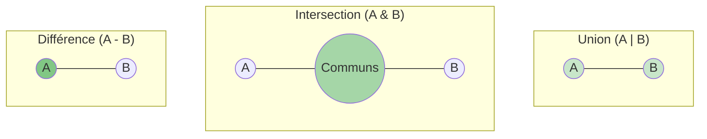

# Sets: Collections d'Éléments Uniques {#sets-uniques-13}

Nous avons vu les listes (ordonnées, modifiables), les tuples (ordonnés, non modifiables) et les dictionnaires (accès par clé). Il nous reste une dernière grande structure de données à explorer : le **set**.

Un `set` (ensemble en français) est une collection qui ne se soucie que de deux choses : l'**unicité** des éléments qu'elle contient et la **rapidité** pour vérifier si un élément y est présent.

## 1. Unicité et Création d'un Set {#unicite-creation-set-13}

### Quoi
Un `set` est une collection **non ordonnée** d'éléments **uniques**. Cela signifie qu'un `set` ne peut pas contenir de doublons. Si vous essayez d'ajouter un élément qui est déjà présent, il ne se passera rien.

### Pourquoi
Les `sets` sont extrêmement utiles pour deux tâches principales :
1.  **Éliminer les doublons** d'une autre collection (comme une liste) de manière très efficace.
2.  **Vérifier la présence** d'un élément (`membership testing`). C'est beaucoup plus rapide de vérifier si un élément est dans un `set` que dans une `liste`, surtout si la collection est grande.

### Comment
On peut créer un `set` de deux manières :
*   Avec la fonction `set()` en lui passant une liste (ou un autre itérable).
*   Avec les accolades `{}` en y listant les éléments (comme pour un dictionnaire, mais sans les paires clé-valeur).

```mermaid
graph TD
    A[Liste avec doublons <br> [1, "a", 2, "a", 3, 1]] --> B(Conversion en set);
    B --> C{Set résultant <br> {1, 2, 3, "a"}};
    subgraph "Processus du Set"
        direction LR
        D["a" arrive] --> E{Déjà présent?} -- Oui --> F[Ignoré]
        G[1 arrive] --> H{Déjà présent?} -- Oui --> I[Ignoré]
    end
```

```python
# Cas d'usage : Supprimer les doublons d'une liste de tags
tags = ["python", "programmation", "web", "python", "tutoriel", "web"]
print(f"Liste de tags initiale (avec doublons) : {tags}")

# 1. Création d'un set à partir de la liste
tags_uniques = set(tags)
print(f"Set de tags uniques : {tags_uniques}")
# Note : L'ordre n'est pas garanti !

# 2. Création directe d'un set
nombres_premiers = {2, 3, 5, 7, 11, 13, 11, 7}
print(f"Set de nombres premiers : {nombres_premiers}")
# Affiche {2, 3, 5, 7, 11, 13}
```

### Zone de Danger
*   **Créer un set vide** : C'est le piège classique. `mon_dict = {}` crée un **dictionnaire vide**. Pour créer un `set` vide, vous devez **obligatoirement** utiliser la fonction `set()`.

    ```python
    set_vide = set()
    dict_vide = {}
    print(f"Type de set() : {type(set_vide)}")   # <class 'set'>
    print(f"Type de {{}} : {type(dict_vide)}") # <class 'dict'>
    ```

*   **Non-indexable** : Comme les `sets` ne sont pas ordonnés, vous ne pouvez pas accéder à leurs éléments via un index. `mon_set[0]` lèvera une `TypeError`.

    > 📸 **CAPTURE D'ÉCRAN REQUISE**
    > **Sujet** : Fenêtre de code avec un set, une tentative d'accès à `mon_set[0]`, et l'erreur `TypeError: 'set' object is not subscriptable` dans le terminal.
    > **Alt Text** : Exemple d'une TypeError en Python en essayant d'utiliser un index sur un set.

---

## 2. Opérations sur les Sets {#operations-sets-13}

### Quoi
Les `sets` sont des objets mutables, on peut donc y ajouter ou en retirer des éléments. Mais leur véritable force réside dans les opérations mathématiques d'ensemble : union, intersection, et différence.

| Opération        | Description                               | Méthode                 | Opérateur |
| ---------------- | ----------------------------------------- | ----------------------- | --------- |
| **Ajouter**        | Ajoute un élément.                        | `mon_set.add(el)`         | N/A       |
| **Supprimer**      | Retire un élément. (`KeyError` si absent) | `mon_set.remove(el)`      | N/A       |
| **Supprimer (sûr)**| Retire un élément. (Ne fait rien si absent) | `mon_set.discard(el)`     | N/A       |
| **Union**          | Tous les éléments des deux sets.          | `set1.union(set2)`        | `set1 | set2`  |
| **Intersection**   | Éléments en commun dans les deux sets.    | `set1.intersection(set2)` | `set1 & set2` |
| **Différence**     | Éléments dans `set1` mais pas dans `set2`.  | `set1.difference(set2)`   | `set1 - set2` |

### Pourquoi
Ces opérations sont une manière extrêmement performante et lisible de comparer des collections de données.
*   **Union** : Obtenir la liste complète de tous les participants à deux événements.
*   **Intersection** : Trouver les clients communs à deux campagnes marketing.
*   **Différence** : Identifier les utilisateurs qui ont un compte mais n'ont pas encore de profil complété.

### Comment



```python
# Cas d'usage : Gérer les compétences de deux équipes de développeurs
equipe_frontend = {"HTML", "CSS", "JavaScript", "React"}
equipe_backend = {"Python", "SQL", "JavaScript", "CSS"}

# Ajouter une compétence
equipe_frontend.add("TypeScript")
print(f"Frontend après ajout : {equipe_frontend}")

# Intersection : compétences communes
communes = equipe_frontend.intersection(equipe_backend)
print(f"Compétences communes : {communes}")

# Union : toutes les compétences de l'entreprise
toutes_competences = equipe_frontend.union(equipe_backend)
print(f"Toutes les compétences disponibles : {toutes_competences}")

# Différence : compétences purement frontend
frontend_seulement = equipe_frontend.difference(equipe_backend)
print(f"Compétences spécifiques au frontend : {frontend_seulement}")
```

### Zone de Danger
*   **`remove()` vs `discard()`** : Utiliser `mon_set.remove("element_absent")` provoquera une erreur `KeyError` et arrêtera votre programme. `mon_set.discard("element_absent")` est plus sûr car il ne fera rien si l'élément n'est pas là. Choisissez `remove()` si l'absence de l'élément est une erreur dans votre logique, et `discard()` si c'est une situation normale.

---

## Validation des Acquis {#validation-13}

### 3 Questions Clés

1.  Quelles sont les deux caractéristiques principales d'un `set` par rapport à une `list` ?
2.  Comment crée-t-on un `set` vide, et quelle est l'erreur fréquente à ne pas commettre ?
3.  Donnez un exemple concret où l'opération d'intersection (`&`) entre deux `sets` serait utile.

### 3 Exercices Progressifs

#### Exercice 1 : Nettoyeur de Liste
Vous avez une liste d'emails collectés, mais elle contient des doublons et des variations de casse.
1.  Créez une fonction `nettoyer_emails` qui prend une liste d'emails en entrée.
2.  À l'intérieur, convertissez tous les emails en minuscules.
3.  Utilisez un `set` pour éliminer les doublons.
4.  Retournez une nouvelle `list` contenant les emails uniques et nettoyés.

```python
emails_bruts = ["test@email.com", "user@gmail.com", "TEST@email.com", "admin@yahoo.com", "user@gmail.com"]
```

<details>
<summary>Découvrir la solution commentée</summary>

```python
emails_bruts = ["test@email.com", "user@gmail.com", "TEST@email.com", "admin@yahoo.com", "user@gmail.com"]

def nettoyer_emails(liste_emails):
    """Nettoie une liste d'emails en les passant en minuscules et en supprimant les doublons."""
    
    # 1. Créer une liste vide pour les emails en minuscules
    emails_minuscules = []
    for email in liste_emails:
        emails_minuscules.append(email.lower())
    
    # 2. Utiliser un set pour supprimer les doublons
    emails_uniques_set = set(emails_minuscules)
    
    # 3. Reconvertir le set en liste pour le retour
    emails_propres_liste = list(emails_uniques_set)
    
    return emails_propres_liste

# Appel de la fonction et affichage
emails_nets = nettoyer_emails(emails_bruts)
print(f"Emails bruts : {emails_bruts}")
print(f"Emails nettoyés et uniques : {emails_nets}")
```
</details>

#### Exercice 2 : Gestion d'Ingrédients
Vous écrivez un programme pour un restaurant.
1.  Créez un `set` appelé `ingredients_frigo` contenant quelques ingrédients.
2.  Créez un autre `set` appelé `ingredients_recette` pour une recette spécifique.
3.  Vérifiez si tous les ingrédients de la recette sont bien dans le frigo. Pour cela, trouvez les ingrédients manquants (ceux qui sont dans `ingredients_recette` mais pas dans `ingredients_frigo`).
4.  S'il n'y a pas d'ingrédients manquants, affichez "Vous pouvez préparer la recette !". Sinon, affichez la liste des ingrédients manquants.

<details>
<summary>Découvrir la solution commentée</summary>

```python
# 1. & 2. Création des sets
ingredients_frigo = {"lait", "œufs", "farine", "sucre", "beurre", "chocolat"}
ingredients_recette = {"œufs", "farine", "levure", "sucre"}

print(f"Dans le frigo : {ingredients_frigo}")
print(f"Pour la recette : {ingredients_recette}")

# 3. Trouver les ingrédients manquants en utilisant la différence de sets
ingredients_manquants = ingredients_recette.difference(ingredients_frigo)

# 4. Afficher le résultat
if not ingredients_manquants: # Un set vide est évalué à False dans un if
    print("\nBonne nouvelle ! Vous pouvez préparer la recette !")
else:
    print(f"\nIl vous manque les ingrédients suivants : {ingredients_manquants}")

```
</details>

#### Exercice 3 : Analyse de Groupes d'Utilisateurs
Vous gérez un service en ligne et avez trois groupes d'utilisateurs identifiés par leur ID.
*   `utilisateurs_premium`: Ceux qui ont payé.
*   `utilisateurs_actifs`: Ceux qui se sont connectés le mois dernier.
*   `utilisateurs_beta`: Ceux qui testent les nouvelles fonctionnalités.

Écrivez un script qui trouve et affiche :
1.  Les utilisateurs qui sont à la fois `actifs` et `premium`.
2.  Les utilisateurs qui sont soit `premium`, soit `beta_testers` (ou les deux).
3.  Les utilisateurs `premium` qui ne sont pas `actifs` (pour leur envoyer un email de relance).

```python
utilisateurs_premium = {101, 102, 103, 104, 105}
utilisateurs_actifs = {102, 104, 106, 107}
utilisateurs_beta = {101, 107, 108}
```

<details>
<summary>Découvrir la solution commentée</summary>

```python
utilisateurs_premium = {101, 102, 103, 104, 105}
utilisateurs_actifs = {102, 104, 106, 107}
utilisateurs_beta = {101, 107, 108}

# 1. Utilisateurs actifs ET premium (intersection)
actifs_premium = utilisateurs_actifs.intersection(utilisateurs_premium)
print(f"Utilisateurs à la fois actifs et premium : {actifs_premium}")

# 2. Utilisateurs premium OU beta (union)
premium_ou_beta = utilisateurs_premium.union(utilisateurs_beta)
print(f"Utilisateurs premium ou en beta : {premium_ou_beta}")

# 3. Utilisateurs premium mais PAS actifs (différence)
premium_inactifs = utilisateurs_premium.difference(utilisateurs_actifs)
print(f"Utilisateurs premium à relancer : {premium_inactifs}")
```
</details>