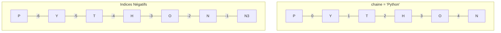

# Strings: Manipulation de Base et Méthodes Essentielles {#strings-manipulation-5}

Les chaînes de caractères (ou `strings` en anglais) sont l'un des types de données les plus omniprésents en programmation. Elles représentent du texte : un nom d'utilisateur, le contenu d'un fichier, un message d'erreur, une adresse web... Savoir les manipuler est une compétence absolument essentielle.

Ce chapitre vous apprend à créer, combiner, découper et transformer des chaînes de caractères avec les outils fondamentaux de Python.

## 1. Création, Concaténation et Formatage {#creation-formatage-strings-5}

### Quoi
Une `string` est une séquence immuable de caractères. On peut la créer en utilisant des guillemets simples (`'`) ou doubles (`"`). L'opération de base pour les combiner est la concaténation. La méthode moderne pour insérer des variables dans une chaîne est le formatage avec les **f-strings**.

### Pourquoi
La concaténation simple est utile pour des assemblages basiques. Cependant, les f-strings sont plus lisibles, plus efficaces et gèrent automatiquement la conversion des types non-textuels, ce qui évite de nombreuses erreurs courantes.

### Comment

```python
# Création
prenom = "Alice"
profession = 'Développeuse'

# Concaténation "à l'ancienne" avec l'opérateur +
# Attention, il faut ajouter les espaces manuellement !
message_ancien = "Bonjour, je m'appelle " + prenom + " et je suis " + profession + "."
print(message_ancien)

# Formatage moderne avec les f-strings (recommandé)
# On préfixe la chaîne par 'f' et on insère les variables entre accolades {}
age = 30
message_moderne = f"Bonjour, je m'appelle {prenom} et j'ai {age} ans."
print(message_moderne)
```

### Zone de Danger
La concaténation avec `+` ne fonctionne qu'entre des chaînes de caractères. Essayer de "coller" une `string` et un nombre lèvera une `TypeError`.

```python
# Provoque une erreur :
# message_erreur = "Mon âge est : " + 30 # TypeError: can only concatenate str (not "int") to str

# La bonne pratique (sans f-string) serait de convertir le nombre en string
message_correct = "Mon âge est : " + str(30)

# L'avantage du f-string est qu'il fait cette conversion pour nous !
print(f"Mon âge est : {30}") # Fonctionne parfaitement
```

---

## 2. Accéder aux Caractères : Indexing et Slicing {#indexing-slicing-5}

### Quoi
Comme une `string` est une séquence, chaque caractère a une position, appelée **index**, qui commence à **0**. On peut accéder à un caractère par son index ou extraire une sous-chaîne (**slicing**).

### Pourquoi
Ceci est fondamental pour extraire des informations spécifiques : la première lettre d'un nom, l'extension d'un fichier (`.txt`), un code postal dans une adresse, etc.

### Comment
*   **Indexing** : `ma_string[index]`
*   **Slicing** : `ma_string[start:stop:step]` (l'élément `stop` est toujours exclu)



```python
chaine = "Python"

# Indexing
premier_caractere = chaine[0] # 'P'
dernier_caractere = chaine[5] # 'n'
dernier_caractere_neg = chaine[-1] # 'n' (plus pratique !)
avant_dernier = chaine[-2] # 'o'

print(f"Premier caractère : {premier_caractere}")
print(f"Dernier caractère : {dernier_caractere_neg}")

# Slicing
trois_premiers = chaine[0:3] # 'Pyt' (de 0 inclus à 3 exclu)
du_milieu = chaine[2:4] # 'th' (de 2 inclus à 4 exclu)
tout_sauf_premier = chaine[1:] # 'ython' (de 1 jusqu'à la fin)
tout_sauf_deux_derniers = chaine[:-2] # 'Pyth' (du début jusqu'à l'index -2 exclu)
```

### Zone de Danger
*   **`IndexError`** : Tenter d'accéder à un index qui n'existe pas (`chaine[6]` dans notre exemple) plantera le programme.
*   **Immutabilité** : Les strings sont immuables. Vous ne pouvez pas modifier un caractère d'une chaîne existante. Pour "changer" une `string`, il faut en créer une nouvelle.

```python
nom = "Alixe"
# nom[3] = 'c' # ❌ TypeError: 'str' object does not support item assignment

# La bonne façon de faire :
nom_corrige = nom[0:3] + 'c' + nom[4:] # "Ali" + "c" + "e" -> "Alice"
# Ou mieux, avec une méthode dédiée que nous verrons ensuite.
```
> 📸 **CAPTURE D'ÉCRAN REQUISE**
> **Sujet** : Une fenêtre VS Code montrant l'erreur `TypeError` qui se produit lorsqu'on essaie de modifier un caractère d'une string par son index.
> **Alt Text** : Erreur d'immutabilité des strings en Python.

---

## 3. Méthodes de String Essentielles {#methodes-strings-5}

### Quoi
Les objets de type `string` viennent avec des "fonctions intégrées" appelées **méthodes**. On les appelle avec la syntaxe `ma_string.methode()`. Elles permettent d'effectuer des transformations courantes.

| Méthode                 | Description                                                  | Exemple                                   |
| ----------------------- | ------------------------------------------------------------ | ----------------------------------------- |
| `.upper()` / `.lower()` | Met la chaîne en majuscules / minuscules.                    | `'PyThon'.lower()` -> `'python'`          |
| `.strip()`              | Supprime les espaces au début et à la fin.                   | `'  hello  '.strip()` -> `'hello'`        |
| `.replace(old, new)`    | Remplace toutes les occurrences de `old` par `new`.          | `'Bonjour'.replace('jour', 'soir')`       |
| `.split(separator)`     | Découpe la chaîne en une liste selon un séparateur.          | `'a,b,c'.split(',')` -> `['a', 'b', 'c']` |
| `.find(substring)`      | Renvoie l'index de la première occurrence de `substring`.    | `'hello'.find('e')` -> `1`                |
| `.startswith(prefix)`   | Renvoie `True` si la chaîne commence par `prefix`.           | `'image.jpg'.startswith('image')`         |

### Pourquoi
Ces méthodes sont les outils de base pour 90% des tâches de nettoyage et de formatage de données textuelles, comme la normalisation des entrées utilisateur.

### Comment
```python
# Cas d'usage : Nettoyer une entrée utilisateur
user_input = "  alice@Exemple.COM  "

# 1. Enlever les espaces superflus et tout mettre en minuscules
email_clean = user_input.strip().lower()
print(f"Email nettoyé : {email_clean}") # 'alice@exemple.com'

# 2. Remplacer le domaine pour une redirection
email_redirected = email_clean.replace('exemple.com', 'provider.net')
print(f"Email redirigé : {email_redirected}") # 'alice@provider.net'

# 3. Vérifier si c'est une adresse pro
is_pro = email_redirected.startswith('contact@') # False
print(f"Adresse pro ? {is_pro}")
```

### Zone de Danger
Rappel de l'immutabilité : les méthodes de `string` **ne modifient jamais la chaîne originale**. Elles **retournent une nouvelle chaîne modifiée**. Une erreur fréquente est d'appeler la méthode sans récupérer le résultat.

```python
message = "   des espaces partout   "
message.strip() # ❌ INCORRECT: Le résultat est créé mais n'est pas stocké.
print(message)  # Affiche encore "   des espaces partout   "

# ✅ CORRECT: Il faut réassigner le résultat
message_nettoye = message.strip()
print(message_nettoye) # Affiche "des espaces partout"
```

---

## Validation des Acquis {#validation-5}

### 3 Questions Clés

1.  Pourquoi une f-string comme `f"L'item coûte {prix}€"` est-elle généralement préférable à la concaténation ` "L'item coûte " + str(prix) + "€" ` ?
2.  Pour une chaîne `s = "Bienvenue"`, comment accéder au caractère 'e' final en utilisant un index positif et un index négatif ?
3.  Si `texte = "Python est puissant"`, l'instruction `texte.upper()` modifie-t-elle la variable `texte` ? Que faut-il écrire pour stocker le résultat en majuscules ?

### 3 Exercices Progressifs

#### Exercice 1 : Générateur de Nom d'Utilisateur
Créez un script qui demande un prénom et un nom de famille à un utilisateur. Générez un nom d'utilisateur en prenant les 3 premières lettres du prénom et les 3 premières lettres du nom, le tout en minuscules.
*Exemple : "John", "Doe" -> "johdoe"*

<details>
<summary>Découvrir la solution commentée</summary>

```python
# 1. Demander les informations
prenom = input("Entrez votre prénom : ")
nom = input("Entrez votre nom de famille : ")

# 2. Extraire les parties avec le slicing
partie_prenom = prenom[0:3] # Prend les caractères de l'index 0 à 2
partie_nom = nom[0:3]

# 3. Combiner et mettre en minuscules
username = (partie_prenom + partie_nom).lower()

# 4. Afficher le résultat
print(f"Votre nom d'utilisateur suggéré est : {username}")
```
</details>

#### Exercice 2 : Extracteur d'Informations de Fichier
Soit une chaîne `nom_fichier = "document_de_projet_final.docx"`. Écrivez un script qui extrait et affiche :
1.  Le nom du fichier sans l'extension.
2.  L'extension du fichier.
*Indice : utilisez la méthode `.find('.')` pour trouver la position du point, puis le slicing.*

<details>
<summary>Découvrir la solution commentée</summary>

```python
nom_fichier = "document_de_projet_final.docx"

# 1. Trouver la position de l'extension
position_point = nom_fichier.find('.')

# 2. Utiliser cette position pour le slicing
# Le nom va du début jusqu'à l'index du point (exclu)
nom_sans_extension = nom_fichier[0:position_point]

# L'extension va de l'index du point + 1 jusqu'à la fin
extension = nom_fichier[position_point + 1:]

# 3. Afficher les résultats
print(f"Nom du fichier complet : {nom_fichier}")
print(f"Nom de base : {nom_sans_extension}")
print(f"Extension : {extension}")
```
</details>

#### Exercice 3 : Nettoyeur de Données
Vous recevez une donnée sous la forme d'une chaîne : ` " | Ref: XY123 | Prix: 59.99 EUR | " `.
Votre but est d'extraire la référence ("XY123") et le prix ("59.99") proprement.
1.  Nettoyez la chaîne des espaces et des barres `|` au début et à la fin.
2.  Séparez la chaîne en plusieurs parties en utilisant `|` comme séparateur.
3.  Pour chaque partie, nettoyez à nouveau les espaces et extrayez l'information pertinente.
*Indice : vous pourriez avoir besoin d'appeler `.strip()` plusieurs fois et d'utiliser `.split()`.*

<details>
<summary>Découvrir la solution commentée</summary>

```python
donnee_brute = " | Ref: XY123 | Prix: 59.99 EUR | "
print(f"Donnée brute : '{donnee_brute}'")

# 1. Premier nettoyage global
# On enlève les espaces et les '|' aux extrémités.
donnee_semi_propre = donnee_brute.strip(' |')
# 'strip()' peut prendre des caractères à enlever en argument.
print(f"Donnée semi-propre : '{donnee_semi_propre}'") # 'Ref: XY123 | Prix: 59.99 EUR'

# 2. Séparer en blocs d'information
parties = donnee_semi_propre.split('|')
print(f"Parties séparées : {parties}") # ['Ref: XY123 ', ' Prix: 59.99 EUR ']

# 3. Traiter chaque partie individuellement
# Première partie : la référence
partie_ref = parties[0].strip() # 'Ref: XY123'
reference = partie_ref.split(':')[1].strip() # Sépare par ':', prend le 2e élément, et nettoie

# Deuxième partie : le prix
partie_prix = parties[1].strip() # 'Prix: 59.99 EUR'
prix_str = partie_prix.split(':')[1].strip().split(' ')[0] # Extrait "59.99 EUR", puis "59.99"

# 4. Afficher les résultats finaux
print(f"\nRéférence extraite : {reference}")
print(f"Prix extrait : {prix_str}")
```
</details>