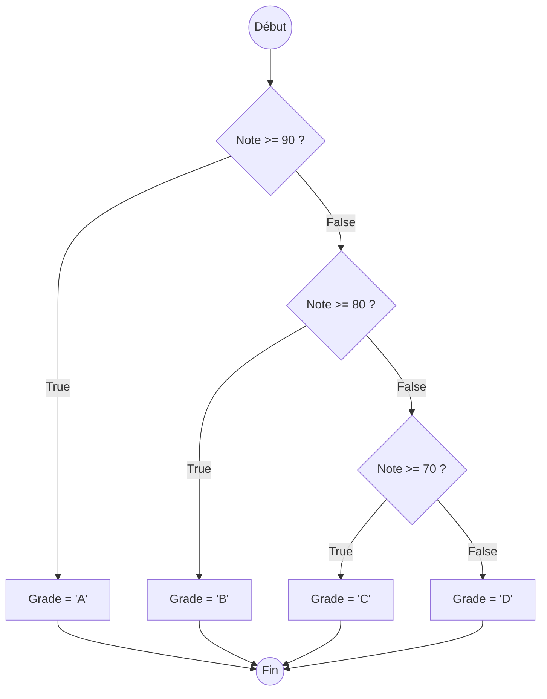

# Structures Conditionnelles: If, Elif, Else {#structures-conditionnelles-7}

Jusqu'à présent, nos scripts s'exécutaient de manière linéaire, une instruction après l'autre. Le véritable pouvoir de la programmation réside dans la capacité à prendre des décisions et à adapter le comportement du programme en fonction des données. C'est le rôle des structures conditionnelles.

Ce chapitre vous apprend à utiliser `if`, `elif`, et `else` pour créer des chemins d'exécution différents et donner une intelligence à votre code.

## 1. La Condition `if` : Exécution sous Condition {#condition-if-7}

### Quoi
Le mot-clé `if` permet d'exécuter un bloc de code **uniquement si** une condition donnée est évaluée comme `True`. Si la condition est `False`, le bloc de code est simplement ignoré.

### Pourquoi
C'est le mécanisme de base pour la prise de décision. Il permet de réagir à des situations spécifiques : afficher une alerte si le stock est bas, donner des droits d'administrateur si l'utilisateur est un "admin", etc.

### Comment
La syntaxe est cruciale : le mot-clé `if`, suivi de la condition, puis de deux-points (`:`). Le bloc de code à exécuter doit être **indenté** (généralement avec 4 espaces).

```python
# Cas d'usage : Gérer un seuil d'alerte de stock
stock_produit = 12
seuil_alerte = 15

print("Analyse du stock en cours...")

# La condition (stock_produit < seuil_alerte) est True (12 < 15)
if stock_produit < seuil_alerte:
    # Ce bloc est donc exécuté
    print(f"ALERTE : Stock faible ! Il ne reste que {stock_produit} unités.")

print("Analyse terminée.")
```

Si `stock_produit` était à `20`, la condition serait `False` et le message d'alerte ne s'afficherait pas.

### Zone de Danger
*   **L'indentation est obligatoire et significative en Python !** Une erreur d'indentation (`IndentationError`) est l'une des erreurs les plus communes pour les débutants. Le code qui dépend du `if` doit être décalé vers la droite.
*   **Oublier les deux-points (`:`)** à la fin de la ligne du `if` est une `SyntaxError` garantie.

> 📸 **CAPTURE D'ÉCRAN REQUISE**
> **Sujet** : Fenêtre VS Code montrant un bloc `if` avec une ligne non indentée, et l'erreur `IndentationError: expected an indented block` soulignée.
> **Alt Text** : Exemple d'une IndentationError en Python après une instruction 'if'.

---

## 2. Le `else` : Gérer l'Alternative {#condition-else-7}

### Quoi
Le mot-clé `else` fournit un bloc de code "plan B" qui s'exécute lorsque la condition du `if` est `False`. C'est le chemin "sinon".

### Pourquoi
Il garantit qu'une action sera toujours effectuée, quelle que soit l'issue de la condition. Soit le bloc `if` s'exécute, soit le bloc `else` s'exécute, mais jamais les deux.

### Comment
`else` se place au même niveau d'indentation que le `if` et est également suivi de deux-points (`:`).

```mermaid
graph TD
    A{Âge >= 18 ?} -->|True| B[Afficher "Accès autorisé"]
    A -->|False| C[Afficher "Accès refusé"]
    B --> D[Fin]
    C --> D
```

```python
# Cas d'usage : Vérification de l'âge pour l'accès
age = int(input("Quel est votre âge ? "))

if age >= 18:
    print("Accès autorisé. Bienvenue !")
else:
    print("Accès refusé. Vous devez être majeur pour entrer.")

print("Merci de votre visite.")
```

### Zone de Danger
*   Un `else` ne peut pas exister sans un `if` qui le précède.
*   `else` n'a **jamais** de condition. Il capture simplement tous les cas où la condition du `if` est fausse.

---

## 3. Le `elif` : Gérer les Conditions Multiples {#condition-elif-7}

### Quoi
`elif` est la contraction de "else if". Il permet de tester une nouvelle condition **uniquement si** les conditions précédentes (`if` et `elif` précédents) étaient `False`. On peut enchaîner autant de `elif` que nécessaire.

### Pourquoi
Il permet de créer une chaîne de conditions exclusives. Dès qu'une condition est `True`, son bloc est exécuté et le reste de la chaîne (`elif` et `else`) est ignoré. C'est parfait pour gérer des scénarios avec plus de deux issues possibles (ex: A, B, C ou D).

### Comment
La structure complète est `if`, suivi d'un ou plusieurs `elif`, et se termine optionnellement par un `else` pour tous les autres cas.



```python
# Cas d'usage : Système de notation de notes
note = int(input("Entrez la note de l'étudiant (sur 100) : "))
grade = ""

if note >= 90:
    grade = "A (Excellent)"
elif note >= 80:
    grade = "B (Très bien)"
elif note >= 70:
    grade = "C (Bien)"
elif note >= 60:
    grade = "D (Passable)"
else:
    grade = "F (Échec)"

print(f"La note {note}/100 correspond au grade : {grade}")
```

### Zone de Danger
**L'ordre des `elif` est crucial !** Le programme les teste dans l'ordre où ils sont écrits. Si vous aviez testé `note >= 60` en premier, un étudiant avec 95 obtiendrait un "D", car `95 >= 60` est `True` et le reste de la chaîne serait ignoré. Il faut toujours aller du plus spécifique au plus général (ou du plus haut au plus bas).

---

## Validation des Acquis {#validation-7}

### 3 Questions Clés

1.  Quelle est la différence entre utiliser deux `if` séparés et utiliser un `if` suivi d'un `elif` ?
2.  Le bloc `else` est-il obligatoire dans une structure conditionnelle ? Que se passe-t-il s'il est omis et que toutes les conditions `if`/`elif` sont fausses ?
3.  Pourquoi l'indentation est-elle si importante en Python, particulièrement avec les structures conditionnelles ?

### 3 Exercices Progressifs

#### Exercice 1 : Positif, Négatif ou Nul
Écrivez un script qui demande à l'utilisateur de saisir un nombre. Le programme doit ensuite afficher si ce nombre est "Positif", "Négatif" ou "Nul".

<details>
<summary>Découvrir la solution commentée</summary>

```python
# 1. Demander un nombre à l'utilisateur et le convertir en float
nombre_str = input("Veuillez entrer un nombre : ")
nombre = float(nombre_str)

# 2. Utiliser une structure if/elif/else pour tester les trois cas
if nombre > 0:
    # Ce bloc s'exécute si le nombre est strictement positif
    print("Le nombre est Positif.")
elif nombre < 0:
    # Ce bloc s'exécute seulement si le premier 'if' est faux,
    # et si le nombre est strictement négatif.
    print("Le nombre est Négatif.")
else:
    # Le 'else' attrape le dernier cas possible : si le nombre n'est
    # ni plus grand, ni plus petit que 0, il est forcément nul.
    print("Le nombre est Nul.")
```
</details>

#### Exercice 2 : Tarifs de Cinéma
Un cinéma applique les tarifs suivants :
*   **Enfant (0-12 ans)** : 5€
*   **Adolescent (13-17 ans)** : 8€
*   **Adulte (18 ans et plus)** : 12€

Créez un programme qui demande l'âge du client et affiche le tarif applicable.

<details>
<summary>Découvrir la solution commentée</summary>

```python
# 1. Demander l'âge et le convertir en entier
age_str = input("Quel est l'âge du client ? ")
age = int(age_str)

# 2. Déterminer le tarif avec une chaîne if/elif/else
# L'ordre est important. On commence par le cas le plus bas.
if age <= 12:
    tarif = 5
    categorie = "Enfant"
elif age <= 17: # Pas besoin de vérifier age >= 13, c'est implicite
    tarif = 8
    categorie = "Adolescent"
else: # Tous les âges de 18 et plus
    tarif = 12
    categorie = "Adulte"

# 3. Afficher le résultat de manière claire
print(f"Catégorie : {categorie}")
print(f"Le tarif pour un client de {age} ans est de {tarif}€.")
```
</details>

#### Exercice 3 : Validateur de Mot de Passe
Écrivez un script qui vérifie la complexité d'un mot de passe saisi par l'utilisateur.
1.  Demandez un mot de passe.
2.  Vérifiez les règles suivantes :
    *   S'il a moins de 8 caractères, affichez "Mot de passe trop court."
    *   S'il a 8 caractères ou plus mais ne contient aucun chiffre, affichez "Le mot de passe doit contenir au moins un chiffre."
    *   S'il a 8 caractères ou plus et contient des chiffres, affichez "Mot de passe valide."

*Indice : vous pouvez utiliser une boucle `for` et `isdigit()` pour vérifier la présence d'un chiffre, ou la méthode `any()` que vous pouvez rechercher.*

<details>
<summary>Découvrir la solution commentée</summary>

```python
# 1. Demander le mot de passe
mot_de_passe = input("Veuillez choisir un mot de passe : ")

# 2. Première condition : vérifier la longueur
if len(mot_de_passe) < 8:
    print("Erreur : Mot de passe trop court (8 caractères minimum).")
else:
    # Ce bloc 'else' signifie que la longueur est correcte (>= 8).
    # On peut donc y imbriquer la vérification suivante.
    contient_un_chiffre = False # On part du principe qu'il n'y en a pas
    
    # On parcourt chaque caractère du mot de passe
    for caractere in mot_de_passe:
        if caractere.isdigit():
            contient_un_chiffre = True
            break # On a trouvé un chiffre, pas la peine de continuer la boucle

    # Maintenant on vérifie notre booléen
    if contient_un_chiffre:
        print("Succès : Mot de passe valide.")
    else:
        print("Erreur : Le mot de passe doit contenir au moins un chiffre.")

```
</details>