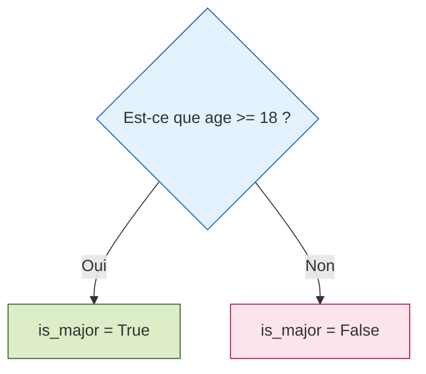

# Variables, Types de Données Primitifs (Int, Float, Bool) {#variables-types-primitifs-3}

Maintenant que votre environnement est prêt, il est temps d'apprendre le vocabulaire de base de Python. Un programme informatique, dans son essence, manipule des données. Les variables sont les "boîtes" où nous stockons ces données, et les types définissent la nature de ce qu'il y a à l'intérieur.

Ce chapitre couvre les types de données les plus fondamentaux : les nombres et les booléens, qui sont les piliers de toute logique de programmation.

## 1. Les Variables : Étiquettes sur des Données {#variables-3}

### Quoi
Une variable est un nom que vous assignez à une valeur stockée en mémoire. Pensez-y comme une étiquette que vous collez sur une boîte : l'étiquette a un nom, et la boîte contient une information.

### Pourquoi
Sans variables, une information utilisée à un endroit ne pourrait pas être réutilisée ailleurs. Elles sont essentielles pour conserver des états, stocker des résultats de calculs et rendre le code lisible et maintenable.

### Comment
La syntaxe est simple : `nom_de_la_variable = valeur`. La convention en Python est d'utiliser le `snake_case` (minuscules et underscores).

```python
# Assignation de variables
user_age = 34
user_name = "John Doe"
account_balance = 150.75
is_premium_member = True

# Utilisation d'une variable
print(user_name) # Affiche "John Doe"
```

### Zone de Danger
*   **Sensibilité à la casse** : `age`, `Age` et `AGE` sont trois variables différentes.
*   **Mots réservés** : Ne nommez jamais vos variables comme des mots-clés Python (`if`, `for`, `class`, `True`, etc.).
*   **Commencer par un chiffre** : Un nom de variable ne peut pas commencer par un chiffre (`1er_utilisateur` est invalide).

---

## 2. Les Types Numériques : `int` et `float` {#types-numeriques-3}

### Quoi
Python dispose de deux types principaux pour gérer les nombres :
*   `int` (Integer) : Pour les nombres entiers, positifs ou négatifs (`-10`, `0`, `42`).
*   `float` (Floating-point) : Pour les nombres à virgule (`3.14`, `-0.001`, `99.99`).

### Pourquoi
La distinction est cruciale car les opérations et le stockage en mémoire ne sont pas les mêmes. Un `int` est exact, tandis qu'un `float` est une approximation, ce qui peut avoir des conséquences dans des calculs financiers de haute précision.

### Comment
Python devine le type lorsque vous assignez la valeur. On peut réaliser toutes les opérations arithmétiques standards.

```python
# Entiers (int)
nombre_articles = 15
stock_restant = -5

# Nombres à virgule (float)
prix_unitaire = 29.99
taux_tva = 0.20

# Opérations
total_ht = nombre_articles * prix_unitaire
total_ttc = total_ht * (1 + taux_tva)

# La division simple (/) produit toujours un float
resultat_division = 10 / 3 # Résultat: 3.333...

# La division entière (//) produit un int (tronque le résultat)
resultat_division_entiere = 10 // 3 # Résultat: 3

print(f"Total TTC : {total_ttc}")
```

La fonction `type()` permet de vérifier le type d'une variable à tout moment : `print(type(nombre_articles))` affichera `<class 'int'>`.

---

## 3. Le Type Booléen : `bool` {#type-booleen-3}

### Quoi
Le type booléen (`bool`) ne peut avoir que deux valeurs : `True` ou `False`. Attention, la majuscule est obligatoire.

### Pourquoi
Les booléens sont le cœur de la prise de décision en programmation. Ils permettent de contrôler le flux d'un programme en répondant à des questions par "vrai" ou "faux".

### Comment
On les assigne directement ou on les obtient comme résultat d'une comparaison.

```python
# Assignation directe
is_logged_in = True
has_admin_rights = False

# Résultat d'une comparaison
age = 25
is_major = (age >= 18) # is_major vaudra True

solde = 100
a_decouvert = (solde < 0) # a_decouvert vaudra False

print(f"Utilisateur majeur : {is_major}")
```



---

## Zone de Danger : Typage Dynamique et Conversion (Casting) {#zone-danger-casting-3}

Python est à **typage dynamique**, ce qui signifie que le type d'une variable est déterminé à l'exécution et peut changer.

```python
ma_variable = 10      # ma_variable est un int
ma_variable = "dix"   # Maintenant, c'est un str. Python ne râle pas !
```
Cette flexibilité est une force mais aussi une source d'erreurs. L'erreur la plus commune pour un débutant est de mélanger des types incompatibles, notamment après un `input()`.

La fonction `input()` renvoie **TOUJOURS** une chaîne de caractères (`str`).

```python
age_str = input("Quel est votre âge ? ") # L'utilisateur tape 30
# age_str contient "30", pas 30.

# age_dans_dix_ans = age_str + 10 # ❌ TypeError: can only concatenate str (not "int") to str
```
Pour corriger cela, il faut **caster** (convertir) la variable dans le type désiré avec les fonctions `int()`, `float()`, ou `str()`.

```python
age_int = int(age_str) # Conversion de "30" en 30
age_dans_dix_ans = age_int + 10 # ✅ Ça fonctionne !

print(f"Dans 10 ans, vous aurez {age_dans_dix_ans} ans.")
```
> 📸 **CAPTURE D'ÉCRAN REQUISE**
> **Sujet** : Une fenêtre VS Code montrant le message d'erreur `TypeError` surligné en rouge, puis la version corrigée avec la fonction `int()`.
> **Alt Text** : Débogage d'une TypeError en Python due à un mauvais typage de variable.

---

## Validation des Acquis {#validation-3}

### 3 Questions Clés

1.  Quelle est la différence fondamentale en Python entre la valeur `42`, `42.0` et `"42"` ?
2.  Si `a = 10` et `b = 4`, quel est le résultat de `a / b` et de `a // b` ? Pourquoi sont-ils différents ?
3.  Une variable `est_disponible = "True"` a été créée. S'agit-il d'un booléen ? Comment la corriger pour qu'elle le devienne ?

### 3 Exercices Progressifs

#### Exercice 1 : Calculateur d'IMC (Indice de Masse Corporelle)
Créez un script qui demande à l'utilisateur son poids en kg (`float`) et sa taille en mètres (`float`). Calculez ensuite l'IMC en utilisant la formule : `poids / (taille * taille)`. Affichez le résultat avec une phrase claire.

<details>
<summary>Découvrir la solution commentée</summary>

```python
# 1. Demander les informations à l'utilisateur
poids_str = input("Veuillez entrer votre poids en kg (ex: 70.5) : ")
taille_str = input("Veuillez entrer votre taille en mètres (ex: 1.75) : ")

# 2. Convertir (caster) les entrées en float
poids = float(poids_str)
taille = float(taille_str)

# 3. Calculer l'IMC
# On peut aussi écrire taille ** 2
imc = poids / (taille * taille)

# 4. Afficher le résultat formaté
# L'option :.2f dans la f-string arrondit le résultat à 2 décimales
print(f"Votre poids est de {poids} kg et votre taille de {taille} m.")
print(f"Votre Indice de Masse Corporelle est de {imc:.2f}.")
```
</details>

#### Exercice 2 : Convertisseur de Température
Écrivez un programme qui convertit une température de degrés Celsius en degrés Fahrenheit.
1. Demandez une température en Celsius à l'utilisateur.
2. Appliquez la formule de conversion : `Fahrenheit = (Celsius * 9/5) + 32`.
3. Affichez le résultat.

<details>
<summary>Découvrir la solution commentée</summary>

```python
# 1. Obtenir la température en Celsius
celsius_str = input("Entrez la température en degrés Celsius : ")

# 2. Caster la valeur en float pour permettre les décimales
celsius = float(celsius_str)

# 3. Appliquer la formule de conversion
fahrenheit = (celsius * 9/5) + 32

# 4. Afficher le résultat de manière lisible
print(f"{celsius}°C équivaut à {fahrenheit}°F.")
```
</details>

#### Exercice 3 : Vérificateur d'Éligibilité (Booléens)
Vous développez une fonctionnalité pour un service en ligne.
1. Créez des variables pour simuler les données d'un utilisateur : `age` (int), `solde_compte` (float), `a_deja_commande` (bool).
2. L'utilisateur est éligible à une offre spéciale s'il a plus de 18 ans **ET** si son solde est supérieur à 0.
3. Créez une variable `est_eligible` qui stocke le résultat booléen de cette vérification.
4. Affichez le statut d'éligibilité.

<details>
<summary>Découvrir la solution commentée</summary>

```python
# 1. Simulation des données utilisateur
age = 22
solde_compte = 57.80
# a_deja_commande = False # Non utilisé pour la condition mais bonne pratique

# 2. Logique de vérification
# L'opérateur 'and' renvoie True uniquement si les deux conditions sont True
condition_age = (age >= 18)
condition_solde = (solde_compte > 0)

est_eligible = condition_age and condition_solde

# 3. Affichage du résultat
print(f"Âge : {age}, Solde : {solde_compte}€")
print(f"Le client est-il éligible à l'offre spéciale ? {est_eligible}") 
# Cela affichera : "Le client est-il éligible à l'offre spéciale ? True"
```
</details>