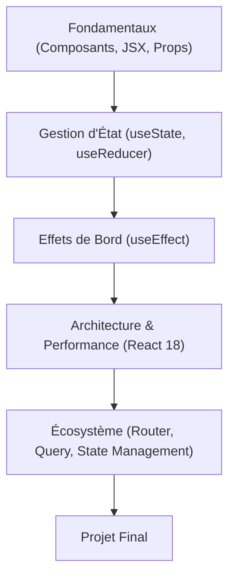

# Avant-propos : Maîtriser React 18.x {#avant-propos-:-maîtriser-react-18.x-0}

Bienvenue dans ce parcours de formation dédié à **React 18.x**. Ce cursus est conçu pour vous transformer en développeur front-end capable de concevoir des interfaces utilisateur modernes, performantes et maintenables.

### Prérequis {#prérequis-0}

Pour aborder cette formation dans les meilleures conditions, une maîtrise solide des fondamentaux suivants est indispensable :

- **JavaScript ES6+** : Syntaxe moderne, déstructuration, opérateurs spread/rest, promesses, async/await, et modules ES.
- **DOM & Web APIs** : Compréhension du fonctionnement du navigateur et de la manipulation du DOM.
- **Environnement de développement** : Utilisation de Node.js, npm/yarn et de Git.

### Objectifs pédagogiques {#objectifs-pédagogiques-0}

À l'issue de cette formation, vous serez capable de :

1. **Comprendre le paradigme déclaratif** : Passer d'une manipulation impérative du DOM à une gestion d'état réactive.
2. **Maîtriser le cycle de vie des composants** : Utiliser les Hooks pour gérer les effets de bord et le cycle de vie.
3. **Optimiser les performances** : Tirer parti des fonctionnalités de React 18 comme le *Concurrent Rendering* et les transitions.
4. **Architecturer des applications scalables** : Structurer vos projets pour faciliter la maintenance et la collaboration.
5. **Intégrer l'écosystème** : Utiliser les outils standards pour la gestion d'état, le routage et les appels API.

### Architecture de l'apprentissage {#architecture-de-l'apprentissage-0}

Le parcours est structuré pour suivre une progression logique, allant des concepts fondamentaux vers des patterns d'architecture avancés.

### Comment utiliser cette formation {#comment-utiliser-cette-formation-0}

Chaque chapitre est conçu pour être autonome tout en s'inscrivant dans une progression globale. Nous privilégions une approche "Learning by doing" :

- **Théorie concise** : Focus sur le "Pourquoi" avant le "Comment".
- **Code métier** : Les exemples sont basés sur des scénarios réels rencontrés en entreprise.
- **Zones de danger** : Des sections dédiées pour éviter les pièges classiques et les mauvaises pratiques.
- **Validation** : Des questions clés et des exercices progressifs ponctuent chaque étape pour consolider vos acquis.

Préparez votre environnement, ouvrez votre éditeur de code, et commençons cette immersion dans l'écosystème React.