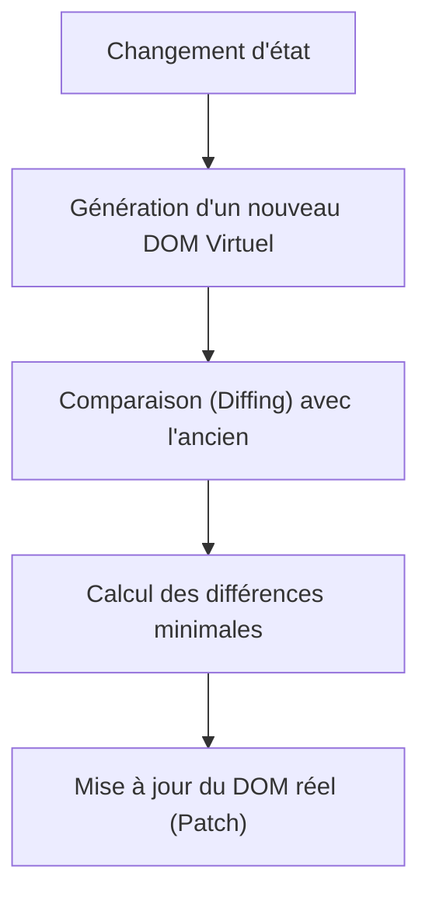

# Chapitre 1 : Introduction à React {#chapitre-1-:-introduction-à-react-1}

Composants, DOM Virtuel, Déclarativité, Réactivité.

## Qu'est-ce que React ? {#qu'est-ce-que-react-1}

### 1. Quoi
**React** est une bibliothèque JavaScript open-source, développée par Meta, utilisée pour construire des interfaces utilisateur (UI) interactives. Elle repose sur une architecture basée sur des **composants** réutilisables.

### 2. Pourquoi
Avant React, la manipulation du DOM était impérative : le développeur devait manuellement mettre à jour chaque élément de la page lors d'un changement d'état. Cela rendait le code complexe et difficile à maintenir. React propose une approche **déclarative** : vous décrivez l'état souhaité de votre interface, et React se charge de mettre à jour le DOM efficacement.

### 3. Comment
React utilise une syntaxe appelée **JSX** (JavaScript XML) qui permet d'écrire des structures HTML directement dans le code JavaScript.

```javascript
// Exemple de composant simple
function Bienvenue() {
  return <h1>"Bonjour, utilisateur !"</h1>;
}
```

### 4. Zone de Danger
❌ **À ne pas faire** : Manipuler directement le DOM avec `document.getElementById` ou `querySelector` à l'intérieur de vos composants React. Cela entre en conflit avec la gestion interne de React.
✅ **Bonne pratique** : Laissez React gérer le rendu et utilisez l'état (`state`) pour piloter les changements d'affichage.

---

## Le DOM Virtuel {#le-dom-virtuel-1}

### 1. Quoi
Le **DOM Virtuel** (Virtual DOM) est une représentation légère en mémoire de l'arbre DOM réel. Lorsqu'un état change, React crée une nouvelle version de ce DOM virtuel.

### 2. Pourquoi
Mettre à jour le DOM réel du navigateur est une opération coûteuse en termes de performance. React compare le nouveau DOM virtuel avec l'ancien (processus appelé **Reconciliation** ou *diffing*) et ne met à jour dans le DOM réel que les éléments qui ont réellement changé.

### 3. Comment
Le flux de mise à jour suit ce cycle :



> 📸 **CAPTURE D'ÉCRAN REQUISE**
> **Sujet** : Schéma comparatif entre une mise à jour DOM classique et le processus de réconciliation React.
> **Alt Text** : Diagramme montrant l'optimisation des mises à jour via le DOM Virtuel.

### 4. Zone de Danger
❌ **À ne pas faire** : Penser que le DOM Virtuel est toujours plus rapide que le DOM réel pour des changements triviaux. Il existe un coût de calcul pour le *diffing*.
✅ **Bonne pratique** : Faites confiance à l'algorithme de réconciliation de React, il est hautement optimisé pour la majorité des cas d'usage métier.

---

## Questions clés (validation des acquis du chapitre) {#questions-clés-(validation-des-acquis-du-chapitre)-1}

- **Qu'est-ce que l'approche déclarative dans React ?**
  C'est le fait de décrire à quoi l'interface doit ressembler pour un état donné, plutôt que de donner des instructions étape par étape pour modifier le DOM.
- **Pourquoi le DOM Virtuel améliore-t-il les performances ?**
  Il permet de minimiser les manipulations coûteuses du DOM réel en ne mettant à jour que les parties de l'interface qui ont réellement changé.
- **Qu'est-ce que le JSX ?**
  C'est une extension de syntaxe pour JavaScript qui permet d'écrire des éléments de type HTML au sein du code JavaScript.
- **Pourquoi est-il déconseillé de manipuler le DOM directement ?**
  Parce que React perd alors le contrôle sur la synchronisation entre l'état de l'application et l'affichage, ce qui peut entraîner des bugs imprévisibles.