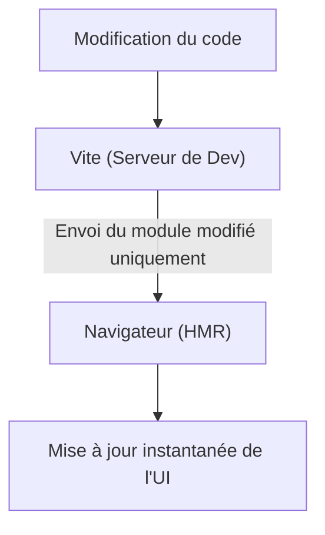
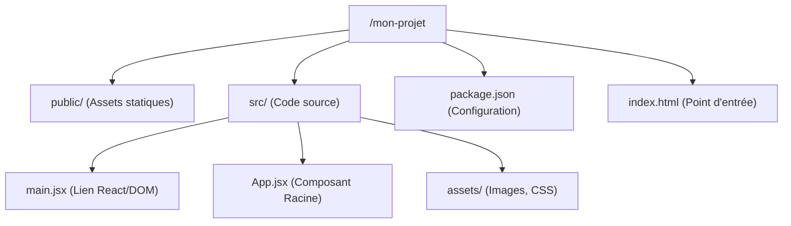

# Chapitre 2 : Installation et environnement {#chapitre-2-:-installation-et-environnement-2}

Node.js, npm/yarn, Vite, Structure de projet.

## Node.js et Gestionnaires de Paquets {#node-js-et-gestionnaires-de-paquets-2}

### 1. Quoi
**Node.js** est un environnement d'exécution JavaScript construit sur le moteur V8 de Chrome, permettant d'exécuter du JavaScript en dehors du navigateur. Il est indissociable de son gestionnaire de paquets, **npm** (Node Package Manager), qui permet d'installer et de gérer les bibliothèques nécessaires à votre projet.

### 2. Pourquoi
Bien que React s'exécute chez le client (navigateur), nous utilisons Node.js durant la phase de développement pour :
- **Compiler** le code JSX en JavaScript standard.
- **Gérer les dépendances** (React, outils de test, etc.).
- **Lancer un serveur local** avec rechargement à chaud (*Hot Module Replacement*) pour voir les modifications en temps réel.

### 3. Comment

#### A. Installation et vérification
1. Installez la version **LTS** (Long Term Support) depuis [nodejs.org](https://nodejs.org/).
2. Vérifiez l'installation dans votre terminal :

```bash
node -v # Doit afficher v18.x.x ou supérieur
npm -v  # Doit afficher la version du gestionnaire
```

#### B. Comparatif des gestionnaires
| Outil | Vitesse | Gestion du cache | Usage recommandé |
| :--- | :--- | :--- | :--- |
| **npm** | Standard | Standard | Par défaut (inclus avec Node) |
| **Yarn** | Rapide | Avancée | Projets d'entreprise complexes |
| **pnpm** | Très rapide | Optimisée (liens symboliques) | Projets avec beaucoup de dépendances |

### 4. Zone de Danger
❌ **À ne pas faire** : Installer Node.js via les dépôts système Linux par défaut (souvent obsolètes).
✅ **Bonne pratique** : Utiliser un gestionnaire de version comme **nvm** (Node Version Manager) pour basculer facilement entre les versions de Node selon les projets.

---

## Vite : L'outil de build moderne {#vite-:-l-outil-de-build-moderne-2}

### 1. Quoi
**Vite** est un outil de build (bundler) de nouvelle génération qui offre une expérience de développement extrêmement rapide. Il remplace l'ancien standard `create-react-app`.

### 2. Pourquoi
Contrairement aux anciens outils qui devaient reconstruire toute l'application à chaque changement, Vite utilise les **ES Modules natifs** du navigateur. Il ne transforme que le fichier que vous venez de modifier, rendant le développement quasi instantané, peu importe la taille du projet.

### 3. Comment

#### A. Création d'un projet
Tapez la commande suivante et suivez les instructions :

```bash
npm create vite@latest mon-projet-react
```

#### B. Configuration interactive
1. **Framework** : Sélectionnez `"React"`.
2. **Variant** : Sélectionnez `"JavaScript"` ou `"JavaScript + SWC"` (plus rapide).

#### C. Initialisation
```bash
cd mon-projet-react
npm install # Installe les dépendances
npm run dev # Lance le serveur de développement
```



> 📸 **CAPTURE D'ÉCRAN REQUISE**
> **Sujet** : Terminal affichant le succès de la commande `npm run dev` avec l'URL locale.
> **Alt Text** : Interface du terminal montrant le serveur Vite prêt sur le port 5173.

### 4. Zone de Danger
❌ **À ne pas faire** : Oublier de lancer `npm install` après avoir créé le projet ou récupéré un projet Git.
✅ **Bonne pratique** : Toujours vérifier que le fichier `package-lock.json` est présent pour garantir que toute l'équipe utilise les mêmes versions de bibliothèques.

---

## Structure d'un projet React {#structure-d-un-projet-react-2}

### 1. Quoi
Un projet React possède une organisation de fichiers spécifique pour séparer la configuration, les ressources publiques et le code source.

### 2. Pourquoi
Maintenir une structure standardisée permet une meilleure collaboration et facilite l'intégration d'outils automatisés (tests, déploiement continu).

### 3. Comment

Voici l'architecture générée par Vite :



- **index.html** : Contient la balise `<div id="root"></div>` où React s'injecte.
- **src/main.jsx** : Le fichier qui "allume" React et fait le pont avec le HTML.
- **src/App.jsx** : Votre premier composant, le point de départ de votre interface.

### 4. Zone de Danger
❌ **À ne pas faire** : Placer des composants React dans le dossier `public/`.
✅ **Bonne pratique** : Garder le dossier `src/` propre en créant des sous-dossiers comme `components/`, `hooks/` et `services/` dès que le projet grandit.

---

## Questions clés (validation des acquis du chapitre) {#questions-clés-(validation-des-acquis-du-chapitre)-2}

- **Pourquoi utilise-t-on la version LTS de Node.js ?**
  Pour garantir la stabilité et le support à long terme des outils de développement.
- **Quel est l'avantage principal de Vite par rapport à Webpack ?**
  Sa vitesse de démarrage et de rechargement grâce à l'utilisation des modules ES natifs.
- **À quoi sert le dossier `node_modules` ?**
  Il contient tout le code des bibliothèques tierces installées via npm. Il ne doit jamais être versionné sur Git.
- **Quel fichier contient la liste des dépendances du projet ?**
  Le fichier `package.json`.
- **Où se trouve le point d'entrée HTML de l'application ?**
  À la racine du projet, dans le fichier `index.html`.