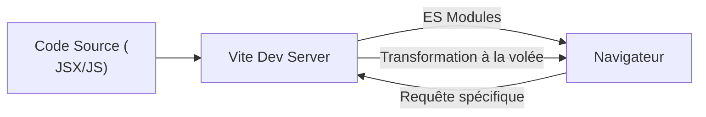
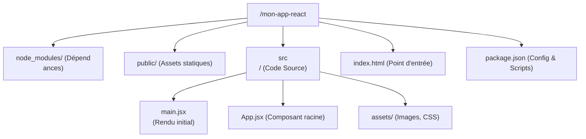

# Chapitre 2 : Installation
 et environnement {#chapitre-2-:-installation-et-environnement-2}

Node.js, npm/
yarn, Vite, Structure de projet.

## Node.js et Gestionnaires de Paquets {#node-js-
et-gestionnaires-de-paquets-2}

### 1. Quoi
**Node.js
** est un environnement d'exécution JavaScript construit sur le moteur V8 de Chrome, permettant d'exécuter du
 JavaScript côté serveur. Il est accompagné de **npm** (Node Package Manager), un gestionnaire de paquets qui permet
 d'installer des bibliothèques tierces.

### 2. Pourquoi
Bien que React s'exéc
ute dans le navigateur, nous avons besoin de Node.js pour :
- Utiliser des outils de compilation (comme
 Vite ou Babel) qui transforment le JSX en JavaScript standard.
- Gérer les dépendances du projet via
 un fichier de configuration.
- Lancer un serveur de développement local avec rechargement automatique (*Hot Module Replacement*
).

### 3. Comment

#### A. Installation
1. Téléchargez la version **LTS** (
Long Term Support) sur le site officiel : [nodejs.org](https://nodejs.org/).
2. Lance
z l'installateur et laissez les options par défaut.

#### B. Vérification
Ouvrez un terminal
 et tapez les commandes suivantes pour vérifier que l'installation a réussi :

```bash
node -v # A
ffiche la version de Node.js
npm -v  # Affiche la version de npm
```

#### C
. Tableau comparatif des gestionnaires de paquets

| Caractéristique | npm | Yarn | pnpm |

| :--- | :--- | :--- | :--- |
| **Origine** | Standard Node.js
 | Créé par Facebook | Optimisé pour l'espace |
| **Vitesse** | Standard | Rapide
 | Très rapide |
| **Stockage** | Duplique les paquets | Duplique les paquets
 | Partage les paquets (Content-addressable) |

### 4. Zone de Danger
❌ **
À ne pas faire** : Installer Node.js via des versions "Current" (expérimentales) pour des projets
 professionnels, car elles peuvent être instables.
✅ **Bonne pratique** : Toujours privilégier la version
 **LTS** pour garantir la compatibilité des outils de build.

---

## Vite : Le Build Tool Moderne
 {#vite-:-le-build-tool-moderne-2}

### 1. Quoi
**
Vite** (mot français pour "rapide") est un outil de build de nouvelle génération. Il remplace avantage
usement l'ancien `create-react-app` (CRA) en utilisant les modules ES natifs du navigateur
 pour un démarrage quasi instantané.

### 2. Pourquoi
Le processus de build traditionnel (Webpack) devait "
bundler" (regrouper) tout le code avant de lancer le serveur. Vite ne bundler que lors de
 la production et utilise des requêtes HTTP pour charger les modules en développement, ce qui rend le cycle de développement beaucoup plus
 fluide.

### 3. Comment

#### A. Création du projet
Exécutez la commande suivante
 dans votre terminal :

```bash
npm create vite@latest mon-app-react
```

Lors de l
'exécution, suivez les instructions interactives :
1. **Select a framework** $\rightarrow$ `React
`
2. **Select a variant** $\rightarrow$ `JavaScript` (ou `TypeScript` pour les projets typés
)

#### B. Lancement et vérification
```bash
cd mon-app-react # On entre dans
 le dossier du projet
npm install      # On installe les dépendances listées dans package.json
npm run
 dev      # On lance le serveur de développement
```

Une fois lancé, Vite vous fournira une URL (g
énéralement `http://localhost:5173`).

> 📸 **CAPTURE D'ÉCRAN
 REQUISE**
> **Sujet** : Terminal affichant la création du projet Vite et l'URL
 du serveur local.
> **Alt Text** : Processus de création et de lancement d'un projet React avec
 Vite.

#### C. Flux de fonctionnement de Vite



### 4. Zone de Danger
❌ **À ne pas faire** : Oub
lier de lancer `npm install` après avoir cloné un projet ou créé un projet Vite. Le dossier `node_
modules` n'est jamais partagé (il est dans le `.gitignore`).
✅ **Bonne pratique** :
 Toujours vérifier que le dossier `node_modules` est présent avant de lancer `npm run dev`.

---


## Structure d'un Projet React {#structure-d-un-projet-react-2}

### 1
. Quoi
Un projet React généré par Vite possède une structure standardisée pour séparer la configuration, les ressources
 statiques et le code source.

### 2. Pourquoi
Une structure cohérente permet à n'importe quel
 développeur de s'orienter rapidement dans le projet et facilite l'automatisation des tests et du déploiement
.

### 3. Comment

Voici la hiérarchie typique d'un projet :



**Détails des fichiers clés :**

- `index.html` : Le seul fichier HTML réel. Il contient une `div` avec l'id
 `"root"` où React injectera l'application.
- `src/main.jsx` : Le point d
'entrée JavaScript. C'est ici que React lie le composant `<App />` au DOM réel.
-
 `package.json` : Le cœur du projet. Il contient la liste des bibliothèques installées et les scripts
 de commande (`dev`, `build`, `preview`).

### 4. Zone de Danger
❌ **À ne
 pas faire** : Placer des fichiers de code source (`.jsx`, `.js`) dans le dossier `public/
`.
✅ **Bonne pratique** : Le dossier `public/` est réservé aux fichiers qui ne doivent pas
 être transformés par Vite (ex: `favicon.ico`, `robots.txt`). Tout le reste va dans 
`src/`.

---

## Questions clés (validation des acquis du chapitre) {#questions-clés-(validation-
des-acquis-du-chapitre)-2}

- **À quoi sert Node.js dans un projet
 React ?**
  Il sert d'environnement d'exécution pour les outils de build et de gestion de paquets
 (npm), permettant de transformer le code moderne en code compatible avec tous les navigateurs.
- **Quelle est la
 différence majeure entre Vite et Create React App (CRA) ?**
  Vite est beaucoup plus rapide car il
 utilise les modules ES natifs du navigateur en développement au lieu de regrouper (bundler) tout le code à
 chaque modification.
- **Quel est le rôle du fichier `package.json` ?**
  Il sert de
 manifeste au projet : il liste les dépendances nécessaires et définit les scripts de commande pour lancer, builder ou tester l'
application.
- **Où doit-on placer les images que l'on souhaite importer dans un composant via
 `import` ?**
  Dans le dossier `src/assets/` pour qu'elles soient optimisées par
 Vite lors du build.