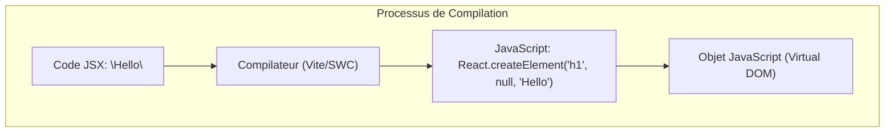

# Chapitre 3 : La Syntaxe JSX {#chapitre-3-:-la-syntaxe-jsx-3}

JSX, Expressions JavaScript, Fragments, Attributs camelCase, Rendu conditionnel.

## Comprendre le JSX {#comprendre-le-jsx-3}

### 1. Quoi
**JSX** (JavaScript XML) est une extension de syntaxe pour JavaScript. Elle ressemble visuellement à du HTML, mais elle possède toute la puissance de JavaScript. Sous le capot, le JSX est transformé en appels de fonctions JavaScript classiques.

### 2. Pourquoi
Le JSX permet de maintenir la structure de l'interface utilisateur (UI) et la logique métier au même endroit. Cela rend le code plus lisible et plus facile à déboguer en évitant de jongler entre des fichiers HTML et des fichiers JS de manipulation de DOM.

### 3. Comment

#### A. Transformation du code
Le navigateur ne comprend pas le JSX nativement. Un compilateur (comme Babel ou SWC, inclus dans Vite) transforme le JSX en objets JavaScript.



#### B. Syntaxe de base
```javascript
const element = <h1 className="title">Bonjour le monde</h1>; // On définit un élément UI de manière déclarative
```

### 4. Zone de Danger
❌ **À ne pas faire** : Oublier que le JSX est du JavaScript. Vous ne pouvez pas utiliser de mots réservés JS comme attributs (ex: `class` ou `for`).
✅ **Bonne pratique** : Utilisez `className` à la place de `class` et `htmlFor` à la place de `for`.

---

## Les Règles d'Or du JSX {#les-règles-d-or-du-jsx-3}

### 1. Quoi
Le JSX impose des contraintes strictes pour garantir que l'arbre des composants reste prévisible et performant.

### 2. Pourquoi
Puisque le JSX est converti en une seule valeur JavaScript (un objet), une fonction ne peut retourner qu'un seul élément racine à la fois.

### 3. Comment

#### A. L'élément racine unique
Si vous avez plusieurs éléments, vous devez les envelopper dans un parent commun ou un **Fragment**.

```javascript
// Utilisation du Fragment <> </> pour éviter d'ajouter des div inutiles au DOM
function UserProfile() {
  return (
    <>
      <h1>Nom : Alice</h1>
      <p>Rôle : Développeuse</p>
    </>
  );
}
```

#### B. Fermeture des balises
Toutes les balises doivent être explicitement fermées, même les balises auto-fermantes.
- HTML : `<br>`, ``
- JSX : `<br />`, ``

#### C. camelCase pour les attributs
Les attributs HTML deviennent des propriétés camelCase en JSX.
- `onclick` $\rightarrow$ `onClick`
- `tabindex` $\rightarrow$ `tabIndex`
- `stroke-width` $\rightarrow$ `strokeWidth`

### 4. Zone de Danger
❌ **À ne pas faire** : Retourner deux éléments adjacents sans parent. Cela provoquera une erreur de syntaxe : *"Adjacent JSX elements must be wrapped in an enclosing tag"*.
✅ **Bonne pratique** : Utilisez les parenthèses `()` lors d'un `return` sur plusieurs lignes pour éviter les problèmes d'insertion automatique de points-virgules en JS.

---

## Expressions JavaScript dans le JSX {#expressions-javascript-dans-le-jsx-3}

### 1. Quoi
Le JSX permet d'injecter n'importe quelle expression JavaScript valide à l'intérieur de balises en utilisant des **accolades** `{}`.

### 2. Pourquoi
C'est ce qui rend React dynamique. Vous pouvez afficher des variables, calculer des valeurs ou appeler des fonctions directement dans votre template.

### 3. Comment

#### A. Variables et calculs
```javascript
function PriceTag() {
  const price = 100;
  const tax = 0.2;

  return <p>Prix TTC : {price * (1 + tax)} €</p>; // Le calcul est évalué avant le rendu
}
```

#### B. Cas concret : Rendu conditionnel
On utilise souvent l'opérateur ternaire `? :` ou l'opérateur logique `&&`.

```javascript
function AuthButton({ isLoggedIn }) {
  return (
    <div>
      {isLoggedIn ? <button>Déconnexion</button> : <button>Connexion</button>}
      {isLoggedIn && <span>Bienvenue, utilisateur !</span>}
    </div>
  );
}
```

### 4. Zone de Danger
❌ **À ne pas faire** : Essayer d'utiliser des structures de contrôle comme `if`, `for` ou `switch` directement entre les accolades `{}`. Ce ne sont pas des expressions (elles ne retournent pas de valeur).
✅ **Bonne pratique** : Préparez votre logique avant le `return` ou utilisez des ternaires pour rester concis.

### 🚨 Limitations de la logique complexe en JSX
Mettre trop de logique (calculs lourds, ternaires imbriqués) à l'intérieur du JSX rend le composant illisible.
- **Solution** : Sortez la logique dans des variables ou des fonctions d'aide avant le `return`.
- **Pourquoi** : Pour séparer la "préparation des données" de la "description de l'interface".

---

## Questions clés (validation des acquis du chapitre) {#questions-clés-(validation-des-acquis-du-chapitre)-3}

- **Pourquoi doit-on utiliser `className` au lieu de `class` ?**
  Parce que `class` est un mot-clé réservé en JavaScript pour définir des classes d'objets.
- **À quoi sert un Fragment (`<>...</>`) ?**
  Il permet de regrouper plusieurs éléments sans ajouter de nœud supplémentaire (comme une `div`) au DOM réel.
- **Peut-on mettre une boucle `for` dans du JSX ?**
  Non, car une boucle `for` est une instruction, pas une expression. On utilise généralement `.map()` pour transformer une liste de données en éléments JSX.

---

## Exercices : {#exercices-:-3}

### Exercice 1 - Le Header du Dashboard {#exercice-1---le-header-du-dashboard-3}
🎯 **Objectif** : Manipuler les variables et les attributs camelCase.
💼 **Mise en situation** : Vous créez l'en-tête d'une application de gestion.
📝 **Énoncé** : Créez un composant qui affiche le nom de l'utilisateur en majuscules et une image de profil (URL : `https://picsum.photos/50`). L'image doit avoir une bordure de 2px définie via l'attribut `style`.

<details>
<summary>Voir le code complet commenté</summary>

```javascript
function Header() {
  const user = "Jean Dupont";
  
  // En React, l'attribut style prend un objet JavaScript
  const imageStyle = {
    border: "2px solid blue",
    borderRadius: "50%"
  };

  return (
    <header>
      <h1>Bienvenue, {user.toUpperCase()}</h1> {/* Transformation JS directe */}
      
    </header>
  );
}
```
</details>

### Exercice 2 - Badge de Stock {#exercice-2---badge-de-stock-3}
🎯 **Objectif** : Pratiquer le rendu conditionnel.
💼 **Mise en situation** : Un site e-commerce doit afficher l'état d'un produit.
📝 **Énoncé** : Créez un composant `StockBadge` qui reçoit une variable `quantity`. 
- Si `quantity > 0`, affichez "En stock" en vert.
- Sinon, affichez "Rupture de stock" en rouge.

<details>
<summary>Voir le code complet commenté</summary>

```javascript
function StockBadge() {
  const quantity = 0; // Testez avec différentes valeurs

  return (
    <div className="badge">
      {quantity > 0 ? (
        <span style={{ color: "green" }}>En stock ({quantity})</span>
      ) : (
        <span style={{ color: "red" }}>Rupture de stock</span>
      )}
    </div>
  );
}
```
</details>

### Exercice 3 - Liste de Services {#exercice-3---liste-de-services-3}
🎯 **Objectif** : Utiliser `.map()` pour générer du contenu dynamique.
💼 **Mise en situation** : Une agence web affiche ses prestations.
📝 **Énoncé** : À partir d'un tableau de chaînes de caractères `["SEO", "Design", "Développement"]`, générez une liste HTML `<ul>`.

<details>
<summary>Voir le code complet commenté</summary>

```javascript
function ServiceList() {
  const services = ["SEO", "Design", "Développement"];

  return (
    <ul>
      {services.map((service, index) => (
        /* Toujours ajouter une 'key' unique lors d'un rendu de liste */
        <li key={index}>{service}</li>
      ))}
    </ul>
  );
}
```
</details>