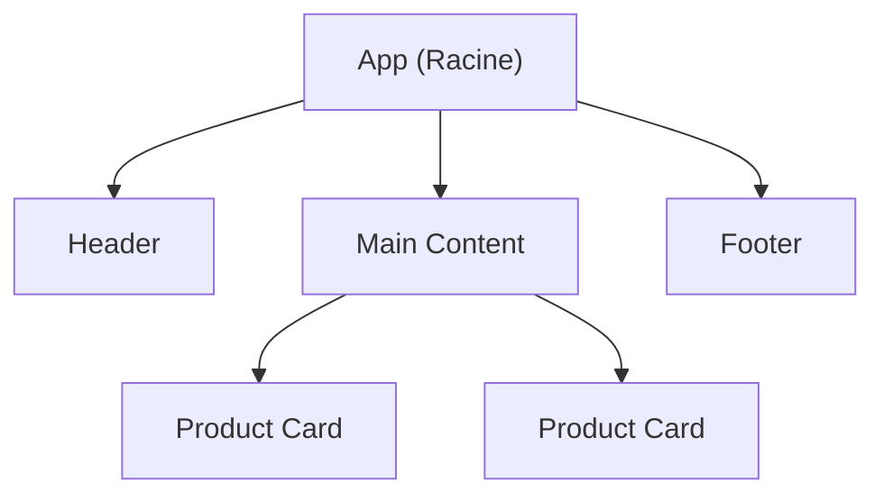

# Chapitre 4 : Les Composants Fonctionnels {#chapitre-4-:-les-composants-fonctionnels-4}

Composants, Fonctions JavaScript, Props, Composition, Réutilisabilité.

## Définition d'un composant fonctionnel {#définition-d-un-composant-fonctionnel-4}

### 1. Quoi
Un **composant fonctionnel** est une simple fonction JavaScript qui accepte des données en entrée (appelées **props**) et retourne un élément React (généralement du **JSX**) décrivant ce qui doit apparaître à l'écran.

### 2. Pourquoi
C'est l'unité de base de React. Contrairement aux anciens "composants classes", les composants fonctionnels sont plus courts, plus faciles à lire et à tester. Ils permettent de découper une interface complexe en petits morceaux indépendants et réutilisables.

### 3. Comment

#### A. Syntaxe de base
On peut utiliser une fonction classique ou une fonction fléchée (*arrow function*).

```javascript
// Approche avec fonction classique
function WelcomeMessage() {
  return <h1>"Bienvenue sur notre plateforme !"</h1>;
}

// Approche avec fonction fléchée (très courante en React moderne)
const Footer = () => {
  return <footer>"© 2024 Mon Entreprise"</footer>;
};
```

#### B. Hiérarchie des composants
Les composants s'imbriquent les uns dans les autres pour former un arbre.



### 4. Zone de Danger
❌ **À ne pas faire** : Nommer un composant avec une minuscule (ex: `function monComposant()`).
✅ **Bonne pratique** : Le nom d'un composant React **doit impérativement commencer par une majuscule** (PascalCase). C'est ainsi que React distingue les composants personnalisés des balises HTML standards.

---

## Les Props (Propriétés) {#les-props-4}

### 1. Quoi
Les **props** (abréviation de *properties*) sont les paramètres que l'on passe à un composant pour le configurer. Elles fonctionnent comme les arguments d'une fonction ou les attributs d'une balise HTML.

### 2. Pourquoi
Sans les props, tous les composants d'un même type afficheraient exactement la même chose. Les props permettent de rendre les composants **dynamiques** et **génériques**.

### 3. Comment

#### A. Passage et réception des props
On passe les props depuis le parent et on les récupère dans l'objet `props` en argument du composant enfant.

```javascript
// Composant Enfant
function UserGreeting(props) {
  return <p>"Bonjour, {props.name} ! Vous avez {props.messages} messages."</p>;
}

// Composant Parent
function App() {
  return (
    <div>
      <UserGreeting name="Alice" messages={5} />
      <UserGreeting name="Bob" messages={0} />
    </div>
  );
}
```

#### B. Destructuration (Recommandé)
Pour plus de clarté, on extrait souvent les propriétés directement dans les parenthèses de la fonction.

```javascript
const UserGreeting = ({ name, messages }) => {
  return <p>"Bonjour, {name} ! Messages : {messages}"</p>;
};
```

### 4. Zone de Danger
❌ **À ne pas faire** : Tenter de modifier une prop à l'intérieur du composant qui la reçoit (ex: `props.name = "Nouveau Nom"`).
✅ **Bonne pratique** : Les props sont **en lecture seule** (*read-only*). Un composant doit se comporter comme une "fonction pure" vis-à-vis de ses props : il ne doit jamais les altérer.

---

## Composition de composants {#composition-de-composants-4}

### 1. Quoi
La **composition** consiste à assembler de petits composants simples pour en construire de plus complexes. C'est l'équivalent de construire un château avec des briques LEGO.

### 2. Pourquoi
Cela favorise la séparation des responsabilités. Un composant ne devrait idéalement faire qu'une seule chose (principe de responsabilité unique).

### 3. Comment

#### Cas concret : Une carte de profil utilisateur
Nous allons diviser une carte en trois composants : `Avatar`, `UserInfo`, et le parent `UserCard`.

```javascript
const Avatar = ({ url }) => (
  
);

const UserInfo = ({ name, role }) => (
  <div>
    <h3>{name}</h3>
    <p>{role}</p>
  </div>
);

const UserCard = ({ user }) => {
  return (
    <div className="card" style={{ border: '1px solid #ccc', padding: '10px', display: 'flex', gap: '10px' }}>
      <Avatar url={user.avatarUrl} />
      <UserInfo name={user.name} role={user.role} />
    </div>
  );
};
```

> 📸 **CAPTURE D'ÉCRAN REQUISE**
> **Sujet** : Rendu visuel de la UserCard dans le navigateur.
> **Alt Text** : Exemple de composition de composants montrant une image de profil à côté d'un nom et d'un rôle.

### 4. Zone de Danger
❌ **À ne pas faire** : Créer des composants géants (plus de 200 lignes de JSX).
✅ **Bonne pratique** : Si vous commencez à avoir trop de logique ou de structure HTML dans un seul fichier, extrayez les parties logiques dans de nouveaux composants.

---

## Questions clés (validation des acquis du chapitre) {#questions-clés-4}

- **Quelle est la différence entre une balise HTML `<div>` et un composant React `<Card />` ?**
  La balise HTML est native au navigateur, tandis que le composant React est une fonction JavaScript définie par le développeur qui doit commencer par une majuscule.
- **Les props sont-elles modifiables par le composant qui les reçoit ?**
  Non, elles sont immuables (en lecture seule).
- **Qu'est-ce que la destructuration des props ?**
  C'est une syntaxe JavaScript permettant d'extraire directement les propriétés de l'objet props dans les arguments de la fonction : `({ name })` au lieu de `(props)`.

---

## Exercices : {#exercices-:-4}

### Exercice 1 - Le Badge de Statut {#exercice-1---le-badge-de-statut-4}
🎯 **Objectif** : Créer un composant simple avec des props.
💼 **Mise en situation** : Vous travaillez sur un outil de gestion de tickets (type Jira).
📝 **Énoncé** : Créez un composant `StatusBadge` qui reçoit une prop `label` (texte) et `color` (chaîne de caractères pour la couleur de fond). Le badge doit avoir des coins arrondis et du texte blanc.

<details>
<summary>Voir le code complet commenté</summary>

```javascript
const StatusBadge = ({ label, color }) => {
  // On définit le style dynamiquement via la prop color
  const badgeStyle = {
    backgroundColor: color,
    color: 'white',
    padding: '4px 8px',
    borderRadius: '12px',
    fontSize: '0.8rem',
    display: 'inline-block'
  };

  return <span style={badgeStyle}>{label}</span>;
};

// Utilisation : <StatusBadge label="En cours" color="orange" />
```
</details>

### Exercice 2 - Liste de Produits {#exercice-2---liste-de-produits-4}
🎯 **Objectif** : Pratiquer la composition et le passage de données.
💼 **Mise en situation** : Une page catalogue pour une boutique en ligne.
📝 **Énoncé** : 
1. Créez un composant `ProductItem` qui affiche le nom et le prix d'un produit.
2. Créez un composant `ProductList` qui contient trois `ProductItem` avec des données différentes.

<details>
<summary>Voir le code complet commenté</summary>

```javascript
const ProductItem = ({ name, price }) => {
  return (
    <li>
      <strong>{name}</strong> : {price}€
    </li>
  );
};

const ProductList = () => {
  return (
    <div>
      <h2>Nos Produits</h2>
      <ul>
        {/* On compose ProductList en utilisant plusieurs ProductItem */}
        <ProductItem name="Café Équitable" price={12} />
        <ProductItem name="Thé Vert Bio" price={15} />
        <ProductItem name="Chocolat Noir" price={8} />
      </ul>
    </div>
  );
};
```
</details>

### Exercice 3 - La Carte de Visite Dynamique {#exercice-3---la-carte-de-visite-dynamique-4}
🎯 **Objectif** : Manipuler des objets complexes en props.
💼 **Mise en situation** : Un annuaire d'entreprise.
📝 **Énoncé** : Créez un composant `BusinessCard`. Il doit recevoir une prop unique `identity` qui est un objet contenant `firstName`, `lastName` et `email`. Affichez ces informations proprement.

<details>
<summary>Voir le code complet commenté</summary>

```javascript
const BusinessCard = ({ identity }) => {
  // On extrait les données de l'objet identity passé en prop
  const { firstName, lastName, email } = identity;

  return (
    <div style={{ border: '2px solid black', padding: '20px', width: '250px' }}>
      <h2>{firstName} {lastName}</h2>
      <p>Contact : <a href={`mailto:${email}`}>{email}</a></p>
    </div>
  );
};

// Utilisation : 
// const user = { firstName: "Marc", lastName: "Lavoine", email: "m.lavoine@tech.com" };
// <BusinessCard identity={user} />
```
</details>