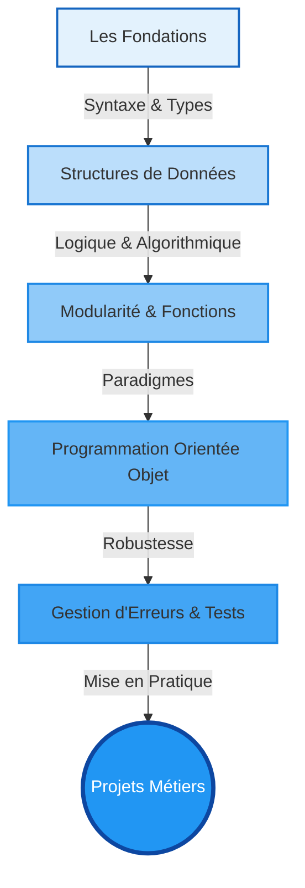

# Bienvenue dans l'univers Python {#bienvenue-0}

Vous vous apprêtez à débuter un parcours complet sur Python, le langage qui a redéfini le développement moderne. Que vous souhaitiez automatiser des tâches quotidiennes, analyser des mégadonnées, construire des applications web robustes ou entraîner des modèles d'intelligence artificielle, Python est la clé de voûte de ces écosystèmes.

Ce cours a été conçu avec une ambition précise : **dépasser la simple syntaxe pour vous enseigner l'art du code "Pythonique"**. Nous ne voulons pas seulement que votre code fonctionne, nous voulons qu'il soit élégant, performant et maintenable selon les standards de l'industrie.

> 📸 **CAPTURE D'ÉCRAN REQUISE**
> **Sujet** : Un collage visuel montrant le logo Python au centre, connecté à des icônes représentant le Web (Django/Flask), la Data (Pandas), l'IA (TensorFlow) et l'Automatisation.
> **Alt Text** : Vue d'ensemble de l'écosystème et de la polyvalence de Python.

## La Philosophie de ce Cursus {#philosophie-cursus-0}

Apprendre un langage de programmation est comparable à l'apprentissage d'une langue vivante : le vocabulaire (mots-clés) et la grammaire (syntaxe) ne suffisent pas. Il faut comprendre la culture et les idiomes. 

Notre approche pédagogique repose sur une progression structurée, allant des fondations absolues jusqu'aux concepts d'architecture avancée. Voici une visualisation de votre montée en compétence :

## Objectifs de la Formation {#objectifs-formation-0}

À l'issue de ce parcours, vous ne serez pas simplement un "codeur Python", mais un développeur capable de :

1.  **Écrire du code propre (Clean Code)** respectant scrupuleusement la norme PEP 8.
2.  **Comprendre ce qui se passe "sous le capot"**, notamment la gestion de la mémoire et le modèle d'exécution de Python.
3.  **Utiliser les outils modernes** de l'écosystème (environnements virtuels, gestionnaires de paquets, debuggers).
4.  **Architecturer des solutions complexes** en utilisant la Programmation Orientée Objet (POO).
5.  **Anticiper les erreurs** et gérer les exceptions pour créer des programmes résilients.

## Prérequis Techniques {#pre-requis-0}

Pour suivre cette formation dans des conditions optimales, vous devez préparer votre environnement de travail. Bien que nous détaillions l'installation dans le chapitre suivant, assurez-vous de disposer des éléments ci-dessous.

### Matériel et Système
*   Un ordinateur (PC, Mac ou Linux) avec au moins 4 Go de RAM (8 Go recommandés pour les parties Data/IA).
*   Une connexion internet stable pour le téléchargement des bibliothèques via `pip`.
*   Des droits d'administrateur sur votre machine pour l'installation des outils.

### Outils Recommandés
Nous utiliserons des standards de l'industrie :
*   **Interpréteur** : Python 3.10 ou supérieur.
*   **IDE (Environnement de Développement)** : VS Code (recommandé pour sa légèreté et ses extensions) ou PyCharm.
*   **Terminal** : PowerShell, Bash ou Zsh.

### Connaissances Prises en Charge
Ce cours est accessible aux débutants, mais une familiarité avec les concepts suivants accélérera votre apprentissage :
*   Utilisation basique d'un ordinateur (gestion de fichiers, extensions).
*   Logique élémentaire (si, alors, sinon).

## Comment utiliser ce cours ? {#mode-emploi-0}

Chaque module technique ("Standard") est construit pour maximiser la rétention d'information :

*   **Le Concept** : Nous expliquons le "Pourquoi" avant le "Comment".
*   **La Pratique** : Des exemples de code concrets, loin des exemples abstraits scolaires.
*   **La Zone de Danger** : Une section critique qui met en lumière les pièges courants et les mauvaises pratiques à éviter absolument.
*   **La Validation** : Des quiz et des exercices progressifs pour tester vos acquis immédiatement.

Prêt à démarrer ? Passons à la configuration de votre environnement de développement.