# Comprendre l'Écosystème Python {#ecosysteme-python-1}

Avant d'écrire votre première ligne de code, il est crucial de comprendre l'environnement dans lequel vous évoluez. Python n'est pas seulement un langage, c'est un écosystème vaste comprenant un interpréteur, une machine virtuelle, un gestionnaire de paquets et une philosophie de conception unique.

Ce chapitre se concentre sur la théorie fondamentale : comment Python transforme votre texte en actions machine.

## Pourquoi Python est-il unique ? {#pourquoi-python-1}

Python se distingue par sa philosophie "Batteries Included". Contrairement à des langages comme C++ ou JavaScript qui nécessitent souvent de nombreux outils externes pour démarrer un projet complexe, Python fournit une bibliothèque standard extrêmement riche dès l'installation.

Ses caractéristiques techniques principales sont :
*   **Interprété** : Le code est lu et exécuté ligne par ligne (ou bloc par bloc), ce qui facilite le débogage.
*   **Typage Dynamique** : Pas besoin de déclarer le type des variables (int, string), Python le déduit à l'exécution.
*   **Multi-paradigme** : Il supporte la programmation procédurale, orientée objet et fonctionnelle.

> 📸 **CAPTURE D'ÉCRAN REQUISE**
> **Sujet** : Terminal montrant le Zen de Python (`import this`).
> **Alt Text** : Les 19 aphorismes qui guident la conception du code Python.

## Architecture Interne : Du Code Source à la Machine {#architecture-interne-1}

Beaucoup de développeurs pensent que Python est lent car il est "interprété". C'est une demi-vérité. En réalité, Python compile votre code source en un langage intermédiaire appelé **Bytecode** avant de l'exécuter.

Voici le cycle de vie d'un script Python standard (implémentation CPython) :


1.  **Le Compilateur** : Il vérifie la syntaxe et traduit le code humain en Bytecode (un code de bas niveau, mais pas encore du binaire machine). C'est ce que vous voyez souvent dans les dossiers `__pycache__`.
2.  **La PVM (Python Virtual Machine)** : C'est le cœur du système. C'est une grosse boucle en langage C qui itère sur le Bytecode et exécute les instructions correspondantes.

## Le Python Package Index (PyPI) {#pypi-pip-1}

La force de Python réside dans sa communauté et son dépôt central : **PyPI** (Python Package Index).

*   **PyPI** : C'est le magasin d'applications de Python. Il héberge des centaines de milliers de bibliothèques tierces (Django, Pandas, NumPy, Requests).
*   **pip** : C'est l'outil standard (Package Installer for Python) qui permet de télécharger et installer ces paquets depuis PyPI vers votre machine.

```mermaid
sequenceDiagram
    participant Dev as Développeur
    participant Terminal
    participant PyPI as PyPI (Cloud)
    participant Lib as Dossier site-packages
    
    Dev->>Terminal: pip install requests
    Terminal->>PyPI: Recherche "requests"
    PyPI-->>Terminal: Retourne version compatible
    Terminal->>PyPI: Télécharge le package (.whl / .tar.gz)
    Terminal->>Lib: Installe les fichiers
    Terminal-->>Dev: Succès !
```



## Les Environnements Virtuels (venv) {#environnements-virtuels-1}

Une règle d'or en Python : **Ne jamais installer de paquets dans l'environnement global de votre système.**

Imaginez deux projets :
*   Projet A a besoin de `Django 2.0`.
*   Projet B a besoin de `Django 4.0`.

Si vous installez tout globalement, l'un des deux projets cassera. La solution est l'utilisation d'**environnements virtuels** (`venv`). Chaque projet possède son propre dossier contenant une copie isolée de l'interpréteur Python et ses propres bibliothèques.

> 📸 **CAPTURE D'ÉCRAN REQUISE**
> **Sujet** : Schéma ou capture de dossier montrant la structure d'un dossier `venv` (bin, lib, include).
> **Alt Text** : Structure d'un environnement virtuel isolé.

## Validation de l'Environnement {#validation-environnement-1}

Avant de passer à la pratique, assurons-nous que votre configuration est opérationnelle. Ouvrez votre terminal et exécutez les commandes suivantes.

### 1. Vérifier la version de Python
```bash
python --version
# Ou sur certains systèmes Linux/Mac :
python3 --version
```
*Vous devriez voir une version supérieure ou égale à 3.10.*

### 2. Vérifier pip
```bash
pip --version
# Ou
pip3 --version
```
*Cela confirme que le gestionnaire de paquets est lié à votre installation Python.*

### 3. Test de la Console Interactive (REPL)
Tapez simplement `python` (ou `python3`) et appuyez sur Entrée. Vous entrerez dans le REPL (Read-Eval-Print Loop).
```python
>>> print("L'environnement est prêt !")
L'environnement est prêt !
>>> exit()
```

Si ces trois étapes fonctionnent, votre architecture locale est prête pour le développement.