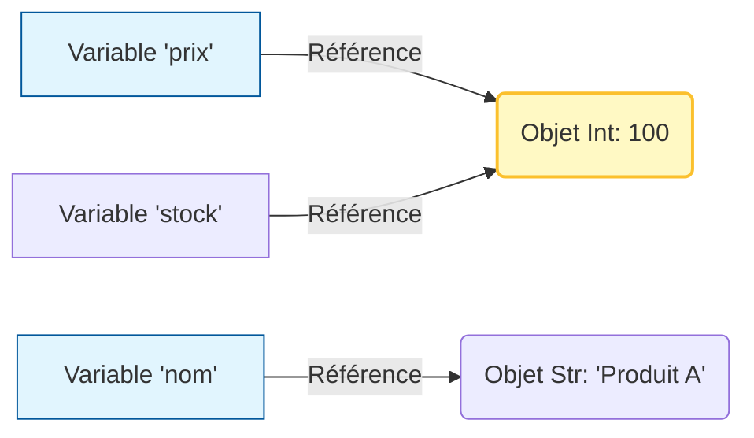

# Introduction à la Syntaxe Python et Premiers Programmes {#introduction-syntaxe-3}

Maintenant que votre environnement est prêt, il est temps d'écrire du code. Python est réputé pour sa syntaxe épurée, souvent comparée à de l'anglais manuscrit. Cependant, cette simplicité cache des règles strictes qui, si elles sont ignorées, empêcheront votre programme de fonctionner.

Ce chapitre pose les fondations absolues : comment structurer son code, stocker des données et interagir avec l'utilisateur.

## 1. L'Indentation et la Structure {#indentation-structure-3}

### Quoi
En Python, la structure du code n'est pas définie par des accolades `{}` ou des mots-clés `begin/end` comme dans d'autres langages (Java, C++, PHP). Elle est définie par l'**indentation** (les espaces en début de ligne).

### Pourquoi
Cette contrainte force le développeur à écrire du code lisible et aéré. Ce qui est visuellement un bloc de code pour l'humain est interprété comme un bloc logique par la machine.

### Comment
Un bloc de code (comme une condition ou une boucle) commence après deux points `:` et doit être décalé vers la droite (généralement 4 espaces).

```python
# Exemple de structure
def dire_bonjour():
    # Début du bloc (indenté)
    print("Bonjour !") 
    print("Bienvenue dans Python.")
    # Fin du bloc (retour à la marge)

# Code principal
dire_bonjour()
```

> 📸 **CAPTURE D'ÉCRAN REQUISE**
> **Sujet** : VS Code montrant les guides d'indentation (lignes verticales grises) et une erreur rouge si l'alignement est mauvais.
> **Alt Text** : Visualisation de l'indentation correcte dans un IDE moderne.

---

## 2. Variables et Typage Dynamique {#variables-typage-3}

### Quoi
Une variable est une étiquette (un nom) que l'on colle sur une valeur stockée en mémoire. Python est un langage à **typage dynamique** : vous n'avez pas besoin de préciser si une variable est un nombre ou un texte, Python le devine tout seul.

### Pourquoi
Cela accélère considérablement le développement. Vous vous concentrez sur la logique métier plutôt que sur la gestion de la mémoire.

### Comment

```python
# Syntaxe : nom_variable = valeur

# Chaîne de caractères (String)
nom_client = "Alice Dupont"

# Entier (Integer)
age = 30

# Nombre à virgule (Float)
prix_ht = 19.99

# Booléen (Boolean)
est_premium = True

# Réassignation possible avec un autre type (Flexibilité)
age = "Trente ans" # Valide en Python, mais attention à la logique !
```

Voici comment Python gère les variables en mémoire contrairement aux langages comme C :



---

## 3. Interactions : Entrées et Sorties {#entrees-sorties-3}

### Quoi
Pour qu'un programme soit utile, il doit pouvoir afficher des résultats (`print`) et recevoir des informations de l'utilisateur (`input`).

### Pourquoi
C'est la base de l'interaction Homme-Machine (IHM) en ligne de commande.

### Comment

**Affichage avec les f-strings (Standard moderne)** :
Utilisez la lettre `f` avant les guillemets pour insérer des variables directement dans le texte avec `{}`.

```python
nom = "Sophie"
score = 95

# Ancienne méthode (à éviter)
print("Joueur : " + nom + " Score : " + str(score))

# Méthode moderne (f-string)
print(f"Joueur : {nom} | Score : {score}/100")
```

**Récupération de données** :
Attention, `input()` renvoie **toujours** du texte (String). Si vous attendez un nombre, vous devez le convertir (*caster*).

```python
# Demander l'âge
age_texte = input("Quel est votre âge ? ") # "25" (String)
age_nombre = int(age_texte) # 25 (Integer)

# En une seule ligne
taille = float(input("Votre taille en m : ")) # 1.75
```

---

## Zone de Danger {#zone-danger-3}

Attention aux erreurs classiques qui frustrent les débutants :

1.  **IndentationError** : Mélanger des tabulations et des espaces, ou décaler une ligne sans raison.
    *   *Solution* : Configurez votre IDE pour convertir "Tab" en "4 espaces".
2.  **TypeError (Opérations impossibles)** : Essayer d'additionner du texte et un nombre.
    *   `print("Prix: " + 15)` ❌ -> Crash.
    *   `print("Prix: " + str(15))` ✅ -> Fonctionne.
3.  **Nommage de variables** : 
    *   Ne jamais utiliser de mots réservés (`if`, `for`, `class`, `list`, `str`).
    *   Utilisez le *snake_case* (tout en minuscule avec des underscores) : `mon_super_variable`.

---

## Validation des Acquis {#validation-3}

### 3 Questions Clés

1. **Que se passe-t-il si vous oubliez d'indenter le code après un `if :` ?**
2. **Si j'écris `prix = input("Prix ?")` et que je tape `10`, quel est le type de la variable `prix` ?**
3. **Quelle est la syntaxe recommandée pour insérer une variable `nom` dans une chaîne de caractères ?**

### 3 Exercices Progressifs

#### Exercice 1 : Le Salueur Personnalisé (Niveau Débutant)
Créez un script qui demande le prénom et l'année de naissance de l'utilisateur. Le script doit afficher : "Bonjour [Prénom], vous avez environ [Age] ans.".
*Indice : Pour l'année actuelle, vous pouvez la fixer en dur (ex: 2023) pour l'instant.*

<details>
<summary>Découvrir la solution commentée</summary>

```python
# 1. Configuration de l'année en cours
ANNEE_ACTUELLE = 2024

# 2. Récupération des données
prenom = input("Quel est votre prénom ? ")
annee_naissance_str = input("Quelle est votre année de naissance ? ")

# 3. Conversion (Casting)
annee_naissance = int(annee_naissance_str)

# 4. Calcul
age = ANNEE_ACTUELLE - annee_naissance

# 5. Affichage avec f-string
print(f"Bonjour {prenom}, vous avez environ {age} ans.")
```
</details>

#### Exercice 2 : Calculateur de Prix TTC (Niveau Intermédiaire)
Vous travaillez pour un magasin. Écrivez un programme qui :
1. Demande le nom du produit.
2. Demande le prix Hors Taxe (HT).
3. Applique une TVA de 20%.
4. Affiche une phrase récapitulative propre.

<details>
<summary>Découvrir la solution commentée</summary>

```python
# Constante de TVA (Bonne pratique : majuscules pour les constantes)
TAUX_TVA = 1.20

# Entrées
produit = input("Nom du produit : ")
# On utilise float() car un prix peut avoir des virgules
prix_ht = float(input("Prix HT (€) : "))

# Traitement
prix_ttc = prix_ht * TAUX_TVA

# Sortie formatée (:.2f permet d'arrondir à 2 décimales)
print(f"Le produit '{produit}' coûte {prix_ttc:.2f} € TTC.")
```
</details>

#### Exercice 3 : Simulateur de Connexion (Mise en situation)
Simulez une page de login basique.
1. Définissez un mot de passe secret dans le code.
2. Demandez à l'utilisateur d'entrer le mot de passe.
3. Affichez "Accès Autorisé" ou "Accès Refusé" en comparant les chaînes (le `if` n'est pas encore vu, utilisez simplement un `print` avec le résultat de la comparaison `True/False` pour l'instant, ou anticipez si vous le connaissez).

*Note : Pour cet exercice sans `if`, nous allons afficher le résultat booléen.*

<details>
<summary>Découvrir la solution commentée</summary>

```python
MOT_DE_PASSE_SECRET = "PythonSecure"

print("--- PORTAIL DE SECURITÉ ---")
saisie = input("Veuillez entrer le mot de passe : ")

# Comparaison (Renvoie True ou False)
est_autorise = (saisie == MOT_DE_PASSE_SECRET)

print(f"Accès autorisé : {est_autorise}")

# Note : Dans un vrai programme, on utiliserait :
# if saisie == MOT_DE_PASSE_SECRET:
#     print("Bienvenue !")
# else:
#     print("Intrus détecté !")
```
</details>